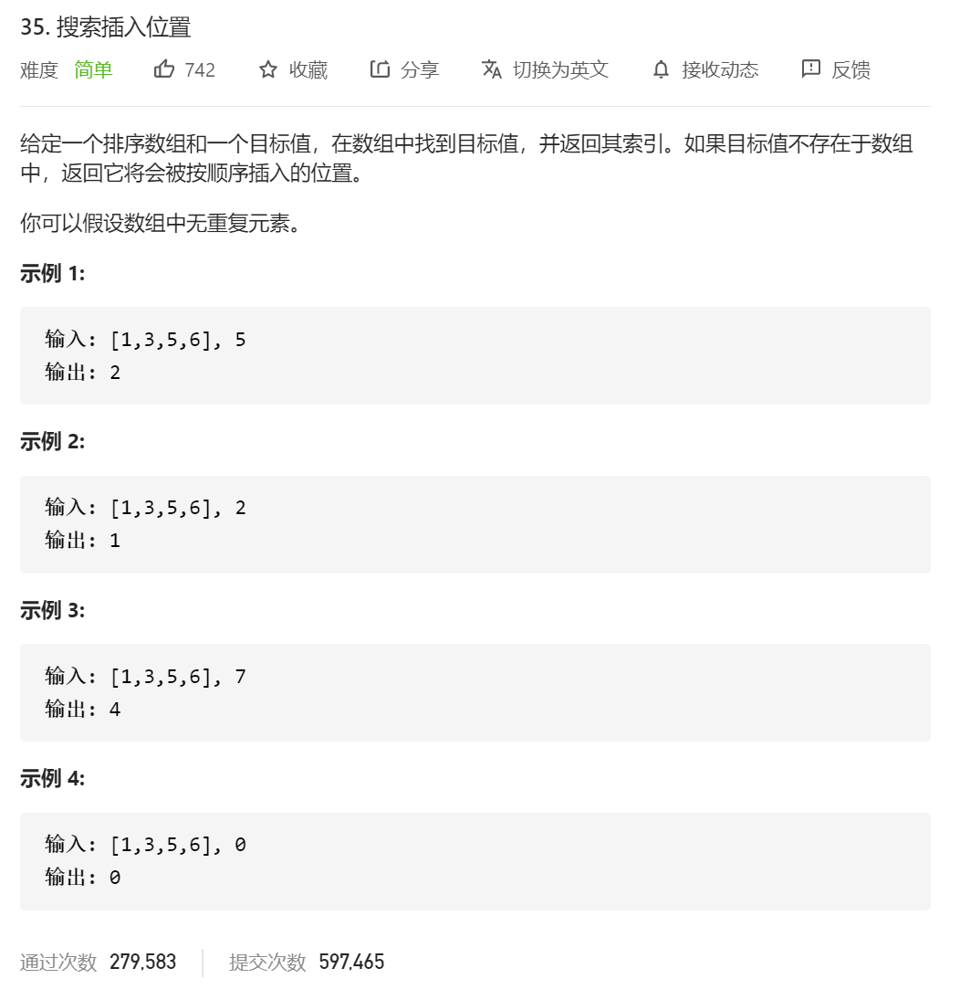

二分查找感觉就是不停地找例子去测试。

这题的思路就是简单的二分查找。

附上二分查找的基本代码：

```java
public class Solution {
  
    // 「力扣」第 704 题：二分查找

    public int search(int[] nums, int target) {
        int len = nums.length;
        //1 2 3   4   5   6
        //l   m  m+1      r
        
        //1         2
        //l(mid)    r
        //当发送等于的时候  r=mid
        
        //1          2  
        //l(mid)     r
        //   target>mid
        //    l=mid+1
        //   
  
        int left = 0;
        int right = len - 1;
        // 目标元素可能存在在区间 [left, right]
        while (left < right) {
            int mid = left + (right - left) / 2;
            if (nums[mid] < target) {
                // 下一轮搜索区间是 [mid + 1, right]
                left = mid + 1;
            } else {
                // 下一轮搜索区间是 [left, mid]
                right = mid;
            }
        }

        if (nums[left] == target) {
            return left;
        }
        return -1;
    }
}

作者：liweiwei1419
链接：https://leetcode-cn.com/leetbook/read/learning-algorithms-with-leetcode/xs41qg/
来源：力扣（LeetCode）
著作权归作者所有。商业转载请联系作者获得授权，非商业转载请注明出处。
```


```java
 public int search_b(int[] nums, int target) {
        int lo = 0, hi = nums.length - 1, mid = 0;
        while (lo <= hi) {
            mid = lo + ((hi - lo) >> 1);////这种写法是为了防止越界
            if (nums[mid] == target) {
                return mid;
            }
            if (nums[mid] < target) {
                lo = mid + 1;
            } else {
                hi = mid - 1;
            }
        }
        return -1;
    }
```

然后 自己写的垃圾代码：

```java
class Solution {
    public int searchInsert(int[] nums, int target) {
        int res=-1;
        int start =0;
        int end=nums.length-1;

        while (start<=end)
        {
            int mid=(start+end)/2;
            if (nums[mid]>target)
            {
                end=mid-1;
            }else if(nums[mid]<target)
            {
                start=mid+1;
            }else
            {
                res=mid;
                break;//这边的break 直接换成return 就行了
            }

        }
       if(res==-1)
        {
            res=start;
        }


        return res;
    }
}
```

