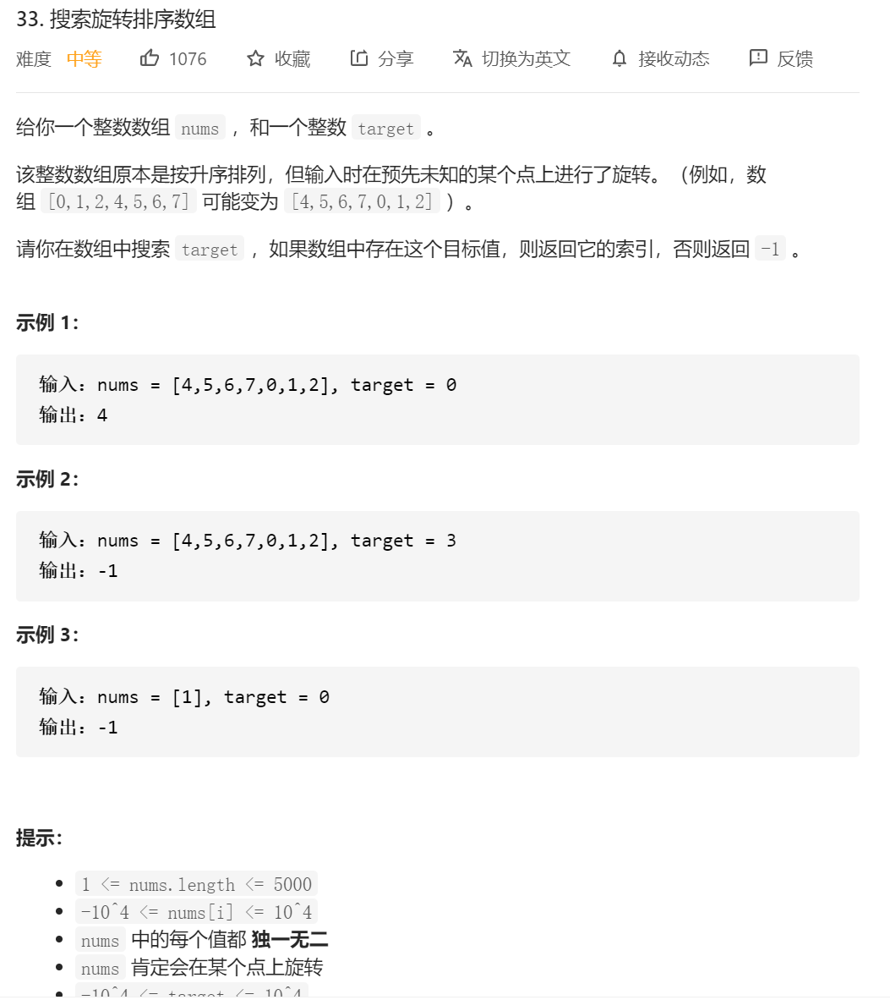

思路：先找到分界的那个值，然后分别的分界的两个地方给二分进行查找。

首先找最小值的函数：

```java
class Solution {
    public int findMin(int[] nums) {
        int left = 0, right = nums.length - 1;
        while (left < right) {
            int middle= left+(right-left)/2;
            if (nums[middle] <= nums[right]) {
                // middle可能是最小值
                right = middle;
            } else {
                // middle肯定不是最小值
                left = middle + 1;
            }
        }

        return nums[left];
    }
}
```

然后对两边分别进行二分查找

```java
class Solution {
    public int search(int[] nums, int target) {
        //思路：先找那个最小的那个点 用二分找 然后 对两段数组分别进行二分
        int min_index=findMin_index(nums);
        if(target>=nums[min_index]&&target<=nums[nums.length-1])//这边好像是为了防止正常顺序时候，会出错  由于是递增的数组，所以就直接固定住那个区域
        {
            int lo = min_index, hi = nums.length - 1, mid = 0;
            while (lo <= hi) {
                mid = lo + ((hi - lo) >> 1);
                if (nums[mid] == target) {
                    return mid;
                }
                if (nums[mid] < target) {
                    lo = mid + 1;
                } else {
                    hi = mid - 1;
                }
            }
            return -1;
        }
        else{
            int lo = 0, hi = min_index - 1, mid = 0;
            while (lo <= hi) {
                mid = lo + ((hi - lo) >> 1);
                if (nums[mid] == target) {
                    return mid;
                }
                if (nums[mid] < target) {
                    lo = mid + 1;
                } else {
                    hi = mid - 1;
                }
            }
            return -1;
        }
    }


    public int findMin_index(int[] nums) {
        int left = 0, right = nums.length - 1;
        while (left < right) {
            int middle = (left + right) / 2;
            if (nums[middle] < nums[right]) {
                // middle可能是最小值
                right = middle;
            } else {
                // middle肯定不是最小值
                left = middle + 1;
            }
        }

        return left;
    }
}
```

