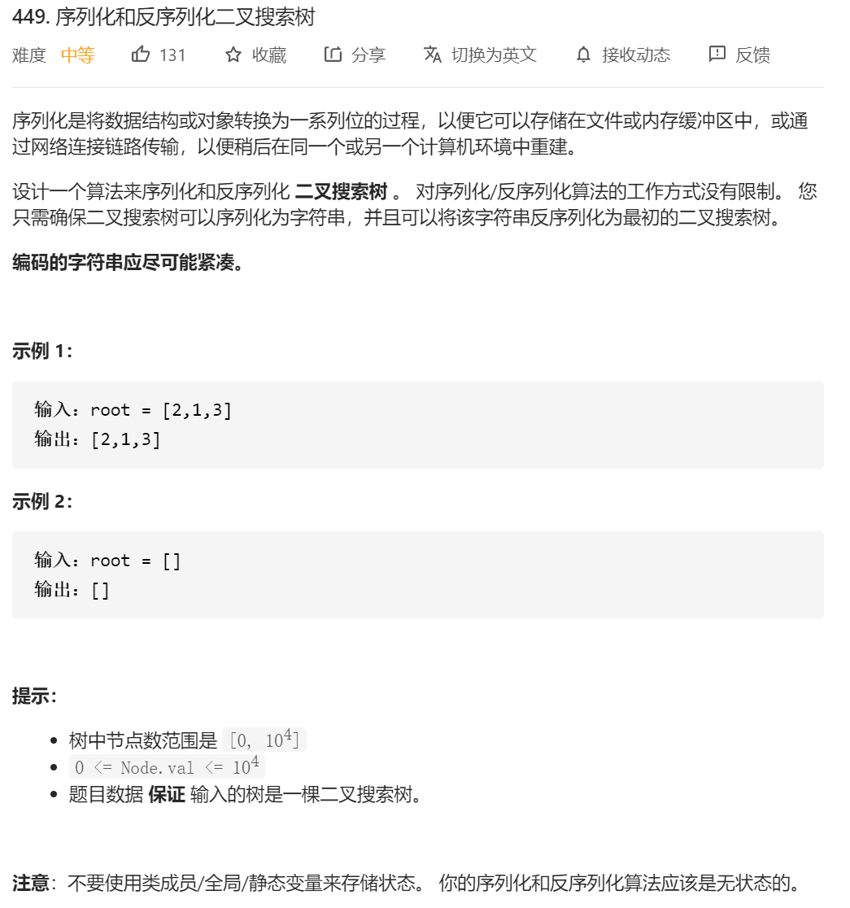

先验知识：

**1.如何构建二叉排序树**

```java
 public void BST_insert(TreeNode node, TreeNode insert_node)
    {//构建二叉排序树

        if(insert_node.val< node.val)//如果是插入的节点小于目标的root节点
        {
            //那就得考虑插入左子树的效果
            if(node.left!=null)
            {//如果左子树不为空 那就递归插入左边子树
                BST_insert(node.left,insert_node);
            }else
            {
                node.left=insert_node;
            }
        }
        else {//大于root 节点 那就插在右边
            if(node.right!=null)
            {//如果左子树不为空 那就递归插入左边子树
                BST_insert(node.right,insert_node);
            }else
            {
                node.right=insert_node;
            }
        }
    }
```

**2.二叉排序树的查找**

```java
public boolean BST_search(TreeNode node,int value)
    {
        if(node.val==value)
        {
            return true;
        }
        if(value< node.val)
        {//往左边找
            if(node.left!=null)
            {
                BST_search(node.left,value);
            }else
            {
                return false;
            }
        }
        else
        {
            //往右边找
            if(node.right!=null)
            {
                BST_search(node.right,value);
            }
            else
            {
                return false;
            }
        }
        return true;
    }
```

知道这些之后这题的思路：

1.问题1：就是给你个二叉排序树，你要把他整成一个编码的字符串，也就是先序遍历这个二叉树，然后在遍历的过程中把节点的值存在一个StringBuilder里面，然后每存一个，后面加一个**‘，’逗号**，这样解码也就方便了。

2.问题2：就是给你一个字符串，你得构建二叉排序树，这个简单，就直接按照**逗号‘，’**来进行spilt，然后一个个数字构建二叉排序树就行了。

```java
public class Codec {

    
    public void BST_insert(TreeNode node, TreeNode insert_node)
    {//构建二叉排序树
        if(insert_node.val< node.val)//如果是插入的节点小于目标的root节点
        {
            //那就得考虑插入左子树的效果
            if(node.left!=null)
            {//如果左子树不为空 那就递归插入左边子树
                BST_insert(node.left,insert_node);
            }else
            {
                node.left=insert_node;
            }
        }
        else {//大于root 节点 那就插在右边
            if(node.right!=null)
            {//如果左子树不为空 那就递归插入左边子树
                BST_insert(node.right,insert_node);
            }else
            {
                node.right=insert_node;
            }
        }
    }

    public boolean BST_search(TreeNode node,int value)
    {
        if(node.val==value)
        {
            return true;
        }
        if(value< node.val)
        {//往左边找
            if(node.left!=null)
            {
                BST_search(node.left,value);
            }else
            {
                return false;
            }
        }
        else
        {
            //往右边找
            if(node.right!=null)
            {
                BST_search(node.right,value);
            }
            else
            {
                return false;
            }
        }
        return true;
    }

    //前序遍历 拼接节点
    private void helper(TreeNode root, StringBuilder sb) {
        if (root == null) return;
        //拼接当前节点
        sb.append(root.val).append(",");
        helper(root.left, sb);
        helper(root.right, sb);
    }

    // Encodes a tree to a single string.
    public String serialize(TreeNode root) {
        if (root == null) return "";
        StringBuilder sb = new StringBuilder();
        helper(root, sb);
        return sb.substring(0, sb.length() - 1);
    }


    // Decodes your encoded data to tree.
    public TreeNode deserialize(String data) {
//        TreeNode res=new TreeNode();

        if (data == null || data.length() == 0) return null;
        String[] arr = data.split(",");
        TreeNode root1=new TreeNode(Integer.valueOf(arr[0]));

        for(int i=1;i<arr.length;i++)
        {
            TreeNode tempNew=new TreeNode(Integer.valueOf(arr[i]));
            BST_insert(root1,tempNew);
        }
        
        return root1;

    }
    
}

```


