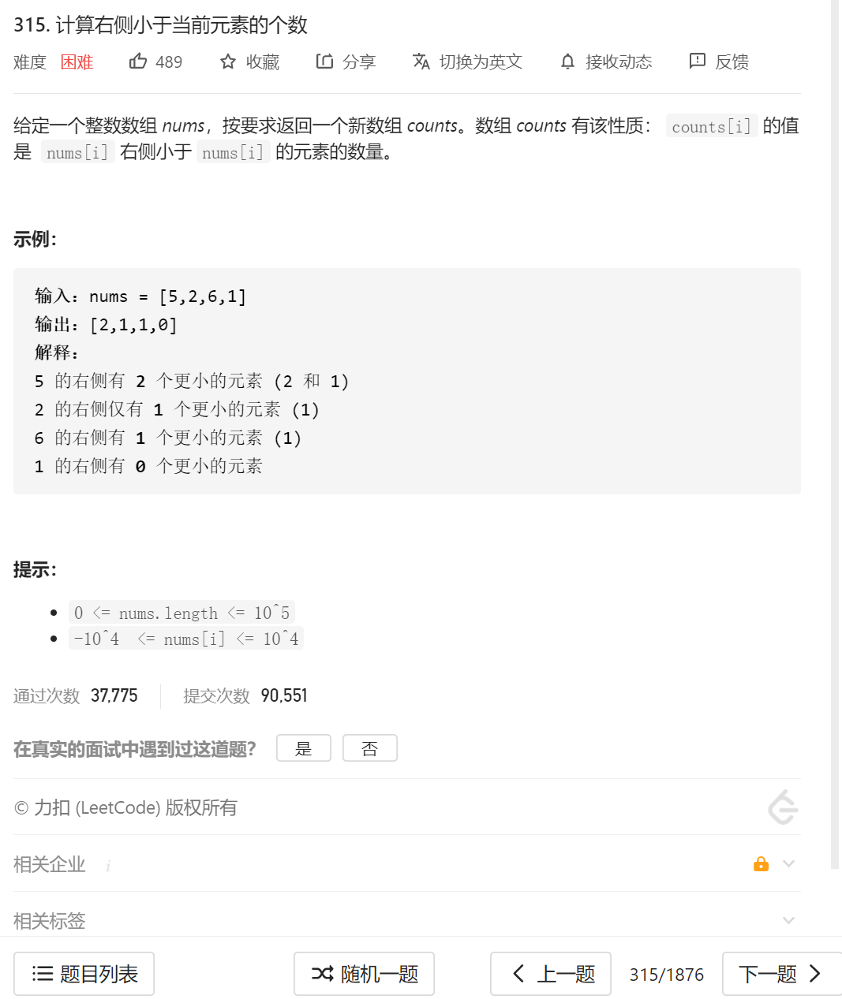
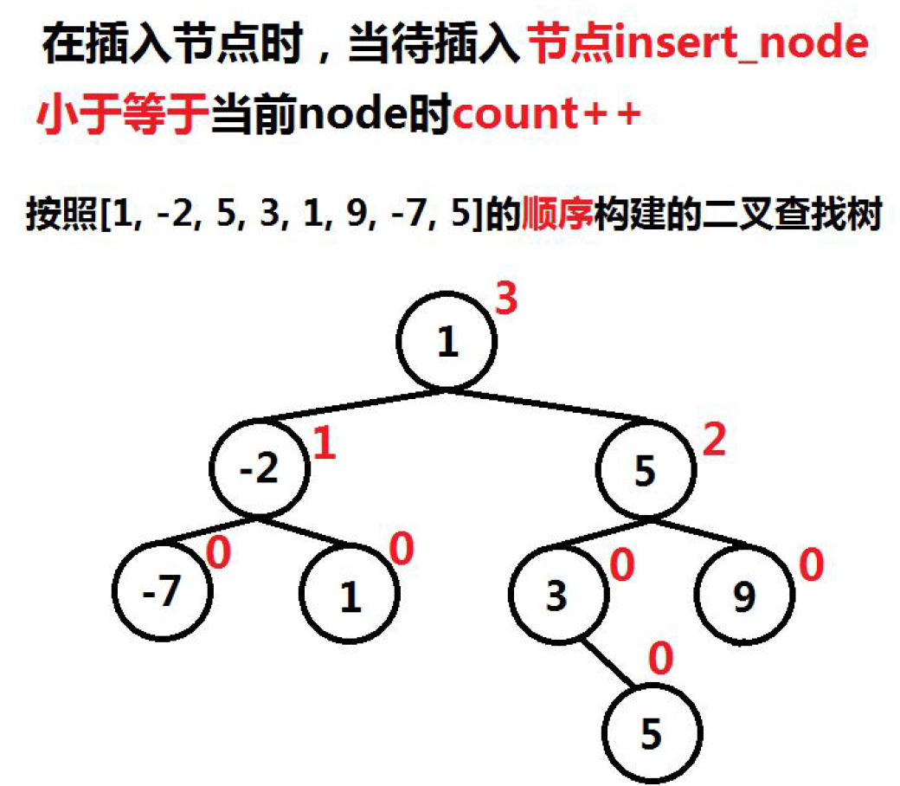
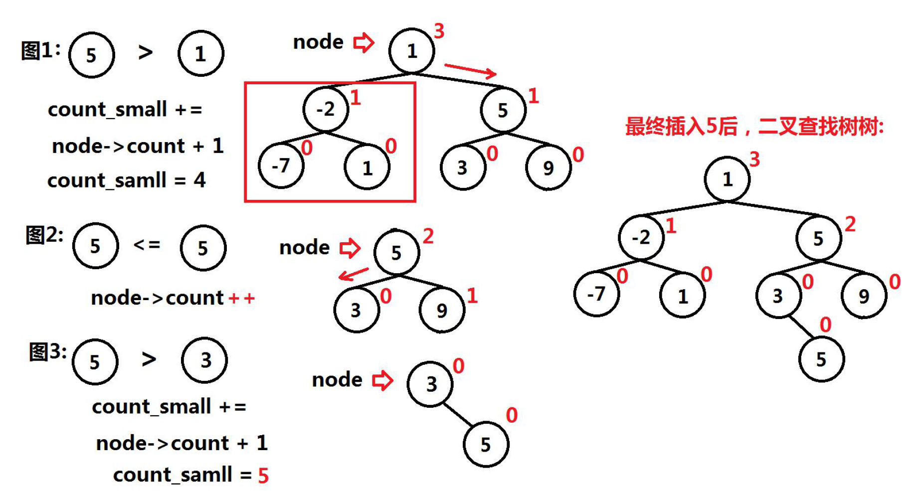

方法有挺多种，这边先整个好理解的二叉搜索树的版本。

1.**从后往前**构建二叉搜索树。

2.每一个节点保证在树的基础上，保留一个count属性，在构建树的过程中，**如果该节点小于等于当前root节点**，则root节点的count需要++，root.count代表左边比这个数小的数；该值**sum不需要改变**



```java
root.count++;
```

3.遍历的过程中**如果该节点大于当前的某一个root节点**（例子：3插入6，1，4），root的**count不变**；**该插入节点的sum=sum+count+1**（1代表的是这个root）（3在经过1的时候，sum=cout[1]（也就是0）+1=1 ）



4.综上，经过小于等于root的节点的时候，root的count++，节点sum不变；当大于root节点的时候，root的count不变，但是sum=sum+root.count+1

5.由于要记录每一个node的sum，换句话说就是从后往前的每一个数的sum，对此，我们**使用一个数组来存储每一个数字的sum情况** 也就是

```java
int count[]=new int[nums.length];
```

我们对于每一个数字进行的操作为：

```java

        TreeNode root=new TreeNode(nums[nums.length-1]);
        //逆序构建排序树
        int count[]=new int[nums.length];
        for(int i=nums.length-2;i>=0;i--)
        {
            TreeNode nodeTemp=new TreeNode(nums[i]);
            BST_insertCount( root,  nodeTemp, count, i);//这边count和i是定位我的每一个数字的在循环中就一直以count[i]的形式存在
        }
```

这边复习一下正常的BST_Insert

```java
 class TreeNode{
    //建立二叉搜索树
    int val;
    int count;
    TreeNode left, right;

    public TreeNode(int val){
        this.val = val;
        this.count = 0;
        left = null;
        right = null;
    }
}
    public void BST_insert(TreeNode node, TreeNode insert_node)
    {//正常构建二叉排序树
        if(insert_node.val< node.val)//如果是插入的节点小于目标的root节点
        {
            //那就得考虑插入左子树的效果
            if(node.left!=null)
            {//如果左子树不为空 那就递归插入左边子树
                BST_insert(node.left,insert_node);
            }else
            {
                node.left=insert_node;
            }
        }
        else {//大于root 节点 那就插在右边
            if(node.right!=null)
            {//如果左子树不为空 那就递归插入左边子树
                BST_insert(node.right,insert_node);
            }else
            {
                node.right=insert_node;
            }
        }
    }
```

然后就是我们的核心函数

```java
 public void BST_insertCount(TreeNode node, TreeNode insert_node,int count[],int index)//count 记录总的sum值 index记录下标
    {//构建二叉排序树

        if(insert_node.val<= node.val)//如果是插入的节点小于等于目标的root节点 
        {
            node.count=node.count+1;//如果有比它小的 就将该节点的count++ 然后将这个节点插入左子树
            //那就得考虑插入左子树的效果
            if(node.left!=null)
            {//如果左子树不为空 那就递归插入左边子树
                BST_insertCount(node.left,insert_node,count,index);
            }else
            {
                node.left=insert_node;
            }
        }
        else {//大于root 节点 那就插在右边
//            如果是大于该节点的 就将左子树所有的节点和给加上去再加上自己
            count[index] += 1 + node.count;
            if(node.right!=null)
            {//如果左子树不为空 那就递归插入左边子树
                BST_insertCount(node.right,insert_node,count,index);
            }else
            {
                node.right=insert_node;
            }
        }
    }
```

最终的答案：

```java
class Solution {
    public List<Integer> countSmaller(int[] nums) {
         List<Integer> res=new ArrayList<Integer>();
        if(nums.length==0)
        {
            return res;
        }

        TreeNode root=new TreeNode(nums[nums.length-1]);//先将root入树
        //逆序构建排序树
        int count[]=new int[nums.length];
        for(int i=nums.length-2;i>=0;i--)
        {
            TreeNode nodeTemp=new TreeNode(nums[i]);
            BST_insertCount( root,  nodeTemp, count, i);
        }
        // List<Integer> res=new ArrayList<Integer>();
        for(int i=0;i<count.length;i++)
        {
            res.add(count[i]);

        }
        return res;
    }


    public void BST_insertCount(TreeNode node, TreeNode insert_node,int count[],int index)//count 记录总的sum值 index记录下标
    {//构建二叉排序树

        if(insert_node.val<= node.val)//如果是插入的节点小于等于目标的root节点 
        {
            node.count=node.count+1;//如果有比它小的 就将该节点的count++ 然后将这个节点插入左子树
            //那就得考虑插入左子树的效果
            if(node.left!=null)
            {//如果左子树不为空 那就递归插入左边子树
                BST_insertCount(node.left,insert_node,count,index);
            }else
            {
                node.left=insert_node;
            }
        }
        else {//大于root 节点 那就插在右边
//            如果是大于该节点的 就将左子树所有的节点和给加上去再加上自己
            count[index] += 1 + node.count;
            if(node.right!=null)
            {//如果左子树不为空 那就递归插入左边子树
                BST_insertCount(node.right,insert_node,count,index);
            }else
            {
                node.right=insert_node;
            }
        }
    }
    
    public void BST_insert(TreeNode node, TreeNode insert_node)
    {//正常构建二叉排序树
        if(insert_node.val< node.val)//如果是插入的节点小于目标的root节点
        {
            //那就得考虑插入左子树的效果
            if(node.left!=null)
            {//如果左子树不为空 那就递归插入左边子树
                BST_insert(node.left,insert_node);
            }else
            {
                node.left=insert_node;
            }
        }
        else {//大于root 节点 那就插在右边
            if(node.right!=null)
            {//如果左子树不为空 那就递归插入左边子树
                BST_insert(node.right,insert_node);
            }else
            {
                node.right=insert_node;
            }
        }
    }

}

class TreeNode{
    //建立二叉搜索树
    int val;
    int count;
    TreeNode left, right;

    public TreeNode(int val){
        this.val = val;
        this.count = 0;
        left = null;
        right = null;
    }
}
```

