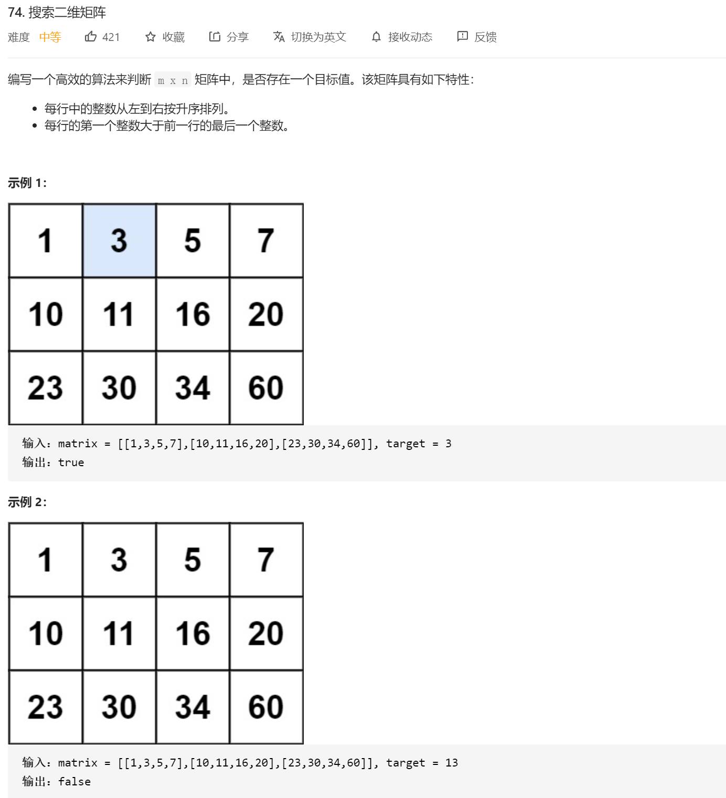

自己的代码：

```java
class Solution {
    public static int bc(int[] nums,int target)
    {
        int left=0;
        int right=nums.length-1;

        while (left<right)
        {
            int mid=left+(right-left)/2;
            if(target>nums[mid])
            {
                left=mid+1;
            }else
            {
                right=mid;
            }
        }

        if (nums[left] == target) {
            return left;
        }
        return -1;
    }
    public boolean searchMatrix(int[][] matrix, int target) {

        int row=matrix.length;//x
        int col=matrix[0].length;//y


        for(int i=0;i<row;i++)//先找x
        {
            if(matrix[i][0]<=target&&matrix[i][col-1]>=target)
            {
                int nums=bc(matrix[i],target);
                if(nums>=0)
                {
                    // System.out.println(nums);
                    return true;
                }
            }
        }

        return false;


    }
}
```


对行也进行二分：

```java
class Solution {
    public boolean searchMatrix(int[][] matrix, int target) {
        int rowIndex = binarySearchFirstColumn(matrix, target);
        if (rowIndex < 0) {
            return false;
        }
        return binarySearchRow(matrix[rowIndex], target);
    }

    public int binarySearchFirstColumn(int[][] matrix, int target) {
        int low = -1, high = matrix.length - 1;
        while (low < high) {
            int mid = (high - low + 1) / 2 + low;
            if (matrix[mid][0] <= target) {
                low = mid;
            } else {
                high = mid - 1;
            }
        }
        return low;
    }

    public boolean binarySearchRow(int[] row, int target) {
        int low = 0, high = row.length - 1;
        while (low <= high) {
            int mid = (high - low) / 2 + low;
            if (row[mid] == target) {
                return true;
            } else if (row[mid] > target) {
                high = mid - 1;
            } else {
                low = mid + 1;
            }
        }
        return false;
    }
}

```


