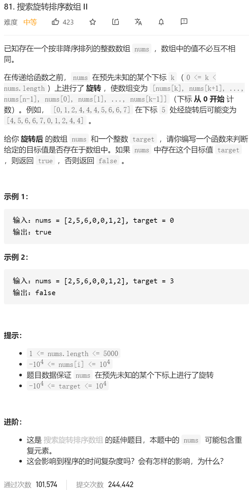
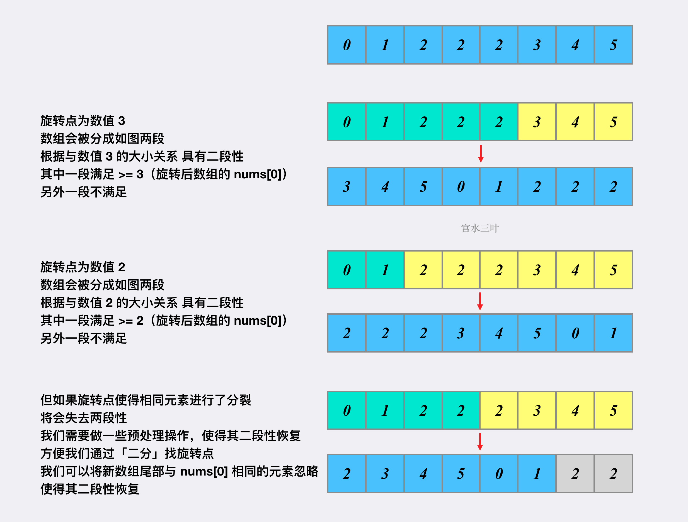

思路：让数组重新恢复二段性，然后再用之前的算法找（就是二分找到分界点，然后左右再二分）

## 二分解法

根据题意，我们知道，所谓的旋转其实就是「将某个下标前面的所有数整体移到后面，使得数组从整体有序变为分段有序」。

但和 33. 搜索旋转排序数组 不同的是，本题元素并不唯一。

这意味着我们无法直接根据与 nums[0]nums[0] 的大小关系，将数组划分为两段，即无法通过「二分」来找到旋转点。

因为「二分」的本质是二段性，并非单调性。只要一段满足某个性质，另外一段不满足某个性质，就可以用「二分」。

举个🌰，我们使用数据 [0,1,2,2,2,3,4,5] 来理解为什么不同的旋转点会导致「二段性丢失」：



java版本

```java
class Solution {
    public boolean search(int[] nums, int t) {
        int n = nums.length;
        int l = 0, r = n - 1;
        // 恢复二段性
        while (l < r && nums[0] == nums[r]) r--;

        // 第一次二分，找旋转点
        while (l < r) {
            int mid = l + r + 1 >> 1;
            if (nums[mid] >= nums[0]) {
                l = mid;
            } else {
                r = mid - 1;
            }
        }
        
        int idx = n;
        if (nums[r] >= nums[0] && r + 1 < n) idx = r + 1;

        // 第二次二分，找目标值
        int ans = find(nums, 0, idx - 1, t);
        if (ans != -1) return true;
        ans = find(nums, idx, n - 1, t);
        return ans != -1;
    }
    int find(int[] nums, int l, int r, int t) {
        while (l < r) {
            int mid = l + r >> 1;
            if (nums[mid] >= t) {
                r = mid;
            } else {
                l = mid + 1;
            }
        }
        return nums[r] == t ? r : -1;
    }
}

作者：AC_OIer
链接：https://leetcode-cn.com/problems/search-in-rotated-sorted-array-ii/solution/gong-shui-san-xie-xiang-jie-wei-he-yuan-xtam4/
来源：力扣（LeetCode）
著作权归作者所有。商业转载请联系作者获得授权，非商业转载请注明出处。
```


我自己的版本

```java
class Solution {
    
   public static int findIndexMin(int nums[],int left,int right)
    {
//        int left=0;
//        int right=nums.length-1;
       
        while (left<right)
        {
             int mid=left+(right-left)/2;
            if(nums[mid]<=nums[right])
            {
                right=mid;
            }else
            {
                left=mid+1;
            }
        }
        return left;
    }

    public static boolean binarySearch(int nums[],int target,int left,int right)
    {
//        int left=0;
//        int right=nums.length-1;
        
        while (left<right)
        {
            int mid=left+(right-left)/2;
            
            // if(nums[mid]==target)
            // {
            //     return true;
            // }
            if(target<=nums[mid])
            {
                right=mid;
            }else
            {
                left=mid+1;
            }
        }

         if(nums[left]==target)
        {
                return true;
        }
        return false;
    }
    public boolean search(int[] nums, int target) {
        int n = nums.length;
        if (n == 0) {
            return false;
        }
        if (n == 1) {
            return nums[0] == target;
        }

        int l = 0, r = n - 1;
        // 恢复二段性
        while (l < r && nums[0] == nums[r]) r--;

        
        int index=findIndexMin(nums,0,r);
        // System.out.println(index);
        
        boolean a=binarySearch(nums,target,0,index-1);
        boolean b=binarySearch(nums,target,index,r);
    
        return a||b;
        // return false;

    }
}
```

