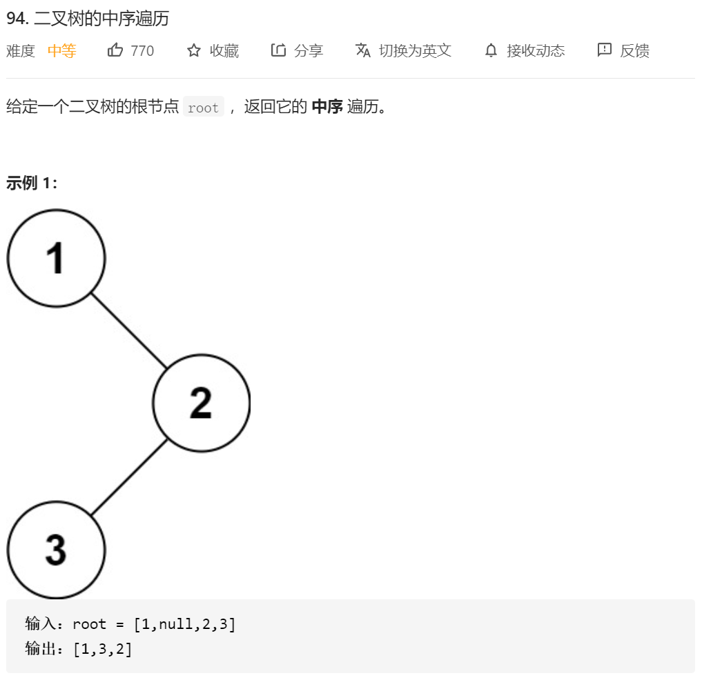
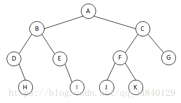
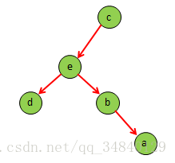
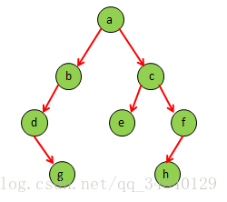

就是很传统的中序遍历，然后这里复习一下二叉树的遍历的相关知识。

## 基础知识

二叉树的遍历主要有三种：

（1）先(根)序遍历（根左右）

（2）中(根)序遍历（左根右）

（3）后(根)序遍历（左右根）



先(根)序遍历（根左右）：A B D H E I C F J K G

中(根)序遍历（左根右） : D H B E I A J F K C G

后(根)序遍历（左右根） : H D I E B J K F G C A

  以后(根)序遍历为例，每次都是先遍历树的左子树，然后再遍历树的右子树，最后再遍历根节点，以此类推，直至遍历完整个树。

  此外，还有一个命题：给定了二叉树的任何一种遍历序列，都无法唯一确定相应的二叉树。但是如果知道了二叉树的中序遍历序列和任意的另一种遍历序列，就可以唯一地确定二叉树。

**例子1：已知二叉树的后序遍历序列是dabec,中序遍历序列是debac,它的前序遍历序列是（cedba）。**

**(1)**中序遍历：debac

后序遍历：dabec

后序遍历序列的最后一个结点是根结点，所以可知c为根结点。

中序遍历序列的根结点在中间，其左边是左子树，右边是右子树。所以从中序遍历序列中可看出，根结点c只有左子树，没有 右子树。

 

**(2)**中序遍历：deba

后序遍历：dabe

后序遍历序列的最后一个结点是根结点，所以可知e为c的左子树的根结点。

中序遍历序列的根结点在中间，其左边是左子树，右边是右子树。所以从中序遍历序列中可看出，根结点e的左子结点是d，右子树是ba。

 

**(3)**中序遍历：ba

后序遍历：ab

由后序遍历序列可知b为e的右子树的根结点。由中序遍历序列中可看出，a为根结点b的右子结点。

树的结构如下：



**例子2：已知二叉树的前序遍历序列是abdgcefh,中序遍历序列是dgbaechf,它的前序遍历序列是（gdbehfca）。**

**(1)**先序遍历：abdgcefh

中序遍历：dgbaechf

先序遍历序列的第一个结点是根结点，所以可知a为根结点。

中序遍历序列的根结点在中间，其左边是左子树，右边是右子树。所以从中序遍历序列中可看出，根结点a的左子树是dgb，右子树是echf。

**a的左子树：**

**(2)**先序遍历：bdg

中序遍历：dgb

先序遍历序列的第一个结点是根结点，所以可知b为a的左子树的根结点。

中序遍历序列的根结点在中间，其左边是左子树，右边是右子树。所以从中序遍历序列中可看出，根结点b的左子树是dg，没有右子树。

**b的左子树：**

**(3)**先序遍历：dg

中序遍历：dg

由先序遍历序列可知d为b的左子树的根结点。

中序遍历序列的根结点在中间，其左边是左子树，右边是右子树。所以从中序遍历序列中可看出，根结点d的右子结点是g。

**a的右子树：**

**(4)**先序遍历：cefh

中序遍历：echf

由先序遍历序列可知c为a的右子树的根结点。

从中序遍历序列中可看出，根结点c的左子结点是e，右子树是hf。

**c的右子树：**

**(5)**先序遍历：fh

中序遍历：hf

由先序遍历序列可知f为c的右子树的根结点。

从中序遍历序列中可看出，根结点f的左子结点是h，没有右子树。

树的结构如下：



## 代码

回归到代码上
其实用递归的话就很明显了

```java
/**
 * Definition for a binary tree node.
 * public class TreeNode {
 *     int val;
 *     TreeNode left;
 *     TreeNode right;
 *     TreeNode() {}
 *     TreeNode(int val) { this.val = val; }
 *     TreeNode(int val, TreeNode left, TreeNode right) {
 *         this.val = val;
 *         this.left = left;
 *         this.right = right;
 *     }
 * }
 */
class Solution {
      public List<Integer> inorderTraversal(TreeNode root) {
        List<Integer> res=new ArrayList<Integer>();
        inorder( root,res);
        return res;
    }
    public void inorder(TreeNode root,List<Integer> res)
    {
        if(root==null)
        {
            return;
        }
        //res.add(root.val);//在这是先序遍历
        inorder(root.left,res);
        res.add(root.val);//在这是中序遍历
        inorder(root.right,res);
         //res.add(root.val);//在这是后序遍历
    }
}
```

今天补充一个非递归的模式吧

## 首先 中序遍历（非递归）

思路：利用一个堆栈，

1.每次先把自己和自己的左子树全部放到堆栈里面去，（while(root！=null|| stack！=empty)） 就循环把自己和自己的左子树放进去 条件 while(root!=null)

2.然后 放完之后，每次从堆栈里面取一个 放进resList，然后root指向右边的子树。

```java
/**
 * Definition for a binary tree node.
 * public class TreeNode {
 *     int val;
 *     TreeNode left;
 *     TreeNode right;
 *     TreeNode() {}
 *     TreeNode(int val) { this.val = val; }
 *     TreeNode(int val, TreeNode left, TreeNode right) {
 *         this.val = val;
 *         this.left = left;
 *         this.right = right;
 *     }
 * }
 */
class Solution {
   public List<Integer> inorderTraversal(TreeNode root) {
        List<Integer> res=new ArrayList<>();
        Deque<TreeNode> stack=new LinkedList<>();

        while (root!=null||!stack.isEmpty())
        {
            while (root!=null)
            {
                stack.push(root);
                root=root.left;
            }

            root=stack.pop();
            res.add(root.val);
            root=root.right;
            // System.out.println();
        }


        return res;

    }
}
```


## 然后就是二叉树的前序遍历（非递归 就是和中序换个位置）

也是一个堆栈，就是我们在push root 之前 直接就把root.val放进我们的res中

```java
class Solution {
    public List<Integer> preorderTraversal(TreeNode root) {
        List<Integer> res = new ArrayList<Integer>();
        if (root == null) {
            return res;
        }

        Deque<TreeNode> stack = new LinkedList<TreeNode>();
        TreeNode node = root;
        while (!stack.isEmpty() || node != null) {
            while (node != null) {
                res.add(node.val);
                stack.push(node);
                node = node.left;
            }
            node = stack.pop();
            node = node.right;
        }
        return res;
    }
}

作者：LeetCode-Solution
链接：https://leetcode-cn.com/problems/binary-tree-preorder-traversal/solution/er-cha-shu-de-qian-xu-bian-li-by-leetcode-solution/
来源：力扣（LeetCode）
著作权归作者所有。商业转载请联系作者获得授权，非商业转载请注明出处。
```


## 然后就是比较复杂的二叉树的后序遍历

后序遍历是 左右中 …… 这个就离谱了……

核心思路：

大条件一致，就是 while(!stack.isEmpty() || root != null)

1.第一步 还是入堆栈，一直往左入入入 入到root != null为止

2.第二步，入完了，取出堆栈顶，判断这个右子树是不是为空（针对左子树最左边的那种情况）**或者** 这个右边的子树被访问过了 那就直接放进res 然后 pre指针指向这个root  root 指针变为空

3. 然后 如果这个root 右子树不为空 那这个root 得先放进堆栈 然后 把右边的那个节点放进堆栈

```java

class Solution {
    public List<Integer> postorderTraversal(TreeNode root) {
        List<Integer> list = new LinkedList<>();
        Stack<TreeNode> stack = new Stack<>();
        // 保存前一个访问的节点，用来确定是否访问过右子
        TreeNode prev = null;
        while(!stack.isEmpty() || root != null){
            // 持续将左子入栈，直到左下末端
            while(root != null){
                stack.push(root);
                root = root.left;
            }
            // 拿出的节点一定是左子访问过的节点
            root = stack.pop();
            // 判断当前栈顶元素右子是否访问过或无右子
            // 即可以直接计入结果的节点
            if(root.right == null || prev == root.right){
                list.add(root.val);
                prev = root;//记录前一节点
                root = null;
            }else if(root.right != null){
                // 右子尚未访问 root重新压回栈中
                stack.push(root);
                // 继续访问右子
                root = root.right;
            }
        }

        return list;


    }
}

作者：wang-mo-ji
链接：https://leetcode-cn.com/problems/binary-tree-postorder-traversal/solution/die-dai-hou-xu-bian-li-by-wang-mo-ji-98ob/
来源：力扣（LeetCode）
著作权归作者所有。商业转载请联系作者获得授权，非商业转载请注明出处。
```

