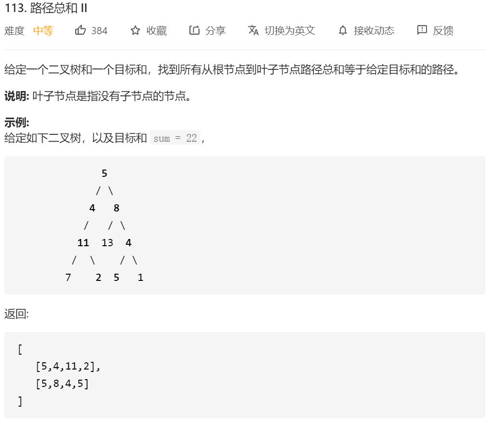

基本思路：和回溯的那些集合的题目一样，用递归的方法来解这一题。

先序遍历，然后访问节点的同时，进行sum=sum+val，path=path.add(node);
然后对该节点访问结束之后，进行sum=sum-val，path=path.remove(node);
中间通过判断sum是否等于题目要求的sum来决定是否将path add 到res中

```java
/**
 * Definition for a binary tree node.
 * public class TreeNode {
 *     int val;
 *     TreeNode left;
 *     TreeNode right;
 *     TreeNode(int x) { val = x; }
 * }
 */
class Solution {
    public List<List<Integer>> pathSum(TreeNode root, int sum) {
        List<List<Integer>> res=new ArrayList<List<Integer>>();
        List<Integer> temp=new ArrayList<Integer>();
        int count=0;
        preorder(root,res,temp,count,sum);
        return res;
    }


    public void preorder(TreeNode root, List<List<Integer>> res,List<Integer> temp,int count,int sum)
    {
         if(root==null)
        {
            return;
        }
//        if(root==null && count==sum)
//        {
//            res.add(new ArrayList<Integer>(temp));
//            return;
//        }

        temp.add(root.val);
        count=count+root.val;
        if(count==sum&&root.left==null&&root.right==null)
        {
            res.add(new ArrayList<Integer>(temp));
           //return; 注意这边不能return 如果return的话会导致缺少这个节点被remove掉的情况 这个节点就一直存在于path中了
        }
        preorder(root.left,res,temp,count,sum);
        preorder(root.right,res,temp,count,sum);
        temp.remove(temp.size()-1);
        count=count-root.val;
    }
}
```

