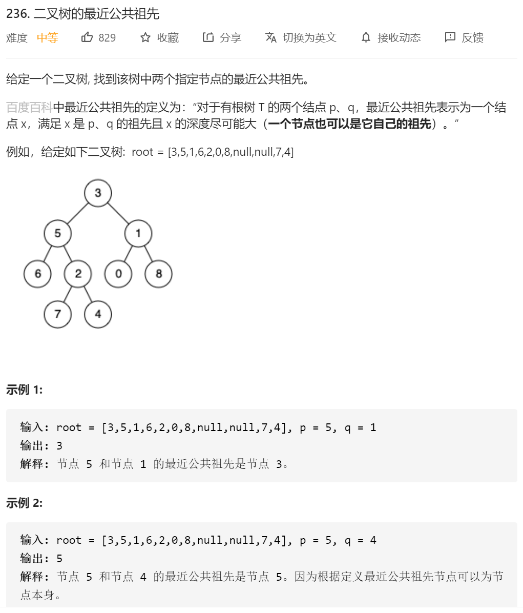
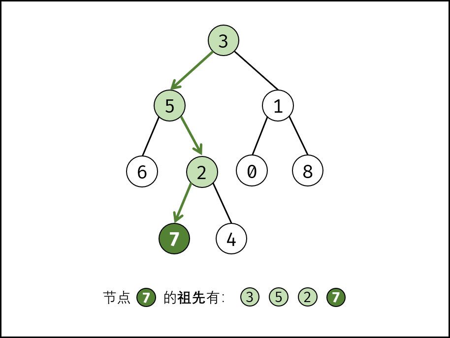
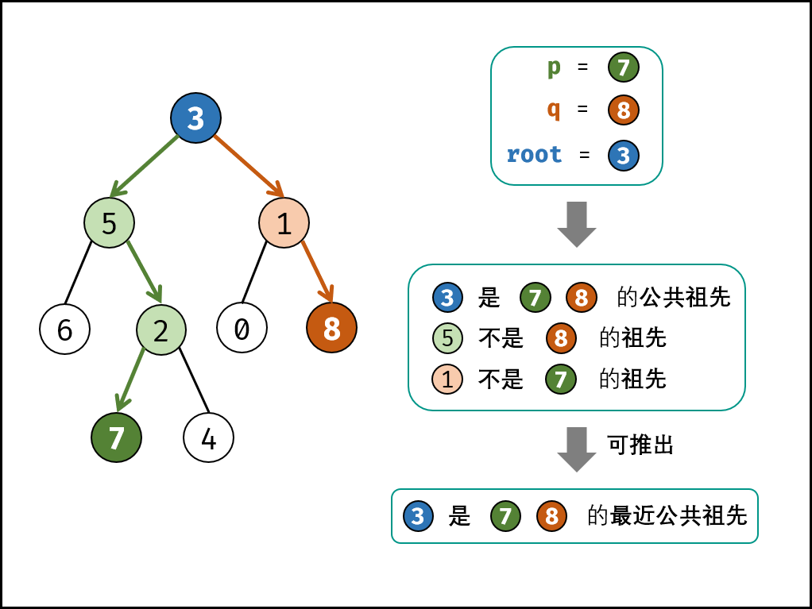

## 方法一：

先序遍历，然后一直往path里面加入访问到的节点，path=path.add(node),然后访问节点的同时，进行判断是否访问到了我需要的节点，如果访问到了，res=res.add(path)。然后对该节点访问结束之后path=path.remove(node);

然后遍历两个节点的path，找到最后一个相同的node就是我们需要的最近公共祖先。

代码：

```java
/**
 * Definition for a binary tree node.
 * public class TreeNode {
 *     int val;
 *     TreeNode left;
 *     TreeNode right;
 *     TreeNode(int x) { val = x; }
 * }
 */
class Solution {
    public TreeNode lowestCommonAncestor(TreeNode root, TreeNode p, TreeNode q) {
         TreeNode res=new TreeNode();
        List<List<TreeNode>> twoPath=new ArrayList<List<TreeNode>>();
        List<TreeNode> tempPath=new ArrayList<TreeNode>();

        preOrder(root,p,q,twoPath,tempPath);
        // System.out.println(twoPath);
        // for(int i=0;i<twoPath.size();i++)
        // {
        //     System.out.println("第"+i+"path:");
        //     for(int j=0;j<twoPath.get(i).size();j++)
        //     {
        //         System.out.println(twoPath.get(i).get(j).val);
        //     }
        // }

        int len;
        if(twoPath.get(0).size()<twoPath.get(1).size())
        {
            len=twoPath.get(0).size();
        }else
        {
            len=twoPath.get(1).size();
        }
        for(int i=0;i<len;i++)
        {
            if(twoPath.get(0).get(i)==twoPath.get(1).get(i))
            {
                res=twoPath.get(0).get(i);
            }
            else
            {
                break;
            }
        }

        return res;
    }

    public void preOrder(TreeNode root, TreeNode p, TreeNode q, List<List<TreeNode>> twoPath, List<TreeNode> tempPath)
    {
        if(root==null)
        {
            return;
        }

        tempPath.add(root);
        if(root==p || root==q)
        {
            twoPath.add(new ArrayList<TreeNode>(tempPath));
        }
        preOrder(root.left,p,q,twoPath,tempPath);
        preOrder(root.right,p,q,twoPath,tempPath);

        tempPath.remove(tempPath.size()-1);
        
    }
}
```

## 方法2：递归解法

作者：jyd
链接：https://leetcode-cn.com/problems/lowest-common-ancestor-of-a-binary-tree/solution/236-er-cha-shu-de-zui-jin-gong-gong-zu-xian-hou-xu/

**祖先的定义：** 若节点 p*p* 在节点 root 的左（右）子树中，或 p = root，则称 root是 p*p* 的祖先。



最近公共祖先的定义： 设节点 root 为节点 p, q 的某公共祖先，若其左子节点 root.left 和右子节点 root.right 都不是 p,q 的公共祖先，则称 root 是 “最近的公共祖先” 。



根据以上定义，若 root是 p, q的 最近公共祖先 ，则只可能为以下情况之一：

p 和 q 在 root 的子树中，且分列root 的 异侧（即分别在左、右子树中）；
p = root ，且 q 在root 的左或右子树中；
q = root，且 p 在 root 的左或右子树中；

考虑通过递归对二叉树进行**后序遍历**（这个 我感觉在代码里面还是先序遍历），当遇到节点 p 或 q 时返回。从底至顶回溯，当节点 p,q 在节点root 的异侧时，节点 root即为最近公共祖先，则向上返回 root 。

递归解析：
**终止条件：**
当越过叶节点，则直接返回 null ；
当 root 等于 p, q ，则直接返回 root ；
**递推工作：**
开启递归左子节点，返回值记为 left ；
开启递归右子节点，返回值记为 right ；
**返回值：** 根据 left 和 right ，可展开为四种情况；
1.当 left和 right 同时为空 ：说明root 的左 / 右子树中都不包含 p,q ，返回 null ；
2.当 left 和 right 同时不为空 ：说明p,q 分列在 root 的 异侧 （分别在 左 / 右子树），因此 root 为最近公共祖先，返回 rootroot ；
3.当 left 为空 ，right 不为空 ：p,q 都不在 root 的左子树中，直接返回right 。具体可分为两种情况：
	3.1p,q 其中一个在 root 的 右子树 中，此时 right 指向p（假设为p ）；
	3.2p,q 两节点都在root 的 右子树 中，此时的 right 指向 最近公共祖先节点 ；
4.当 left 不为空 ，right 为空 ：与情况 3. 同理；
观察发现， 情况 1. 可合并至 3. 和 4. 内，详见文章末尾代码。

```java
class Solution {
    public TreeNode lowestCommonAncestor(TreeNode root, TreeNode p, TreeNode q) {
        if(root == null || root == p || root == q) return root;
        TreeNode left = lowestCommonAncestor(root.left, p, q);
        TreeNode right = lowestCommonAncestor(root.right, p, q);
        if(left == null) return right;
        if(right == null) return left;
        return root;
    }
}


```

展开写

```java
class Solution {
    public TreeNode lowestCommonAncestor(TreeNode root, TreeNode p, TreeNode q) {
        if(root == null || root == p || root == q) return root;
        TreeNode left = lowestCommonAncestor(root.left, p, q);
        TreeNode right = lowestCommonAncestor(root.right, p, q);
        if(left == null && right == null) return null; // 1.
        if(left == null) return right; // 3.
        if(right == null) return left; // 4.
        return root; // 2. if(left != null and right != null)
    }
}


```

