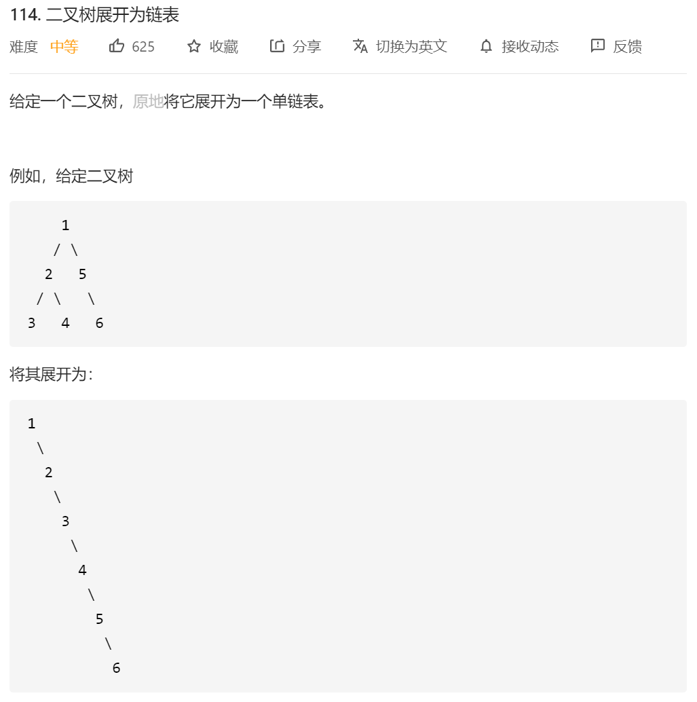

方法1：用一个path临时变量顺序存节点node（地址），然后用一个临时指针存放Root节点。最后全部串起来，题解说这个是原地，那就是吧。

```java

class Solution {
     public void flatten(TreeNode root) {
        List<TreeNode> path=new ArrayList<TreeNode>();

        preorder( root,  path);
        TreeNode temp=root;
        for(int i=1;i<path.size();i++)
        {
            temp.left=null;
            temp.right=path.get(i);
            temp=temp.right;
        }
        
    }

    public void preorder(TreeNode root, List<TreeNode> path)
    {
        if(root==null)
        {
            return;
        }
        path.add(root);//不需要new

        preorder(root.left,path);
        preorder(root.right,path);

    }
}
```

还有就是递归的方法：

```java
    1
   / \
  2   5
 / \   \
3   4   6

//将 1 的左子树插入到右子树的地方
    1
     \
      2         5
     / \         \
    3   4         6        
//将原来的右子树接到左子树的最右边节点
    1
     \
      2          
     / \          
    3   4  
         \
          5
           \
            6
            
 //将 2 的左子树插入到右子树的地方
    1
     \
      2          
       \          
        3       4  
                 \
                  5
                   \
                    6   
        
 //将原来的右子树接到左子树的最右边节点
    1
     \
      2          
       \          
        3      
         \
          4  
           \
            5
             \
              6         
  

```

```
public void flatten(TreeNode root) {
    while (root != null) { 
        //左子树为 null，直接考虑下一个节点
        if (root.left == null) {
            root = root.right;
        } else {
            // 找左子树最右边的节点
            TreeNode pre = root.left;
            while (pre.right != null) {
                pre = pre.right;
            } 
            //将原来的右子树接到左子树的最右边节点
            pre.right = root.right;
            // 将左子树插入到右子树的地方
            root.right = root.left;
            root.left = null;
            // 考虑下一个节点
            root = root.right;
        }
    }
}

```

