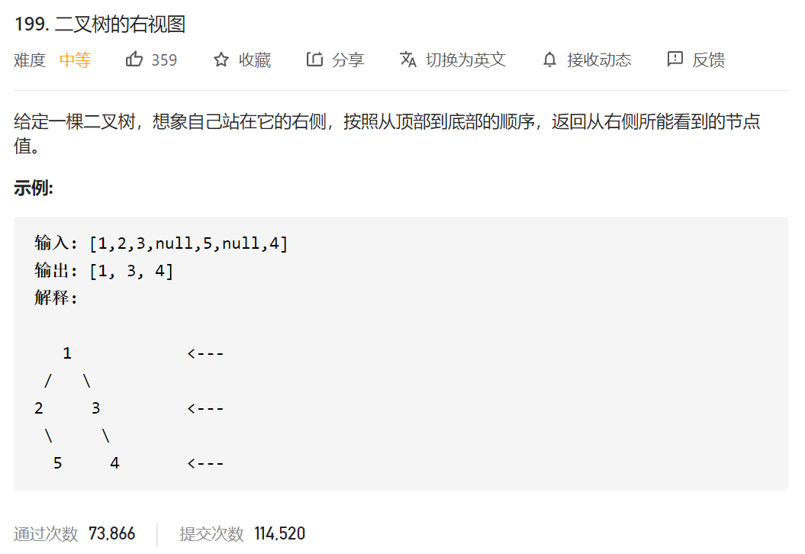

其实就是层序遍历的最后一个，保存最后一个就完事了。

```java
/**
 * Definition for a binary tree node.
 * public class TreeNode {
 *     int val;
 *     TreeNode left;
 *     TreeNode right;
 *     TreeNode(int x) { val = x; }
 * }
 */
class Solution {
    public List<Integer> rightSideView(TreeNode root) { List<List<Integer>> res=new ArrayList<List<Integer>>();
        List<Integer> res2=new ArrayList<Integer>();


        Queue<TreeNode> queueTemp = new LinkedList<>();
        if(root==null)
        {
            return res2;
        }

        queueTemp.offer(root);

        while (!queueTemp.isEmpty())
        {
            List<Integer> pathTemp=new ArrayList<Integer>();
            int queueNum=queueTemp.size();
            for(int i=0;i<queueNum;i++)
            {
                TreeNode temp=queueTemp.poll();
                pathTemp.add(temp.val);
                if (temp.left!=null)
                {
                    queueTemp.offer(temp.left);

                }
                if(temp.right!=null)
                {
                    queueTemp.offer(temp.right);
                }
                if(i==queueNum-1)//就是
                {
                    res2.add(temp.val);
                }

            }
            res.add(new ArrayList<Integer>(pathTemp));
        }

//        for(int i=0;i<res.size();i++)
//        {
//            res2.add(res.get(i).get(res.get(i).size()-1));
//        }


//        Collections.reverse(res);
//        return res;

        return res2;
    }
}
```

