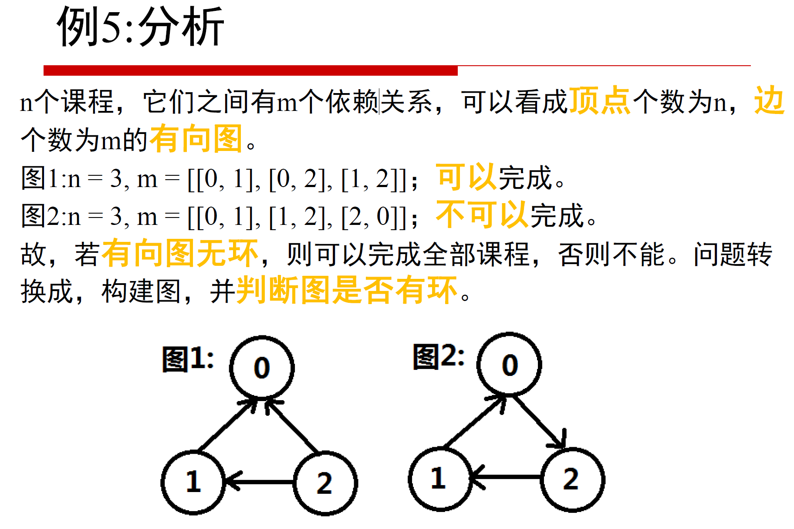

人生的第一题图，其实就是判断图有没有环



有两种算法，深度和广度。这次先记录深度的，第二次刷的时候。复习广度的。

```java
class Solution {
   public boolean canFinish(int numCourses, int[][] prerequisites) {
        boolean res=true;
        //new a graph
        List<List<Integer>> adjacency=new ArrayList<List<Integer>>();
        for(int i=0;i<numCourses;i++)
        {
            adjacency.add(new ArrayList<Integer>());//先构建节点
        }

        //构建访问表
        int flag[]=new int[numCourses];
        //构建邻接表
        for(int cp[]:prerequisites)
        {
            adjacency.get(cp[1]).add(cp[0]);//第cp[0] 门课 需要先学cp【1】 所以是1指向0
        }
        for(int i=0;i<numCourses;i++)
        {
            if(dfs(adjacency,flag,i)==false)
            {
                return false;
            }
        }
        return true;

    }

    public boolean dfs(List<List<Integer>> adjacency,int flag[],int i)
    {
        if(flag[i]==1)
        {
            //说明在本轮 DFS 搜索中节点 i 被第 2 次访问，即 课程安排图有环 ，直接返回 False。
            return false;
        }
        if(flag[i]==-1)
        {
            return true;
            //说明当前访问节点已被其他节点启动的 DFS 访问，无需再重复搜索，直接返回 TrueTrue。
        }
        //如果都不是 将当前访问节点 i 对应 flag[i] 置 11，即标记其被本轮 DFS 访问过；
        flag[i] = 1;
        //递归访问当前节点 i 的所有邻接节点 j，当发现环直接返回 FalseFalse；
        for(Integer j : adjacency.get(i))
        {
            if(dfs(adjacency,flag,j)==false)//如果有环
            {
                return false;
            }
        }
        //如果没环
        flag[i]=-1;//设定这个节点被访问完了
        return true;
    }
}
```

