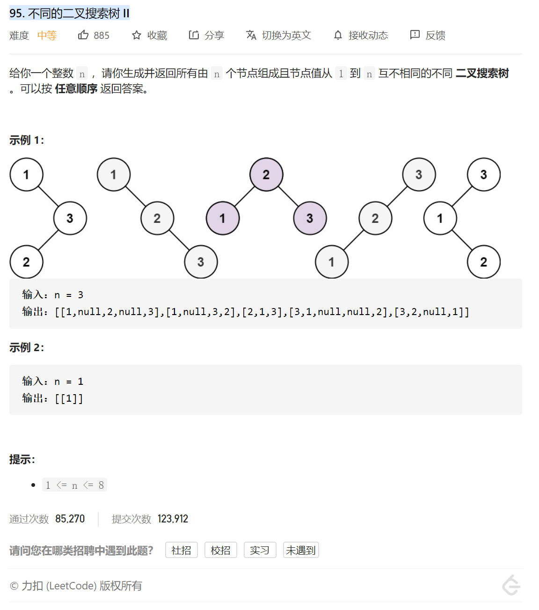

这题的思路，首先我们做了96 知道了 所有节点都是可以作为根节点的。

其实就是拿一个节点作为根节点，然后判断其左边 左子树有几种情况 右边 右子树有几种情况

然后将左子树和右子树 做一个排列组合（双重for循环） 得到所有的结果

```java
class Solution {
    public List<TreeNode> generateTrees(int n) {
        if(n == 0) return new LinkedList<>();
        return generateTrees(1, n);
    }

    //回溯生成所有根节点值在[start, end]间的树
    public List<TreeNode> generateTrees(int start, int end){
        List<TreeNode> allTrees = new LinkedList<>();
        //此时应该生成空节点 终止条件 start>end 因为哪怕等于end 都是可以作为根节点的
        if(start > end){
            allTrees.add(null);
            return allTrees;
        }
        //对每个值为i的根节点，其左右子树的根节点的值分别在[start, i - 1]和[i + 1, end]范围内
        for(int i = start; i <= end; i++){
            //递归生成所有可能的二叉搜索左右子树
            List<TreeNode> leftTrees = generateTrees(start, i - 1);
            List<TreeNode> rightTrees = generateTrees(i + 1, end);
            //枚举所有左右子树的组合生成合法的二叉搜索树
            for(TreeNode left: leftTrees){
                for(TreeNode right: rightTrees){
                    TreeNode root = new TreeNode(i);
                    root.left = left;
                    root.right = right;
                    allTrees.add(root);
                }
            }
        }
        return allTrees;
    }
}

作者：CelesteZephyr
链接：https://leetcode-cn.com/problems/unique-binary-search-trees-ii/solution/95-bu-tong-de-er-cha-sou-suo-shu-iihui-s-yrwe/
来源：力扣（LeetCode）
著作权归作者所有。商业转载请联系作者获得授权，非商业转载请注明出处。
```

自己的代码：

```java
/**
 * Definition for a binary tree node.
 * public class TreeNode {
 *     int val;
 *     TreeNode left;
 *     TreeNode right;
 *     TreeNode() {}
 *     TreeNode(int val) { this.val = val; }
 *     TreeNode(int val, TreeNode left, TreeNode right) {
 *         this.val = val;
 *         this.left = left;
 *         this.right = right;
 *     }
 * }
 */
class Solution {
   public List<TreeNode> generateTrees(int n) {
        if(n==0){
            return new ArrayList<>();
        }
        List<TreeNode> allTree=new ArrayList<>();

        return dfs(1, n);
    }


    public List<TreeNode>  dfs(int begin,int end)
    {
        List<TreeNode> allTree=new ArrayList<>();
        if(begin>end)
        {
            //终止条件 就是左边比右边大的时候 直接插null
            allTree.add(null);
            return allTree;
        }

        for (int i=begin;i<=end;i++)
        {
            List<TreeNode> leftTree=dfs(begin,i-1);//因为i 是根节点
            List<TreeNode> rightTree=dfs(i+1,end);//因为i 是根节点

            for (TreeNode leftTreeNode : leftTree) {//排列组合生成左右子树
                for (TreeNode rightTreeNode : rightTree) {
                    TreeNode root= new TreeNode(i);
                    root.left=leftTreeNode;
                    root.right=rightTreeNode;
                    allTree.add(root);
                }
            }

        }

        return allTree;
    }
}
```

