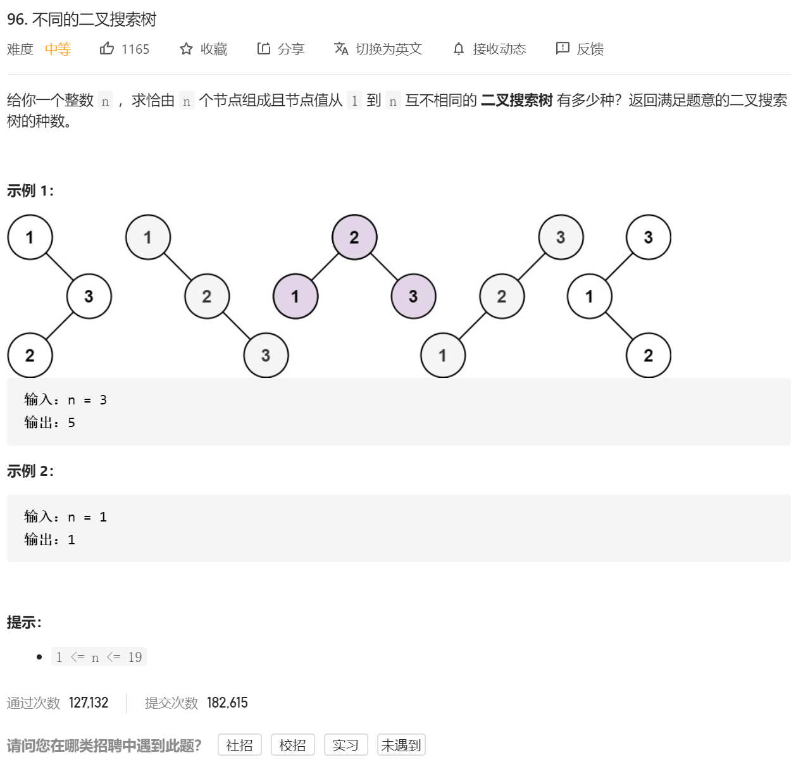
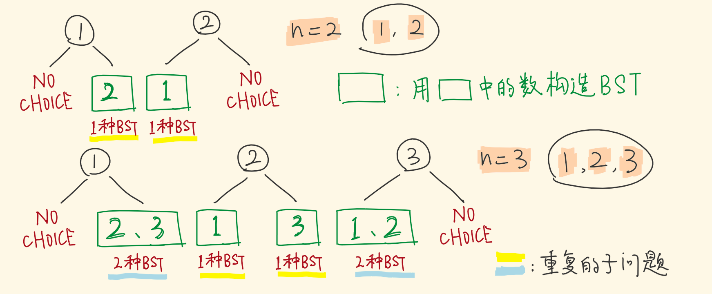
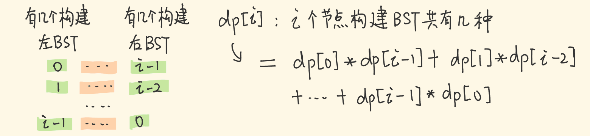
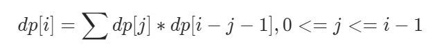

思路：https://leetcode-cn.com/problems/unique-binary-search-trees/solution/shou-hua-tu-jie-san-chong-xie-fa-dp-di-gui-ji-yi-h/

- 如果整数 1 - n 中的 k 作为根节点值，则 1 - k-1 会去构建左子树，k+1 - n 会去构建右子树。
- 左子树出来的形态有 a 种，右子树出来的形态有 b 种，则整个树的形态有 a * b 种。

- 以 k为根节点的 BST 种类数 = 左子树 BST种类数 * 右子树 BST种类数

问题变成：不同的 k之下，等号右边的乘积，进行累加。

#### 定义 DP 子问题



- 用 2、3 构建，和用 1、2 构建，出来的种类数是一样的，因为参与构建的个数一样。

- 再比如 2，3，4 和 1，2，3 都是连着的三个数，构建出的 *B**S**T* 的种类数相同，属于重复的子问题。

- 定义 `dp[i]` ：用连着的 `i` 个数，所构建出的 *B**S**T* 种类数

#### 状态转移方程

- 用 *i* 个节点构建 *B**S**T*，除去根节点，剩 *i*−1 个节点构建左、右子树，左子树分配 0个，则右子树分配到 *i*−1 个……以此类推。



左子树用掉 `j` 个，则右子树用掉 `i-j-1` 个，能构建出 `dp[j] * dp[i-j-1]` 种不同的BST。



#### base case

- 当*n*=0 时，没有数字，只能形成一种 B**S**T* ：空树。

- 当 n*=1 时，只有一个数字，只能形成一种 B**S**T* ：单个节点。

代码：

```java
class Solution {
    public int numTrees(int n) {
         int res=0;
        int dp[]=new int[n+1];
        dp[0]=1;
        dp[1]=1;

        for(int i=2;i<n+1;i++)//第一层循环训话循环所有的n
        {
            for(int j=0;j<i;j++)//第二层循环循环每一层n的所有情况
            {
                dp[i]=dp[i]+dp[j]*dp[i-1-j];
            }
        }
        
        return dp[n];

    }
}
```

