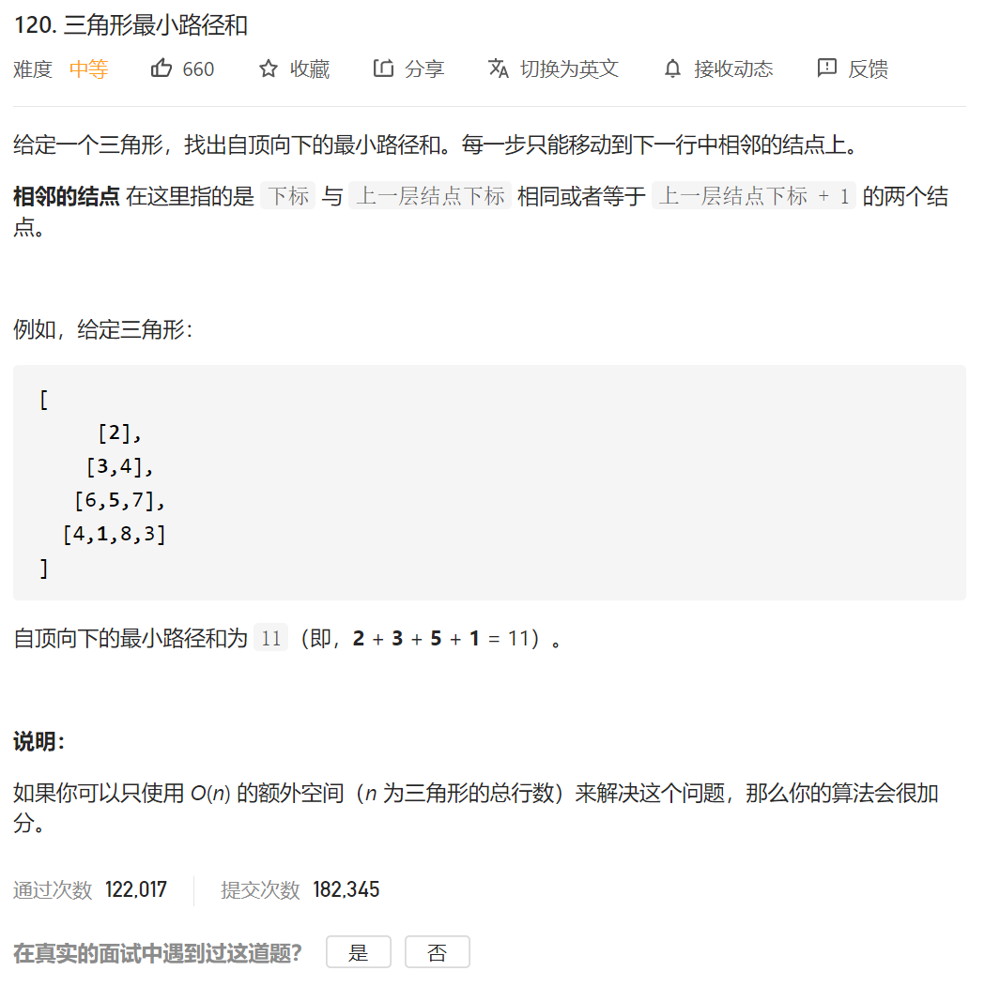

自己的方法：自顶向下的方法

1.定义状态：dp[i] [j] 到达点 i j 所需要的最短路径 

2. 定义状态转移方程 ：dp[i] [j] =Math.min{dp[i-1] [j-1],dp[i] [j-1]}+nums[i] [j]

3.定义初始状态 ，也就是顶点 还有就是最边上的两边的点的值只能由上一个dp[i] [j-1] 决定

结果就是再最后一层里面找最小的

我的代码：

```java
class Solution {
    public int minimumTotal(List<List<Integer>> triangle) {
           int count=0;
        //层数
        int n=triangle.size();
        int dp[][]=new int[n+1][n+1];

        dp[0][0]=triangle.get(0).get(0);
        if(triangle.size()==1)
        {
            return dp[0][0];
        }
        for(int i=1;i<n;i++)//最左边 和最右边 是固定的
        {//遍历每一层
            //只要是第一个或者最后一个数字 就直接=上一层的第一个/最后一个数字 + 这层数值的value  //坑点1 这个点只能和最相邻的两个数
            dp[i][0]=dp[i-1][0]+triangle.get(i).get(0);
            dp[i][triangle.get(i).size()-1]=dp[i-1][triangle.get(i-1).size()-1]+triangle.get(i).get(triangle.get(i).size()-1);
        }
        //状态转移方程 dp[n][m]=min(dp[n-1][m],dp[n-1][m-1])+value[m]

        //  for(int i=0;i<dp.length;i++)
        // {
        //     for(int j=0;j<dp[0].length;j++)
        //     {
        //         System.out.println(dp[i][j]);
        //     }
        // }

        for(int i=1;i<n;i++)
        {
            for(int j=1;j<triangle.get(i).size()-1;j++)
            {
                // if(j!=0||j!=triangle.get(i).size()-1)
                dp[i][j]=Math.min(dp[i-1][j],dp[i-1][j-1])+triangle.get(i).get(j);
            }
        }
        // //遍历最后一层找到最小值
        // for(int i=0;i<dp.length;i++)
        // {
        //     for(int j=0;j<dp[0].length;j++)
        //     {
        //         System.out.println(dp[i][j]);
        //     }
        //     System.out.println("________________________");
        // }

        int min=Integer.MAX_VALUE;

        int length=triangle.get(triangle.size()-1).size();
        for(int i=0;i<length;i++)
        {
            if(dp[n-1][i]<min)
            {
                min=dp[n-1][i];
            }
        }

        return min;


    }
}
```

自底向上的办法：

```java
class Solution {
    public int minimumTotal(List<List<Integer>> triangle) {
        int n = triangle.size();
        // dp[i][j] 表示从点 (i, j) 到底边的最小路径和。
        int[][] dp = new int[n + 1][n + 1];
        // 从三角形的最后一行开始递推。
        for (int i = n - 1; i >= 0; i--) {
            for (int j = 0; j <= i; j++) {
                dp[i][j] = Math.min(dp[i + 1][j], dp[i + 1][j + 1]) + triangle.get(i).get(j);
            }
        }
        return dp[0][0];
    }
}

作者：sweetiee
链接：https://leetcode-cn.com/problems/triangle/solution/di-gui-ji-yi-hua-dp-bi-xu-miao-dong-by-sweetiee/
来源：力扣（LeetCode）
著作权归作者所有。商业转载请联系作者获得授权，非商业转载请注明出处。
```

