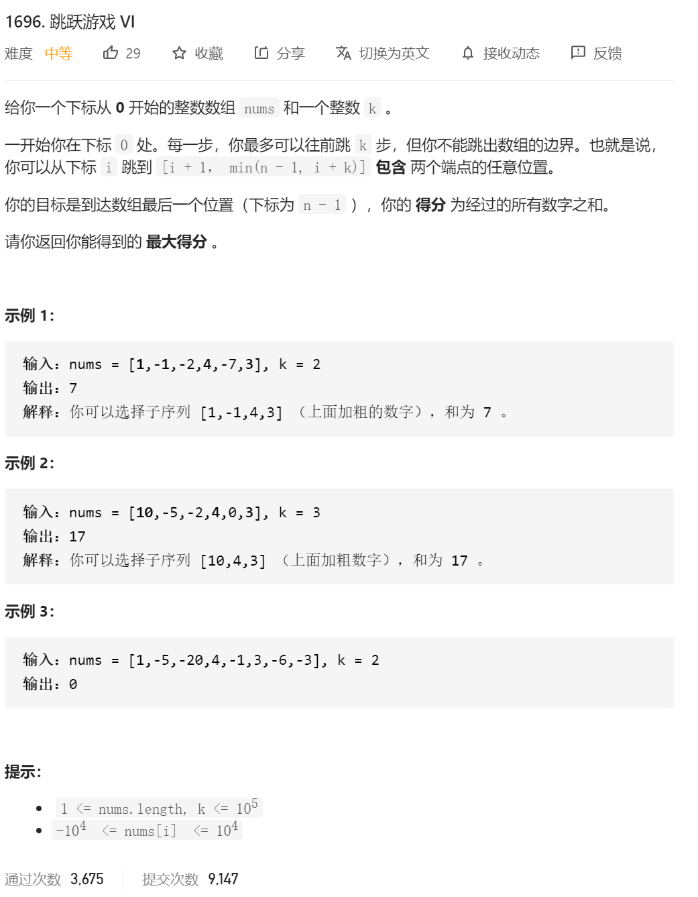
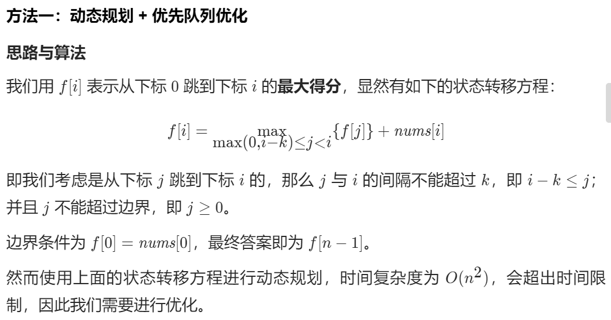

//状态方程定义 ： dp[i] 经过n步 到i点的最大的值       

 // dp[i]=max{dp[j]}+num[i]  max(0,i-k)<=j<=i-1;

这个时候的代码：

```java
class Solution {
    public int maxResult(int[] nums, int k) {
        int dp[]=new int[nums.length+1];

        //状态方程定义 ： dp[i] 经过n步 到i点的最大的值
        // dp[i]=max{dp[j]}+num[i]  max(0,i-k)<=j<=i-1;
        if(nums.length==1)
        {
            return nums[0];
        }


        //初始化
        dp[0]=nums[0];

        for(int i=1;i<nums.length;i++)
        {
            dp[i]=Integer.MIN_VALUE;
            for(int j=Math.max(0,i-k);j<=i-1;j++)
            {
                int tempSum=dp[j]+nums[i];
                if(tempSum>dp[i])
                {
                    dp[i]=tempSum;
                }
            }
        }
        return dp[nums.length-1];

    }
}
```

会超时的！



由于我们要最大化 f[j]*f*[*j*]，因此我们可以使用优先队列（堆）维护所有的 (f[j], j)(*f*[*j*],*j*) 二元组，这样优先队列的堆顶元素就是我们的最优转移。同时需要注意的是，对于当前的*i*，优先队列中的最大值的 j*j* 可能已经不满足 max(0,i-k)<=j<i的限制，并且**随着*****i\* 的增加**，原本不满足限制的 j*j* 仍然是不满足限制的。因此一旦堆顶元素不满足限制了，我们就可以把它「永久」从堆中移除。

别人的代码：

```java
public int maxResult(int[] nums, int k) {
        int len = nums.length;
        Queue<int[]> queue = new PriorityQueue<>((o1, o2) -> o2[0] - o1[0]);
        queue.offer(new int[]{nums[0], 0});
        int res = nums[0];
        for (int i = 1; i < len; i++) {
            while (i - queue.peek()[1] > k){
                queue.poll();
            }
            res = queue.peek()[0] + nums[i];
            queue.offer(new int[]{res, i});
        }
        return res;
    }
```

自己的代码：

```java
class Solution {
    public int maxResult(int[] nums, int k) {
        int n = nums.length;
        int[] dp = new int[n];
        dp[0] = nums[0];
        //这次使用优先级队列
        //状态转移方程 dp[i]=max{dp[i-1],dp[i-2],...,dp[i-k]}+nums[i];

        Queue<int []> maxHeap=new PriorityQueue<>(new Comparator<int[]>() {//大顶二维堆
            @Override
            public int compare(int[] o1, int[] o2) {
                if(o1[0]<o2[0])//这样就不容易出现越界的情况
                {
                    return 1;
                }
                else
                {
                    return -1;
                }
            }
        });

        maxHeap.offer(new int[]{dp[0],0});


        for (int i = 1; i < n; i++) {
            //首先要维护这个堆 只有前i 的前k个的最大
            while (!maxHeap.isEmpty())
            {
                if((maxHeap.peek()[1]<(i-k)))//如果坐标不满足要求了 永久出队
                {
                    maxHeap.poll();
                }else
                {
                    break;
                }
            }

            dp[i]=maxHeap.peek()[0]+nums[i];//这里加上了i 到i的时候 我们最大会是多少
            //维护大顶堆
            maxHeap.offer(new int[]{dp[i],i});

//
        }

        return dp[nums.length-1];

    }
}
```

