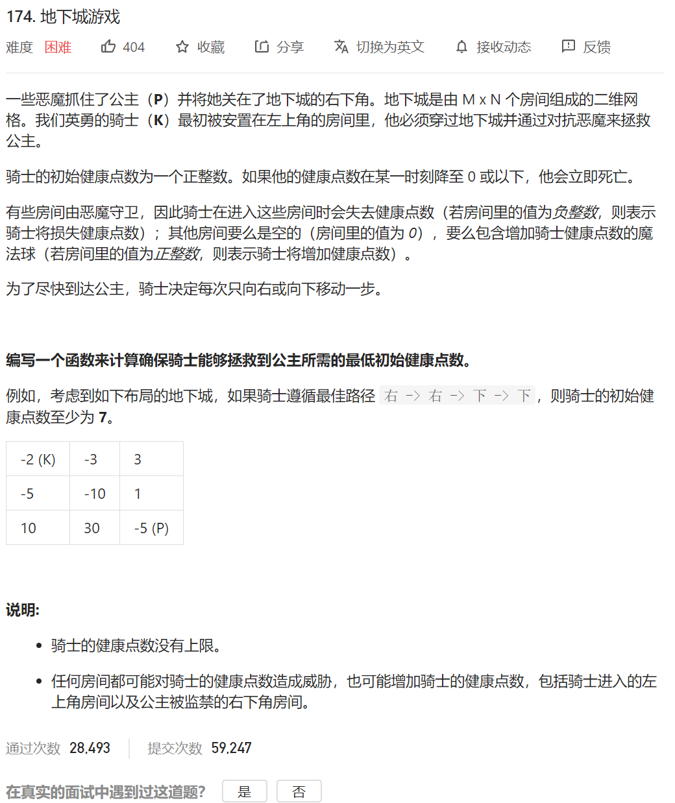

这题需要我们求的是最开始需要的最低的血量值，那我们可以想到，最开始的血量值，是从最后的血量值**逆推回来**的，所以，我们定义状态为：

dp[i] [j]=到达坐标点i j时，能保证最后的血量至少为1  所需要的最少的血量

状态转移方程

dp[i] [j]= math.min(dp[i+1] [j],dp[j+1] [i])-dp[i] [j]

如果math.min(dp[i+1] [j],dp[j+1] [i])-dp[i] [j]<1 说明这个点 的血包很足，我在负血的状态下都能满足>1,但是，我们不能到负血，所以这个点我们最少需要的血至少为1 

所以 加一步：

dp[i] [j]= math.min(dp[i+1] [j],dp[j+1] [i])-dp[i] [j]

dp[i] [j]= math.max(1,dp[i] [j])

初始状态定义：

dp[dungeon.length-1] [dungeon[0].length-1]=Math.max(1-dungeon[dungeon.length-1] [dungeon[0].length-1],1);

代码：

```java
class Solution {
    public int calculateMinimumHP(int[][] dungeon) {
         int dp[][]=new int[dungeon.length][dungeon[0].length];
        //状态方程的定义  dp[i][j] 从dp[i][j]出发 到最终点的 需要的最少的血量
        //dp[i][j]=min dp[i-1][j] ,dp[i][j-1]
        

        //初始化
        dp[dungeon.length-1][dungeon[0].length-1]=Math.max(1-dungeon[dungeon.length-1][dungeon[0].length-1],1);
//        初始状态 到最后一步的时候 我们需要有1-dungeon[dungeon.length-1][dungeon[0].length-1] 这么多的血量
        //如果最后一个值是大于0的 那只需要保证 dp[last][last]=1就可以了
        //纵向初始化 因为这些地方只能是下面或者右边 递推回去的 所以可以直接初始化
        for(int i=dungeon.length-2;i>=0;i--)
        {
//            dp[i][dungeon[0].length-1]=Math.max(1-dungeon[i][dungeon[0].length-1],dp[i+1][dungeon[0].length-1]-dungeon[i][dungeon[0].length-1]);
//            dp[i][dungeon[0].length-1]=Math.max(1,dp[i][dungeon[0].length-1]);

            dp[i][dungeon[0].length-1]=Math.max(1,dp[i+1][dungeon[0].length-1]-dungeon[i][dungeon[0].length-1]);//由于我前面的数都是大于1的所以没必要1-了 肯定是大于=1-的

        }
        //横向初始化
        for(int i=dungeon[0].length-2;i>=0;i--)
        {
//            dp[dungeon.length-1][i]=Math.max(1-dungeon[dungeon.length-1][i],);
            dp[dungeon.length-1][i]=Math.max(1,dp[dungeon.length-1][i+1]-dungeon[dungeon.length-1][i]);//如果出现负数 直接设定为1
        }

        //然后开始递推
        for(int i=dungeon.length-2;i>=0;i--)
        {
            for(int j=dungeon[0].length-2;j>=0;j--)
            {
                dp[i][j]=Math.min(dp[i+1][j],dp[i][j+1])-dungeon[i][j];
                dp[i][j]=Math.max(1,dp[i][j]);

            }
        }
        return dp[0][0];


    }
}
```

