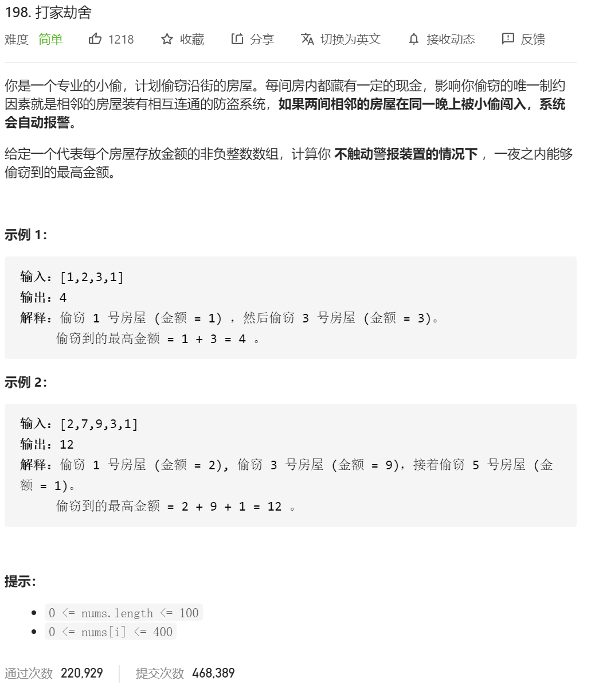

定义状态量：dp[i] = 到坐标点i 能抢到的最多的钱

定义状态转移方程 ：dp[i]=math.max( dp[i-2]+nums[i],dp[i-1])  获取这个点的钱 或者不获取这个点的钱

定义初始化状态： dp[0]=nums[0] dp[1]=math.max(nums[0],nums[1])

```java
class Solution {
    public int rob(int[] nums) {
         int dp[]=new int[nums.length+1];
       
        //定dp[i] 到i点能获得的最大的值
        // dp[i]=max{dp[i-2]+nums[i] ,dp[i-1]}
        if(nums.length==0)//坑点 1  注意没有数的时候
        {
            return 0;
        }
        dp[0]=nums[0];
        if(nums.length==1)
        {
            return dp[0];
        }
        dp[1]=Math.max(nums[1],nums[0]);
        if(nums.length==2)
        {
            return Math.max(dp[0],dp[1]);
        }


        for(int i=2;i< nums.length;i++)
        {

            dp[i]=Math.max(dp[i-2]+nums[i],dp[i-1]);
        }

        return dp[nums.length-1];
    }
}
```