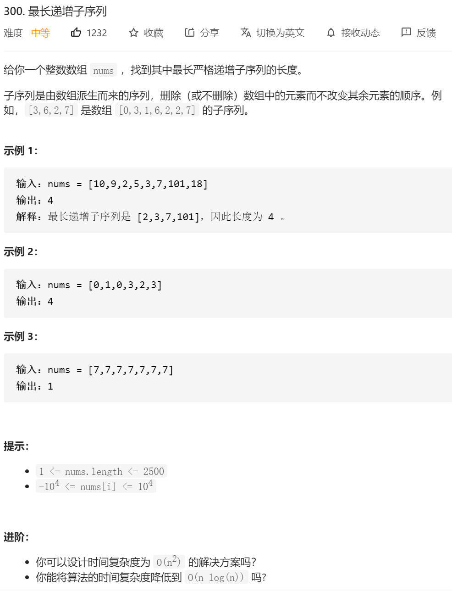
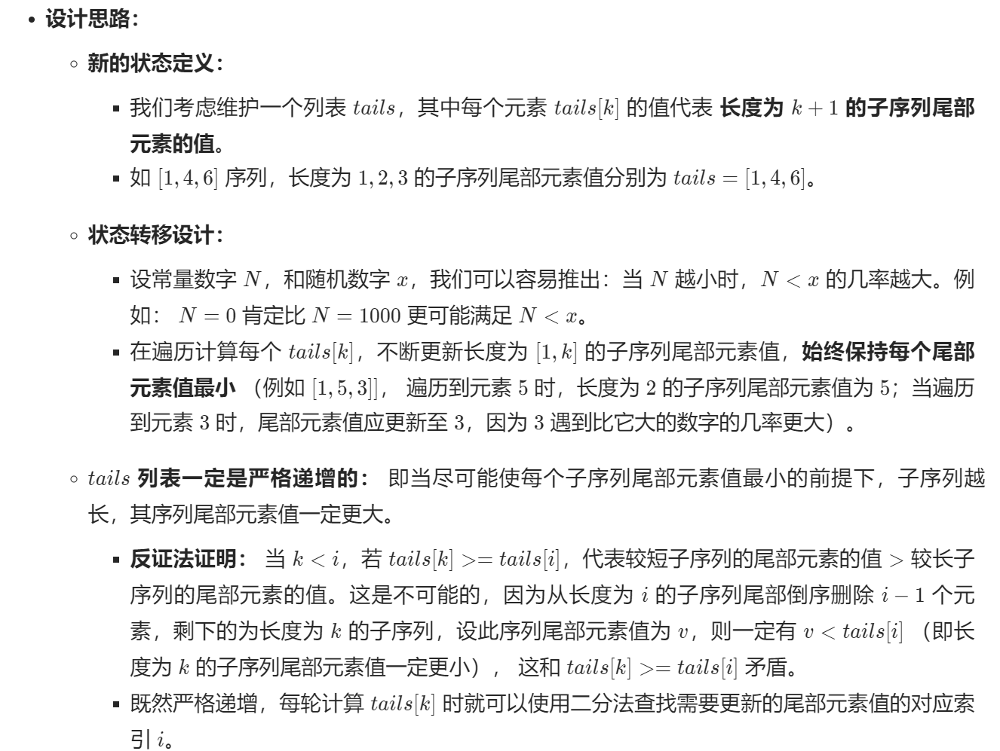
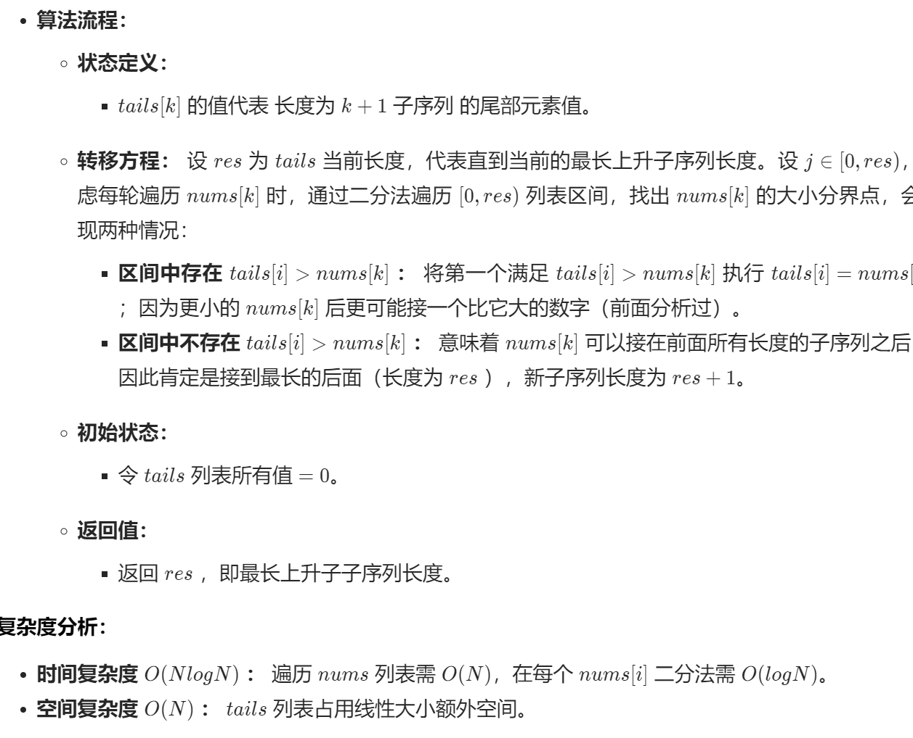

思路1 ：

1.定义dp[i]状态 代表了以nums[i]为结尾的（也就是必须包含n）的最长子序列的长度

2.定义状态该转移方程   //dp[n]= max{if(num[0->n-1]<num[n])}+1  如果不存在小于nums[n]的直接就是1

3.定义初始状态  dp[0]=1;//以坐标0 结尾的必定只有一个数字 就是他本身

```java
class Solution {
    public int lengthOfLIS(int[] nums) {
        int res=-1;
        // dp[n] 代表了以nums[n]为结尾的（也就是必须包含n）的最长子序列的长度
        //dp[n]= max{if(num[0->n-1]<num[n])}+1  如果不存在小于nums[n]的直接就是1
        int dp[]=new int[nums.length+1];
        dp[0]=1;//以坐标0 结尾的必定只有一个数字 就是他本身

        for(int i=1;i<nums.length;i++)
        {
            dp[i]=1;
                for(int j=0;j<=i-1;j++)
                {
                    if(nums[j]<nums[i])
                    {
                        int temp=dp[j]+1;
                        if(temp> dp[i])
                        {
                            dp[i]=temp;
                        }
                    }
                }
        }

        for(int i=0;i<nums.length;i++)
        {
            // System.out.println(dp[i]);
            if(dp[i]>res)
            {
                res=dp[i];
            }
        }
        
        return res;

    }
}
```

思路2：

https://leetcode-cn.com/problems/longest-increasing-subsequence/solution/zui-chang-shang-sheng-zi-xu-lie-dong-tai-gui-hua-2/

https://leetcode-cn.com/problems/longest-increasing-subsequence/solution/dong-tai-gui-hua-er-fen-cha-zhao-tan-xin-suan-fa-p/



```
//dp[i] 状态定义为 长度为i+1的时候 dp[i]是这个长度为i+1的序列的最小值
```

动态规划+二分查找
很具小巧思。新建数组 cell，用于保存最长上升子序列。

对原序列进行遍历，将每位元素二分插入 cell 中。

如果 cell 中元素都比它小，将它插到最后
否则，用它**覆盖掉**比它大的元素中最小的那个。
总之，思想就是让 cell 中存储比较小的元素。这样，cell 未必是真实的最长上升子序列，但长度是对的。

```java
class Solution {
    public int lengthOfLIS(int[] nums) {
         //使用 nlogn的方法
        if(nums.length<=1)
        {
            return nums.length;
        }

        int dp[]=new int[nums.length+1];
        //dp[i] 状态定义为 长度为i+1的时候 dp[i]是这个长度为i+1的序列的最小值
        /*
        以输入序列 [0, 8, 4, 12, 2][0,8,4,12,2] 为例：
        第一步插入 0，d = [0]；
        第二步插入 8，d = [0, 8]；
        第三步插入 4，d = [0, 4]；
        第四步插入 12，d = [0, 4, 12]；
        第五步插入 2，d = [0, 2, 12]。//注意这一步 2是覆盖掉4 而不是连着12一起pop了 所以这边不能用双端队列
        * */

        dp[0]=nums[0];//初始化定义 长度为0+1 的序列 最小的那个值为 nums[0]
        int end=0;
        for(int i=1;i<nums.length;i++)
        {
            // System.out.println(nums[i]);
            if(dp[end]<nums[i])
            {//如果长度为end +1 的最后一个数小于 nums[i]，直接长度++，然后将这个nums[i]的值赋值给dp[++end]
                //长度++；
                end++;
                dp[end]=nums[i];
                //  for(int ii=0;ii<=end;ii++)
                // {
                //     System.out.print(dp[ii]);

                // }
                // System.out.println();
            }else
            {
                //进行二分查找 直至找到比nums[i] 大的最小值 将其替换
                int left=0;
                int right=end;
                while (left<right)
                {
                    int mid=left+(right-left)/2;
                    if(dp[mid]>=nums[i])
                    {
                        right=mid;
                    }
                    else {
                        left=mid+1;
                    }
                }
                dp[right]=nums[i];
                // System.out.println("len="+end);
                // for(int ii=0;ii<=right;ii++)
                // {
                //     System.out.print(dp[ii]);

                // }
                // System.out.println();
            }
        }
        return end+1;
        // return end;


    }
}
```

