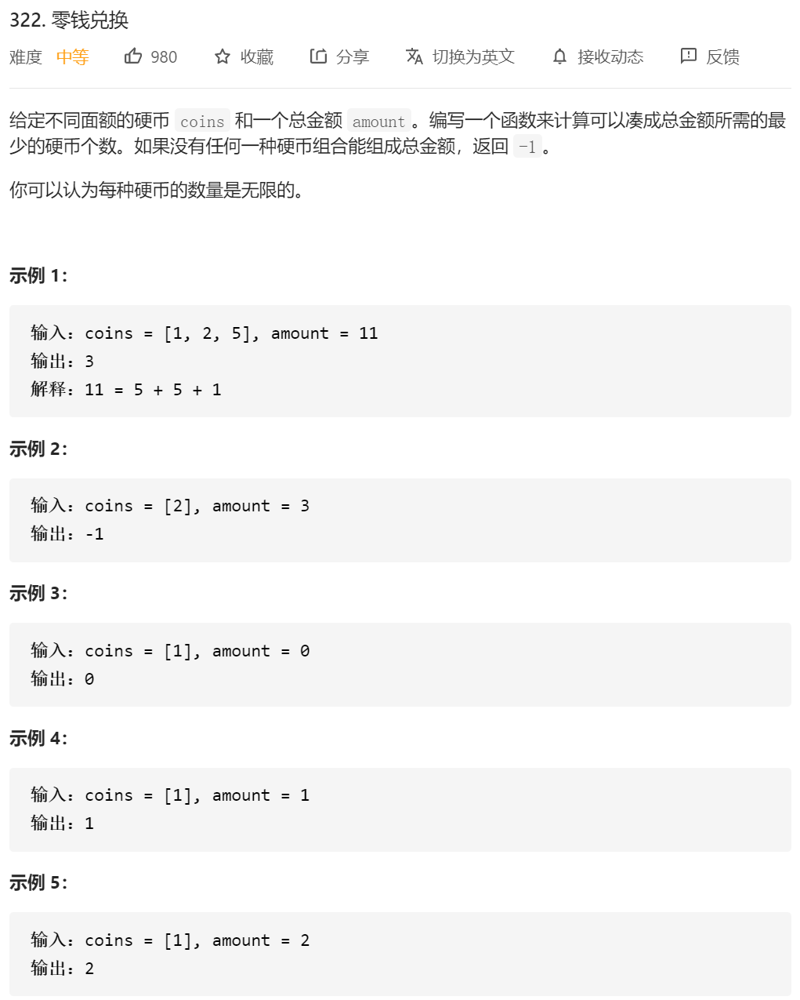

老三样 定义三步

1.定义dp[i],当我们有总金额i的时候，最少的硬币个数

2.定义状态转移方程 dp[i]=  min{dp[i-coin[0]],dp[i-coin[1]],...,dp[i-coin[coin.length-1]]}+1(for 0->coins.length  if(i>cins[j])  ) 注意要有个条件就是 i**>=**coin[j] 且 coin[j]存在

3.dp[0]=0

```java
class Solution {
    public int coinChange(int[] coins, int amount) {
        int dp[]=new int[amount+1];
        dp[0]=0;
        // if(amount==0)//坑点1 这边要注意 当我不需要钱的情况
        // {
        //     return 0;
        // }
       
        for(int i=1;i<=amount;i++)
        {
            if(dp[i]==0)
            {
                dp[i]=Integer.MAX_VALUE;
            }

            for(int j=0;j<coins.length;j++)
            {
                if(i>=coins[j]&&dp[i-coins[j]]!=Integer.MAX_VALUE)//坑点注意这边的i是大于等于
                {
                    dp[i]=Math.min(dp[i],dp[i-coins[j]]+1);
                }
                
            }
        }

        if(dp[amount]==Integer.MAX_VALUE)
        {
            return -1;
        }


        return dp[amount];

    }
}
```

