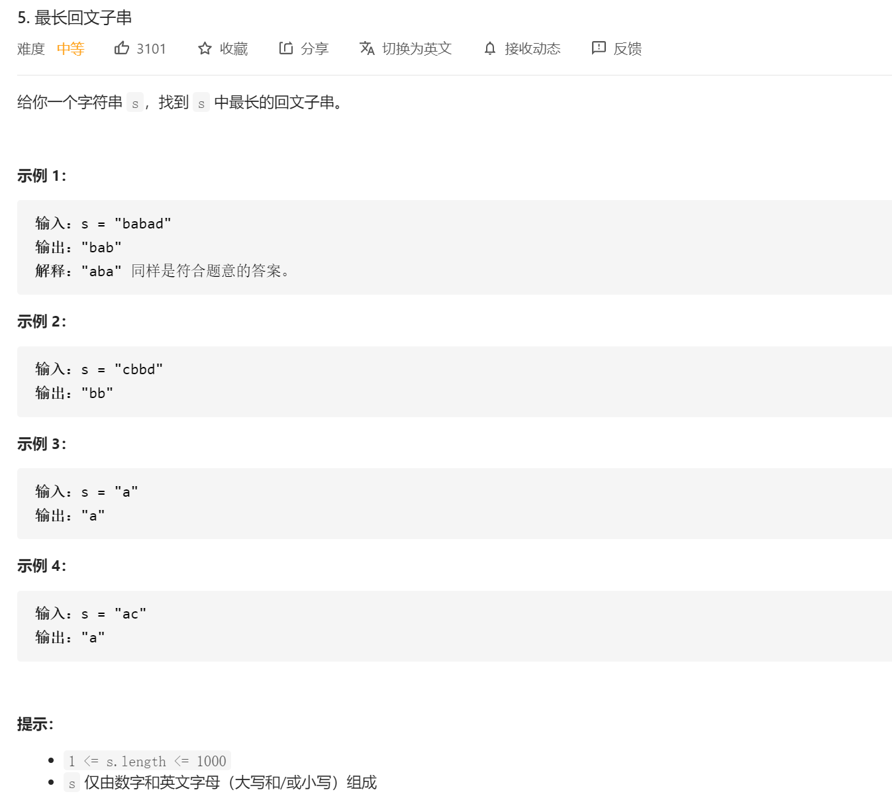
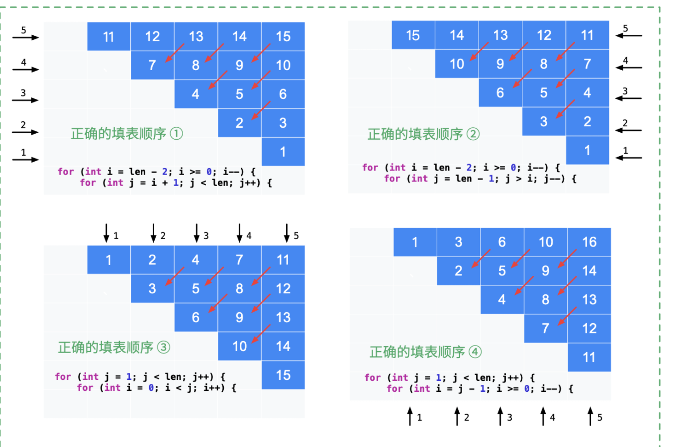

最长，最大最什么什么，这种我们先反应就是dp动态规划 子问题到原问题。

这边是最长的回文串，那我们就得根据回文串的定义来定义状态。回文串就是头尾相等，然后两边到中心都相等。

参考答案：https://leetcode-cn.com/problems/longest-palindromic-substring/solution/zhong-xin-kuo-san-dong-tai-gui-hua-by-liweiwei1419/


#### 第 1 步：定义状态

`dp[i][j]` 表示子串 `s[i..j]` 是否为回文子串，这里子串 `s[i..j]` 定义为左闭右闭区间，可以取到 `s[i]` 和 `s[j]`。

#### 第 2 步：思考状态转移方程

在这一步分类讨论（根据头尾字符是否相等），根据上面的分析得到：

```
dp[i][j] = (s[i] == s[j]) and dp[i + 1][j - 1]
```

说明：

「动态规划」事实上是在填一张二维表格，由于构成子串，因此 `i` 和 `j` 的关系是 `i <= j` ，因此，只需要填这张表格对角线以上的部分。

看到 `dp[i + 1][j - 1]` 就得考虑边界情况。

边界条件是：表达式 [i + 1, j - 1] 不构成区间，即长度严格小于 2，即 j - 1 - (i + 1) + 1 < 2 ，整理得 j - i < 3。

这个结论很显然：j - i < 3 等价于 j - i + 1 < 4，即当子串 s[i..j] 的长度等于 2 或者等于 3 的时候，其实只需要判断一下头尾两个字符是否相等就可以直接下结论了。

- 如果子串 `s[i + 1..j - 1]` 只有 1 个字符，即去掉两头，剩下中间部分只有 11 个字符，显然是回文；

- 如果子串 `s[i + 1..j - 1]` 为空串，那么子串 `s[i, j]` 一定是回文子串。

因此，在 `s[i] == s[j]` 成立和 `j - i < 3` 的前提下，直接可以下结论，`dp[i][j] = true`，否则才执行状态转移。

#### 第 4 步：考虑输出

只要一得到 dp [i] [j] = true，就记录子串的长度和起始位置，没有必要截取，这是因为截取字符串也要消耗性能，记录此时的回文子串的「起始位置」和「回文长度」即可。

#### 第 5 步：考虑优化空间

因为在填表的过程中，只参考了左下方的数值。事实上可以优化，但是增加了代码编写和理解的难度，丢失可读和可解释性。在这里不优化空间。

注意事项：总是先得到小子串的回文判定，然后大子串才能参考小子串的判断结果，即填表顺序很重要。

大家能够可以自己动手，画一下表格，相信会对「动态规划」作为一种「表格法」有一个更好的理解。



```java
class Solution {
    public String longestPalindrome(String s) {
         //定义状态： dp[i][j] s[i]->s[j] （包括了i和j）是否是回文串

        //定义状态转移方程：  dp[i][j] 是回文串 那 dp[i+1][j-1]一定是回文串 且 s[i]==s[j]
        //所以判断dp[i][j] 是不是回文串 就直接 先判断s[i]==s[j] 如果是 再判断dp[i+1][j-1]是不是回文串
        //其中注意一个点 我们在填写二维表的时候(也就是dp转移的时候)
        // 如果 i=1 j=2 这个是 i+1=2 j-1=1 我们应该严格保证 后面的大于前面 也就是j-1-(i+1)>0  j-i>2 也就是 j-i>=3
        //或者说 边界条件是：表达式 [i + 1, j - 1] 不构成区间，即长度严格小于 2，即 j - 1 - (i + 1) + 1 < 2 ，整理得 j - i < 3。
        //即当子串 s[i..j] 的长度等于 2 或者等于 3 的时候，其实只需要判断一下头尾两个字符是否相等就可以直接下结论了。
        //因此，在 s[i] == s[j] 成立和 j - i < 3 的前提下（也就是只有三个数 2个数 的情况下 一个数是我们的初始状态直接为true），直接可以下结论，dp[i][j] = true，否则才执行状态转移。

        //定义初始状态： 初始状态就是 一个数的时候 dp[i][i]=true

        //开始代码：
        String res=s.substring(0,1);
        int dp[][]=new int[s.length()][s.length()];
        int begin=0;

        //初始化所有 i==j 的地方
        for(int i=0;i<s.length();i++)
        {
            dp[i][i]=1;
        }
        int maxLen=1;


        //开始填表格

        for(int j=1;j<s.length();j++)
        {
            //因为子问题是j-1所以 我们竖着填表格
            for(int i=0;i<j;i++)
            {
                if(j-i<3)
                {
                    //如果小于三个字符 比如 0 1 2
                    if(s.charAt(i)==s.charAt(j))//如果头尾相等 直接判断
                    {
                        dp[i][j]=1;
                    }
                    else
                    {
                        dp[i][j]=0;
                    }
                }
                else
                {
                    //如果长度大于两个字符
                    //还是先判断头尾是不是相等
                    if(s.charAt(i)!=s.charAt(j))//如果头尾相等 直接判断
                    {
                        dp[i][j]=0;
                    }
                    else
                    {
                        //如果相等
                        dp[i][j]=dp[i+1][j-1];
                    }
                }

                if(dp[i][j]==1&&(j-i+1)>maxLen)
                {
                    // res=s.substring(i,j+1);
                    begin=i;
                    maxLen=(j-i+1);
                }

            }
        }


        return s.substring(begin,begin+maxLen);

    }
}
```

