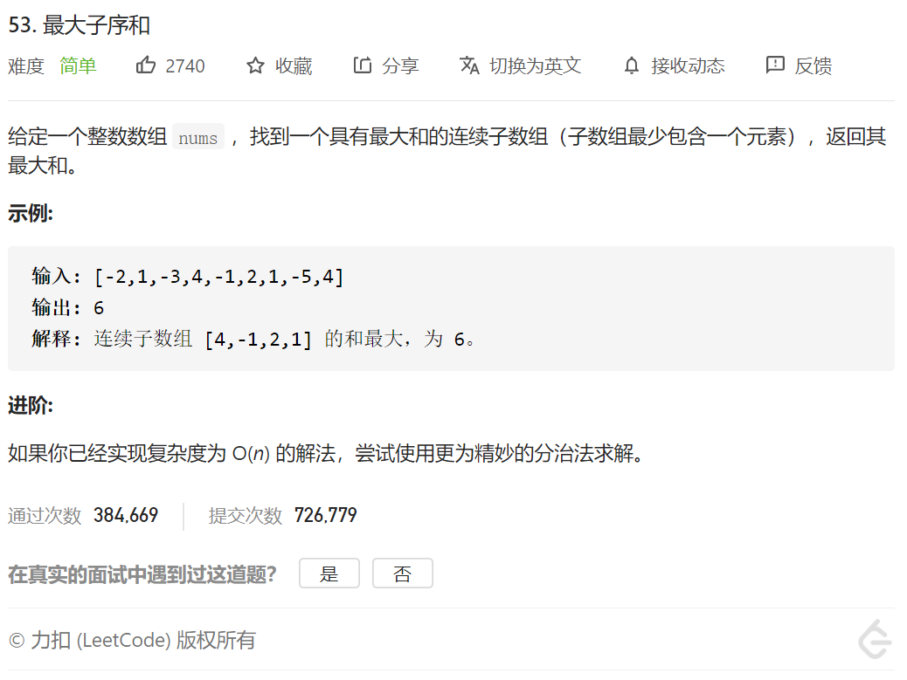

经典dp

1.状态定义：

dp[i]表示 以i为结尾（包括i）的最大的子序列的和

2.状态转移方程

dp[i]=max{nums[i],dp[i-1]+nums[i]}

结果就是 max｛dp[0],dp[1],...,dp[n]｝

3.初始状态定义：

dp[0]=nums[0];

所以，自己写的代码：

```java
class Solution {
    public int maxSubArray(int[] nums) {
        if(nums.length==0)
        {
            return 0;
        }
        int dp[]=new int[nums.length];
        dp[0]=nums[0];
        if(nums.length==1)
        {
            return dp[0];
        }

        for(int i=1;i<nums.length;i++)
        {
            dp[i]=Math.max(nums[i],dp[i-1]+nums[i]);
        }

        int max=Integer.MIN_VALUE;
        for(int i=0;i<nums.length;i++)
        {
            if(max<dp[i])
            {
                max=dp[i];
            }

        }
        
        return max;


    }
}
```

官方题解代码：

```java
class Solution {
    public int maxSubArray(int[] nums) {
        int pre = 0, maxAns = nums[0];
        for (int x : nums) {
            pre = Math.max(pre + x, x);
            maxAns = Math.max(maxAns, pre);
        }
        return maxAns;
    }
}

```

