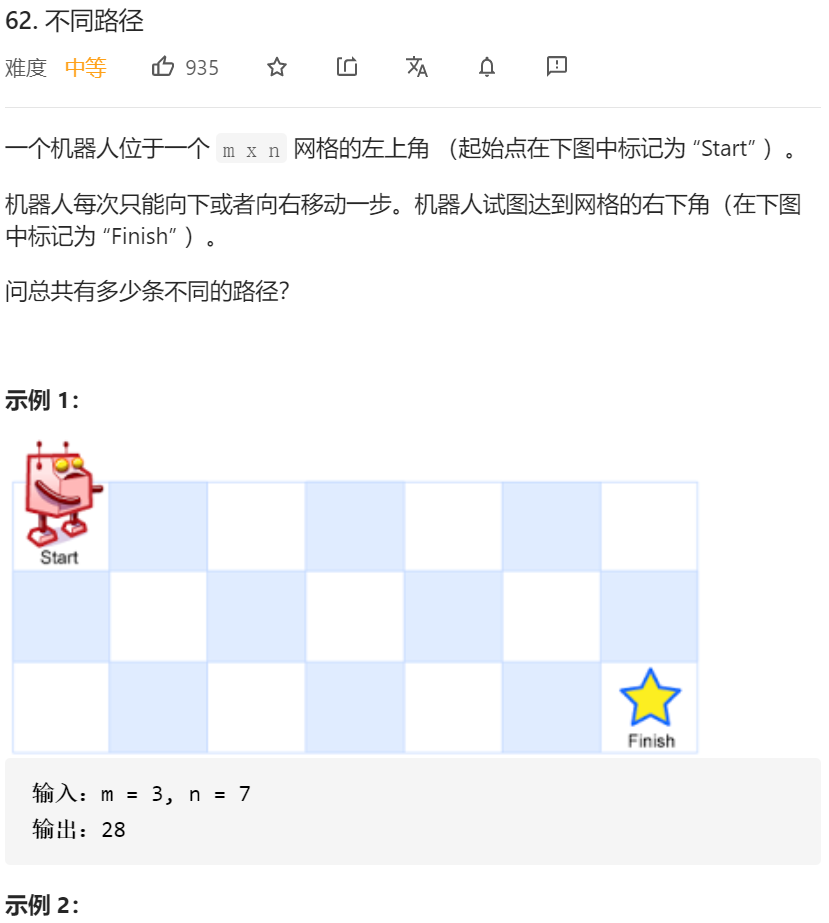

思路清晰：

状态转移方程 dp[i] [j]=dp[i-1] [j]+ dp[i] [j-1]

初始化： 第一行 第一列 全部设置为1


代码：

```java
class Solution {
    public int uniquePaths(int m, int n) {
        int matrix[][]=new int[m][n];

        for(int i=0;i<matrix[0].length;i++)
        {
            matrix[0][i]=1;
        }

        for(int i=0;i<matrix.length;i++)
        {
            matrix[i][0]=1;
        }

        for(int i=1;i<m;i++)
        {
            for(int j=1;j<n;j++)
            {
                matrix[i][j]=matrix[i-1][j]+matrix[i][j-1];
            }
        }

        // System.out.println(matrix[m-1][n-1]);
        return matrix[m-1][n-1];

    }
}
```

