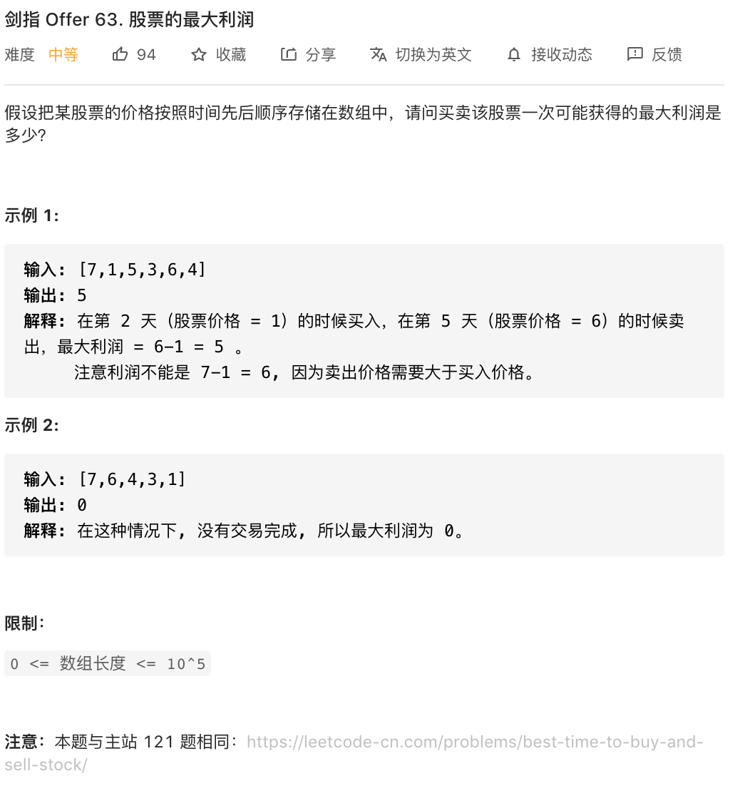
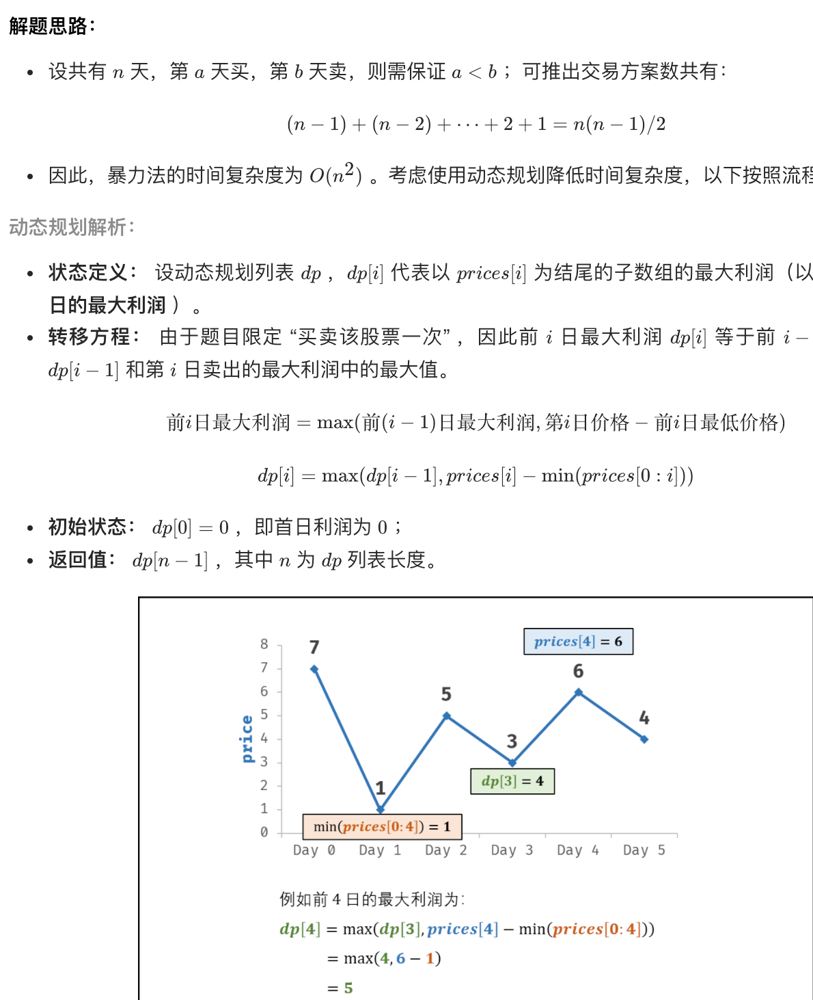

```
class Solution {
    public int maxProfit(int[] prices) {
        int cost = Integer.MAX_VALUE, profit = 0;
        for(int price : prices) {
            cost = Math.min(cost, price);
            profit = Math.max(profit, price - cost);
        }
        return profit;
    }
}

作者：jyd
链接：https://leetcode-cn.com/problems/gu-piao-de-zui-da-li-run-lcof/solution/mian-shi-ti-63-gu-piao-de-zui-da-li-run-dong-tai-2/
来源：力扣（LeetCode）
著作权归作者所有。商业转载请联系作者获得授权，非商业转载请注明出处。
```

