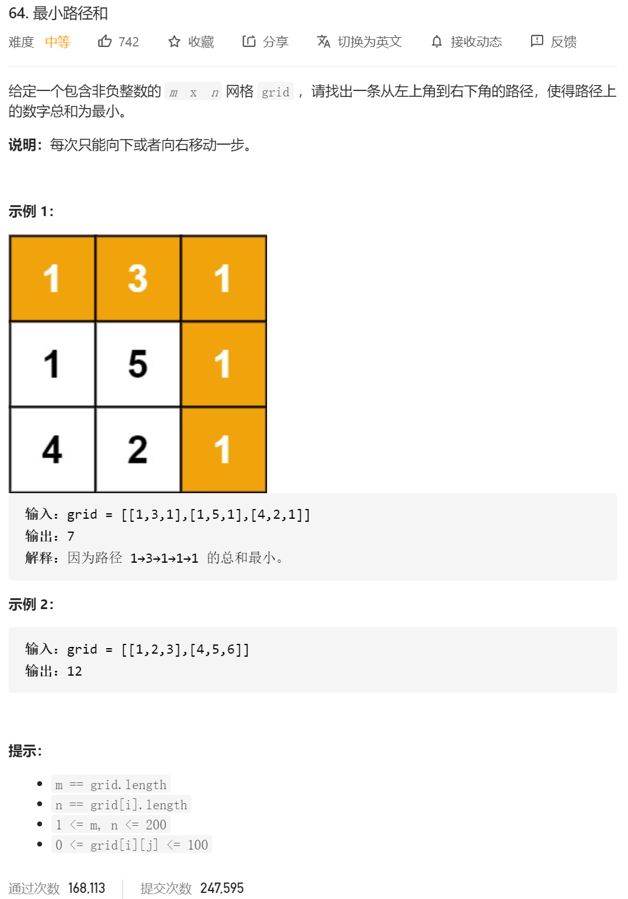

定义状态

dp[i] [j] =Math.min(dp[i-1] [j],dp[j-1] [1])+dp[i] [j] 

```java
class Solution {
    public int minPathSum(int[][] grid) {
         //最小路径和
        int res=0;
        //状态 dp[i][j] 到点i j 的最小路径
        //状态转移方程 dp[i][j]=min{dp[i-1][j],dp[i][j-1]}+value[i]
        //初始的状态定义 dp[0][0] 就是对应的0 0 的位置  然后 最边缘的位置的 dp[0][j] 和dp[i][n-1]的值是确定的

        int dp[][]=new int[grid.length][grid[0].length];
        dp[0][0]=grid[0][0];
        for(int i=1;i< grid.length;i++)//n 行 0列
        {
            dp[i][0]=dp[i-1][0]+grid[i][0];
        }

        for(int j=1;j< grid[0].length;j++)//0 行 n列
        {
            dp[0][j]=dp[0][j-1]+grid[0][j];
        }

        for(int i=1;i< grid.length;i++)
            for(int j=1;j<grid[i].length;j++)
            {
                dp[i][j]=Math.min(dp[i-1][j],dp[i][j-1])+grid[i][j];
            }
        return dp[grid.length-1][grid[0].length-1];

    }
}
```

