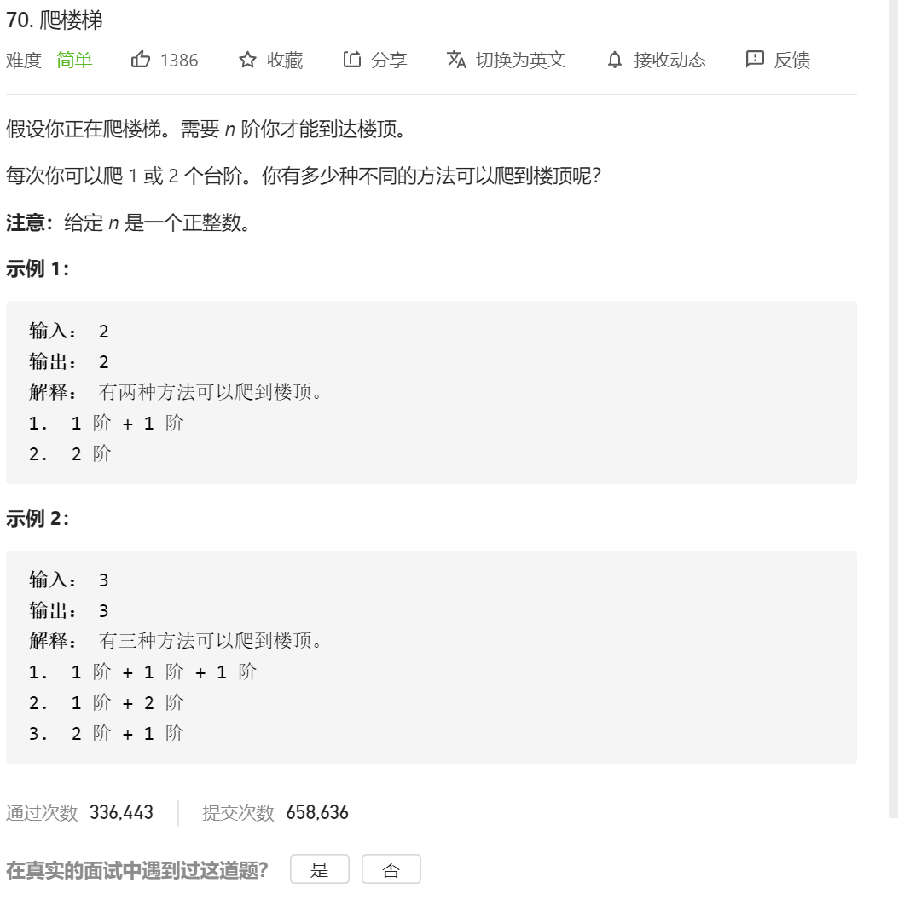

​	这是第一题动态规划，所以说的稍微多那么一点。动态规划要遵循这么几个步骤：

1.定义dp数组的状态，比如dp[i]代表了什么，或者dp[i] [j]代表了什么

2.定义状态转移方程，也就是 dp[i] 是由前面的状态 如何转移过来的。

3.定义初始状态，也就是最初的 dp[0] 的这种状态。

于此同时，借用孙哥的一句话：动态规划你就得想清楚，这个状态可以由哪几个状态转化而来，就是想清楚子问题。比如这边的 dp[i] 就能是由前一步 和 前两步构成 那我dp[i] 就定义为 到了i个阶梯，有几种方式。那就是dp【I-1】的方式 + dp[i-2] 的方式 

知乎一个大佬写的很好：

https://zhuanlan.zhihu.com/p/91582909

他的总结：

**第一步骤**：定义**数组元素的含义**，上面说了，我们会用一个数组，来保存历史数组，假设用一维数组 dp[] 吧。这个时候有一个非常非常重要的点，就是规定你这个数组元素的含义，例如你的 dp[i] 是代表什么意思？

**第二步骤**：找出**数组元素之间的关系式**，我觉得动态规划，还是有一点类似于我们高中学习时的**归纳法**的，当我们要计算 dp[n] 时，是可以利用 dp[n-1]，dp[n-2].....dp[1]，来推出 dp[n] 的，也就是可以利用**历史数据**来推出新的元素值，所以我们要找出数组元素之间的关系式，例如 dp[n] = dp[n-1] + dp[n-2]，这个就是他们的关系式了。而这一步，也是最难的一步，后面我会讲几种类型的题来说。

> 学过动态规划的可能都经常听到**最优子结构**，把大的问题拆分成小的问题，说时候，最开始的时候，我是对**最优子结构**一梦懵逼的。估计你们也听多了，所以这一次，我将**换一种形式来讲，不再是各种子问题，各种最优子结构**。所以大佬可别喷我再乱讲，因为我说了，这是我自己平时做题的套路。

**第三步骤**：找出**初始值**。学过**数学归纳法**的都知道，虽然我们知道了数组元素之间的关系式，例如 dp[n] = dp[n-1] + dp[n-2]，我们可以通过 dp[n-1] 和 dp[n-2] 来计算 dp[n]，但是，我们得知道初始值啊，例如一直推下去的话，会由 dp[3] = dp[2] + dp[1]。而 dp[2] 和 dp[1] 是不能再分解的了，所以我们必须要能够直接获得 dp[2] 和 dp[1] 的值，而这，就是**所谓的初始值**。

由了**初始值**，并且有了**数组元素之间的关系式**，那么我们就可以得到 dp[n] 的值了，而 dp[n] 的含义是由你来定义的，你想**求什么，就定义它是什么**，这样，这道题也就解出来了。

对于这题：

### (1)、定义数组元素的含义

按我上面的步骤说的，首先我们来定义 dp[i] 的含义，我们的问题是要求青蛙跳上 n 级的台阶总共由多少种跳法，那我们就定义 dp[i] 的含义为：**跳上一个 i 级的台阶总共有 dp[i] 种跳法**。这样，如果我们能够算出 dp[n]，不就是我们要求的答案吗？所以第一步定义完成。

### （2）、找出数组元素间的关系式

我们的目的是要求 dp[n]，动态规划的题，如你们经常听说的那样，就是把一个**规模**比较大的问题分成几个**规模**比较小的问题，然后由小的问题推导出大的问题。也就是说，dp[n] 的规模为 n，比它规模小的是 n-1, n-2, n-3.... 也就是说，dp[n] 一定会和 dp[n-1], dp[n-2]....存在某种关系的。我们要找出他们的关系。

**那么问题来了，怎么找？**

这个怎么找，**是最核心最难的一个**，我们必须回到问题本身来了，来寻找他们的关系式，dp[n] 究竟会等于什么呢？

对于这道题，由于情况可以选择跳一级，也可以选择跳两级，所以青蛙到达第 n 级的台阶有两种方式

一种是从第 n-1 级跳上来

一种是从第 n-2 级跳上来

由于我们是要算**所有可能的跳法的**，所以有 dp[n] = dp[n-1] + dp[n-2]。

### （3）、找出初始条件

当 n = 1 时，dp[1] = dp[0] + dp[-1]，而我们是数组是不允许下标为负数的，所以对于 dp[1]，我们必须要**直接给出它的数值**，相当于初始值，显然，dp[1] = 1。一样，dp[0] = 0.（因为 0 个台阶，那肯定是 0 种跳法了）。于是得出初始值：

dp[0] = 0. dp[1] = 1. 即 n <= 1 时，dp[n] = n.

```java
class Solution {
    public int climbStairs(int n) {
        // int count=0;
        if(n==1)
        {
            return 1;
        }
        int dp[]=new int[n+1];
        dp[0]=0;
        dp[1]=1;
        dp[2]=2;
        for (int i=3;i<=n;i++)
        {
            dp[i]=dp[i-1]+dp[i-2];
        }
//        System.out.println();


        return dp[n];

    }
}
```


