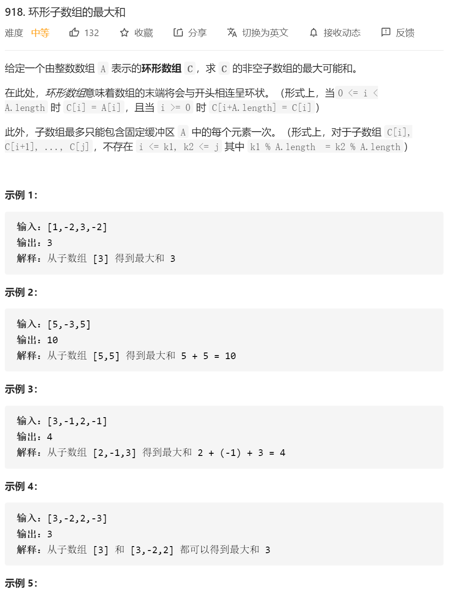
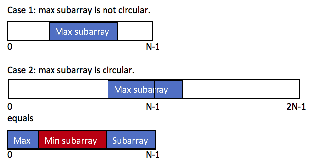

思路：

环形问题两种通常的思路：

1.在原始数组后面再拼接一个同样的数组（这个思路我失败了，欢迎大家给意见）；

2.分类讨论。

分类讨论的思路是，最优解来自以下两种情况：

不考虑环形；

2、考虑跨越两个相同数组交接部分的区域的最大字段和，等价于考虑「两个相同数组交接部分的区域

的最小字段和」。

这里注意一个细节：**求子区间的最小字段和，是不包括头尾的，因为包括了头尾结点的情况就与「不考虑环形」的情况有重复的部分**，分治应该保证「不重不漏」。样例：当这些数是全为负数的时候，

解释：「中间部分」最小，等价于「两头最大」。「两头最大」等价于「两个相同数组交接部分的区域和最大」。

以上两部分考虑最大值，因此这是分治的思想，分别考虑不同的情况，然后综合得出结论。

理解这个思路可以参考「国际版」讨论区的题解：[One Pass](https://leetcode.com/problems/maximum-sum-circular-subarray/discuss/178422/One-Pass) 。



**参考代码**：

```java
import java.util.Arrays;

public class Solution {

    public int maxSubarraySumCircular(int[] A) {
        int len = A.length;
        // 特例判断
        if (len == 0) {
            return 0;
        }
        if (len == 1) {
            return A[0];
        }

        int maxSubArray = maxSubArray(A);
        int minSubArrayExcludeHeadAndTail = minSubArray(A);

        int sum = 0;
        for (int value : A) {
            sum += value;
        }
        return Math.max(maxSubArray, sum - minSubArrayExcludeHeadAndTail);
    }

    public int maxSubArray(int[] nums) {
        int len = nums.length;
        // dp[i]：以 nums[i] 结尾的「连续」子区间的最大和
        int[] dp = new int[len];
        dp[0] = nums[0];

        for (int i = 1; i < len; i++) {
            if (dp[i - 1] >= 0) {
                dp[i] = dp[i - 1] + nums[i];
            } else {
                // dp[i - 1] < 0 的时候，前面的部分丢弃
                dp[i] = nums[i];
            }
        }

        // 全局扫一遍，找到最大值
        int res = dp[0];
        for (int i = 1; i < len; i++) {
            res = Math.max(res, dp[i]);
        }
        return res;
    }

    public int minSubArray(int[] nums) {
        // 思路和 maxSubArray 完全一致，求最大的地方改成最小
        // 但这里求的区间和不包括头和尾
        int len = nums.length;

        // dp[i]：以 nums[i] 结尾的「连续」子区间的最小和
        int[] dp = new int[len];
        dp[0] = nums[0];

        // 注意 i 的下标
        for (int i = 1; i < len - 1; i++) {
            if (dp[i - 1] >= 0) {
                // 加上前面的数，会使得结果更大，因此前面的部分丢弃
                dp[i] = nums[i];
            } else {
                dp[i] = dp[i - 1] + nums[i];
            }
        }

        // 全局扫一遍，找到最小值
        int res = dp[0];
        for (int i = 1; i < len; i++) {
            res = Math.min(res, dp[i]);
        }
        return res;
    }

    public static void main(String[] args) {
        Solution solution = new Solution();
        // int[] A = {1, -2, 3, -2};
        // int[] A = {5, -3, 5};
        int[] A = {3, -1, 2, -1};
        int res = solution.maxSubarraySumCircular(A);
        System.out.println(res);
    }
}

```

自己的：

```java
class Solution {
    public int maxSubarraySumCircular(int[] A) {
        //这题就考虑两种情况，一种 最大和在两个数组之间 第二种 最大和在 一个数组内
        if(A.length==1)
        {
            return A[0];
        }
        int sum=0;
        for(int i=0;i<A.length;i++)
        {
            sum=sum+A[i];
        }
        return Math.max(sum-minSub(A),maxSub(A));
    }


    public int maxSub(int A[])
    {
        int dp[]=new int [A.length+1];
        dp[0]=A[0];
//        if(A.length==1)
//        {
//            return dp[0];
//        }
        int max=A[0];
        for(int i=1;i<A.length;i++)
        {
            dp[i]=Math.max(A[i],dp[i-1]+A[i]);
            max=Math.max(dp[i],max);
        }
        return max;
    }


    public int minSub(int A[])
    {
        int dp[]=new int [A.length+1];
        dp[1]=A[1];
//        if(A.length==1)//这边不可能是1的
//        {
//            return dp[0];
//        }
        int min=A[1];
        for(int i=2;i<A.length-1;i++)
        {
            dp[i]=Math.min(A[i],dp[i-1]+A[i]);
            min=Math.min(dp[i],min);
        }
        return min;
    }
  
}
```

