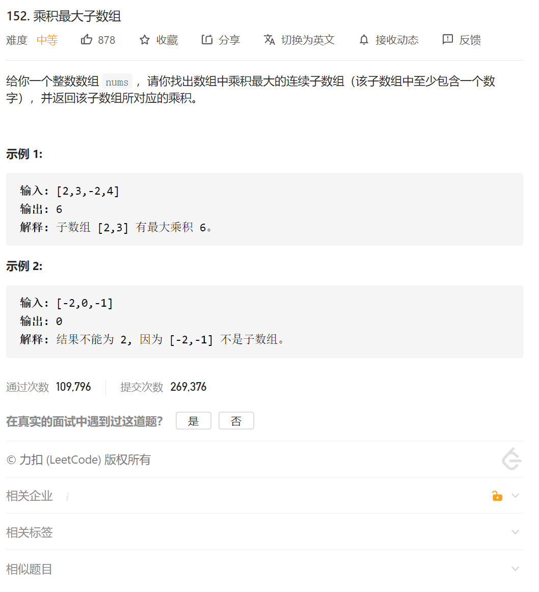
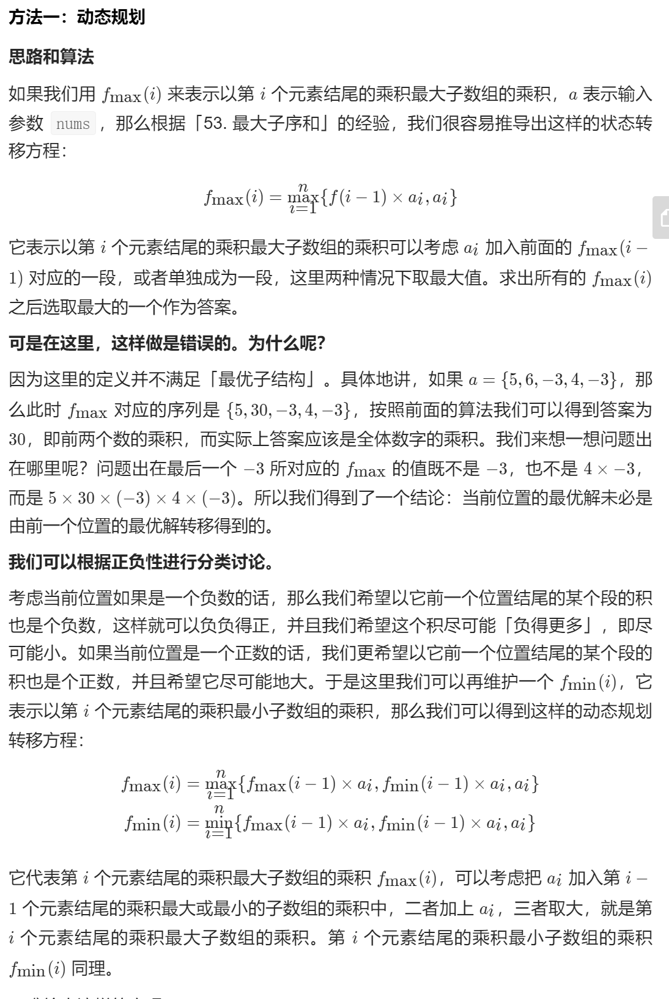

其实总结一下：就是维护一个最大的dp，维护一个最小的dp

dpmax[i]=Math.max(dpMax[-1]*nums[i],nums[i],dpMin[i-1] * nums[i]) #意义就是最大值可能瞬间乘个负数就变小了，最小值乘个复数可能就变大了

最小值也同理

dpMin[i]=Math.min(dpMax[-1]*nums[i],nums[i],dpMin[i-1] * nums[i])

官方的代码：

```java
class Solution {
    public int maxProduct(int[] nums) {
        int maxF = nums[0], minF = nums[0], ans = nums[0];
        int length = nums.length;
        for (int i = 1; i < length; ++i) {
            int mx = maxF, mn = minF;
            maxF = Math.max(mx * nums[i], Math.max(nums[i], mn * nums[i]));
            minF = Math.min(mn * nums[i], Math.min(nums[i], mx * nums[i]));
            ans = Math.max(maxF, ans);
        }
        return ans;
    }
}

作者：LeetCode-Solution
链接：https://leetcode-cn.com/problems/maximum-product-subarray/solution/cheng-ji-zui-da-zi-shu-zu-by-leetcode-solution/
来源：力扣（LeetCode）
著作权归作者所有。商业转载请联系作者获得授权，非商业转载请注明出处。
```

我自己的代码：

```java
class Solution {
    public int maxProduct(int[] nums) {
        if(nums.length==0)
        {
            return 0;
        }
        int dp[]=new int[nums.length];
        int dpMax[]=new int[nums.length];
        int dpMin[]=new int[nums.length];
        dp[0]=nums[0];
        dpMax[0]=nums[0];
        dpMin[0]=nums[0];

        if(nums.length==1)
        {
            return dp[0];
        }
        int max=dp[0];

        for(int i=1;i<nums.length;i++)
        {
            
            dpMax[i]=Math.max(nums[i],Math.max(dpMax[i-1]*nums[i],dpMin[i-1]*nums[i]));
            dpMin[i]=Math.min(nums[i],Math.min(dpMin[i-1]*nums[i],dpMax[i-1]*nums[i]));
            // dp[i]=Math.max(dpMax[i-1]*nums[i],dpMin[i-1]*nums[i]);
            // dp[i]=Math.max(dp[i],nums[i]);
            if(dpMax[i]>max)
            {
                max=dpMax[i];
            }
            
        }

        
        // for(int i=0;i<nums.length;i++)
        // {
        //     System.out.print(dpMax[i]);
        //     System.out.print(',');

        //     // if(max<dp[i])
        //     // {
        //     //     max=dp[i];
        //     // }

        // }
        // System.out.println();

        // for(int i=0;i<nums.length;i++)
        // {
        //    System.out.print(dpMin[i]);
        //     System.out.print(',');
        //     // if(max<dp[i])
        //     // {
        //     //     max=dp[i];
        //     // }

        // }
        // System.out.println();
      
        
        return max;


    }
}
```

