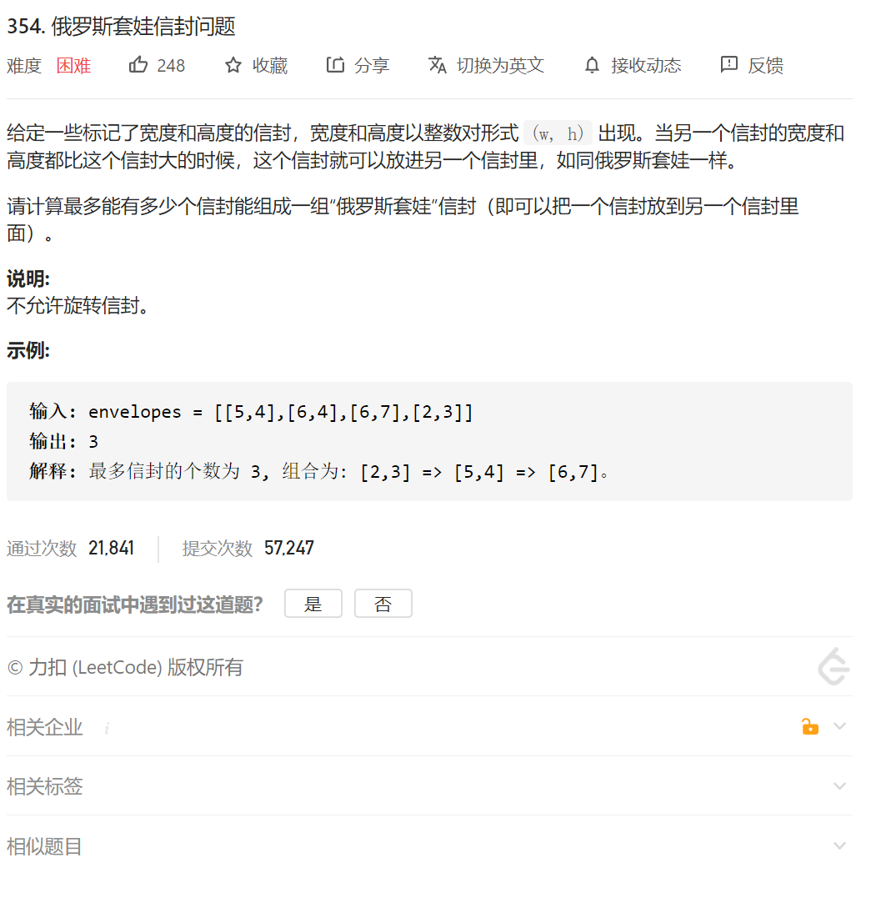

#### 方法：排序 + 最长递增子序列

该问题为最长递增子序列的二维问题。

假设我们知道了信封套娃顺序，那么从里向外的顺序必须是按 `w` 升序排序的子序列。

在对信封按 `w` 进行排序以后，我们可以找到 `h` 上最长递增子序列的长度。

我们考虑输入 `[[1，3]，[1，4]，[1，5]，[2，3]]`，如果我们直接对 `h` 进行 LIS 算法，我们将会得到

`[3，4，5]`，显然这不是我们想要的答案，因为 `w` 相同的信封是不能够套娃的。

为了解决这个问题。我们可以按 `w` 进行升序排序，若 `w` 相同则按 `h` 降序排序。则上述输入排序后为

`[[1，5]，[1，4]，[1，3]，[2，3]]`，再对 `h` 进行 LIS 算法可以得到 `[5]`，长度为 1，是正确的答案。

这个例子可能不明显。

我们将输入改为 `[[1，5]，[1，4]，[1，2]，[2，3]]`。则提取 `h` 为 `[5，4，2，3]`。我们对 `h` 进行LIS 算法将得到 `[2，3]`，是正确的答案。

```java
class Solution {
    public int maxEnvelopes(int[][] envelopes) {
        Arrays.sort(envelopes, new Comparator<int[]>() {
            @Override
            public int compare(int[] o1, int[] o2) {
                if(o1[0]<o2[0])
                {
                    return -1;
                }else if(o1[0]>o2[0])
                {
                    return 1;
                }
                else {
                    if(o1[1]>o2[1])//逆序
                    {
                        return -1;
                    }
                    else
                    {
                        return 1;
                    }
                }
            }
        });

        // for(int i=0;i<envelopes.length;i++)
        // {
        //     System.out.println(Arrays.toString(envelopes[i]));
        // }
         int dp[]=new int[envelopes.length+1];
        //dp[i] 以第i个数为结尾的最长递增子序列 
        dp[0]=1;
        //然后开始找递增子序列长度
        int max=0;
        for(int i=0;i<envelopes.length;i++)
        {
            // System.out.print(envelopes[i][1]);

            dp[i]=1;
            for(int j=0;j<i;j++)
            {
                if(envelopes[i][1]>envelopes[j][1])
                {
                    int temp=1+dp[j];
                    if(temp>dp[i])
                    {
                        dp[i]=temp;
                    }
                }
            }
            if(dp[i]>max)
            {
                max=dp[i];
            }
        }
        // for(int i=0;i<dp.length;i++)
        // {
        //      System.out.print(dp[i]);
        // }


        return max;

    }
}
```

