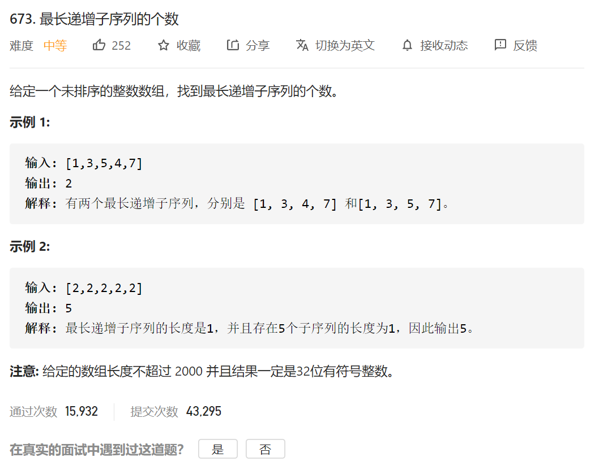

1.假设对于以 `nums[i]` 结尾的序列，我们知道最长序列的长度 `length[i]`，以及具有该长度的序列的 `count[i]`。

2.对于每一个 `i<j` 和一个 `A[i]<A[j]`，我们可以将一个 `A[j]` 附加到以 `A[i]` 结尾的最长子序列上。

3.如果这些序列比 length[j] 长，那么我们就知道我们有count[i] 个长度为 length 的序列。如果这些序列的长度与 length[j] 相等，那么我们就知道现在有 count[i] 个额外的序列（即 count[j]+=count[i]）。

```java
class Solution {
    public int findNumberOfLIS(int[] nums) {
         int dp[]=new int [nums.length+1];
        int count[]=new int [nums.length+1];
       
        dp[0]=1;
        int max=0;
        if(nums.length==1)
        {
            return 1;
        }
        count[0]=1;
        for(int i=1;i<nums.length;i++)
        {
            dp[i]=1;
            count[i]=1;
            for(int j=0;j<i;j++)
            {
                // 第一次找到
                if(nums[j]<nums[i])
                {
                    if(dp[j]+1 > dp[i]) {
                        dp[i] = dp[j] + 1;
                        count[i] = count[j];
                    // 再次找到
                    } else if(dp[j]+1 == dp[i]) {
                        count[i] += count[j];
                    }
                } 
            }
            if(dp[i]>max)//这次找count的最大值
            {
                max=dp[i];
            }

        }
        int res=0;
        for(int i=0;i<count.length;i++)
        {
             if(dp[i] == max)//找到所有能构成最大值的那个情况
                res += count[i];
        }
      

        return res;

    }
}
```

