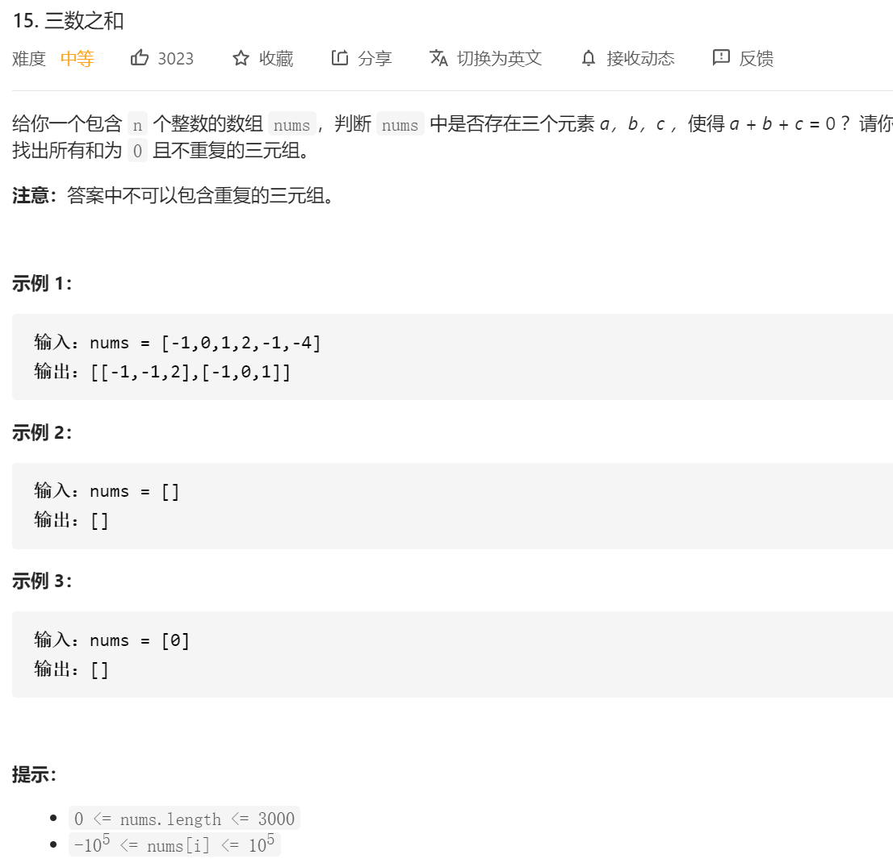
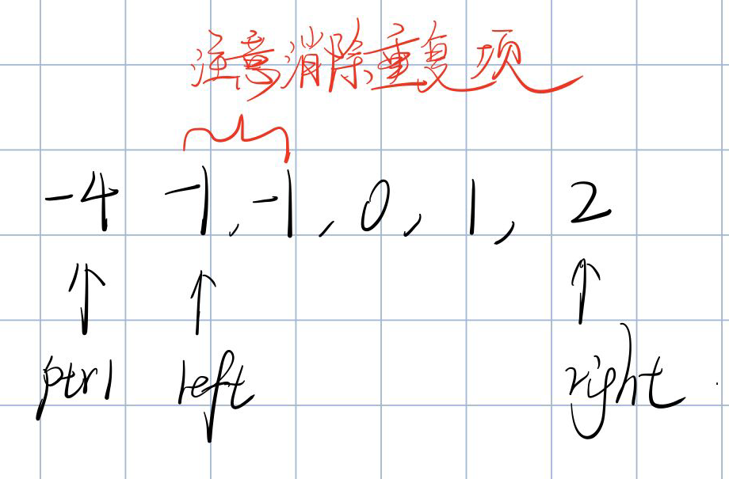
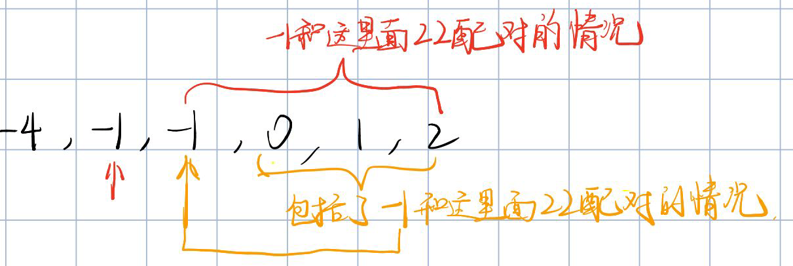

思路：三根指针：

一根用来遍历所有的数字，还有两根分别进行一个二分搜索，找到所有的满足的结果。



先进行排序

不能找到直接返回，考虑指针为-4，有-4  1 3 还有 -4 2 2 

考虑消除重复项 当left或者right重复指向一个数字的时候 直接跳过；并且在一个指针的时候，也是跳过，因为




```java
class Solution {
    public List<List<Integer>> threeSum(int[] nums) {
        List<List<Integer>> res=new ArrayList<>();

        //先排序
        Arrays.sort(nums);

        for(int i=0;i<nums.length;i++)
        {
            if(nums[i]>0)
            {
                break;
            }
            if((i>0&&nums[i]==nums[i-1]))
            {
                continue;
            }

            int left=i+1;
            int right=nums.length-1;

            while (left<right)
            {
                if(nums[i]+nums[left]+nums[right]==0)
                {
                    res.add(Arrays.asList(nums[i],nums[left],nums[right]));
                    while (left<right&&nums[left]==nums[left+1])
                    {
                        left++;
                    }
                    left++;
                }else if(nums[i]+nums[left]+nums[right]>0)
                {
                    while (left<right&&nums[right]==nums[right-1])
                    {
                        right--;
                    }
                    right--;
                    continue;
                }else if(nums[i]+nums[left]+nums[right]<0)
                {
                    while (left<right&&nums[left]==nums[left+1])
                    {
                        left++;
                    }
                    left++;
                    continue;
                }
            }
        }

        return res;

    }
}
```

