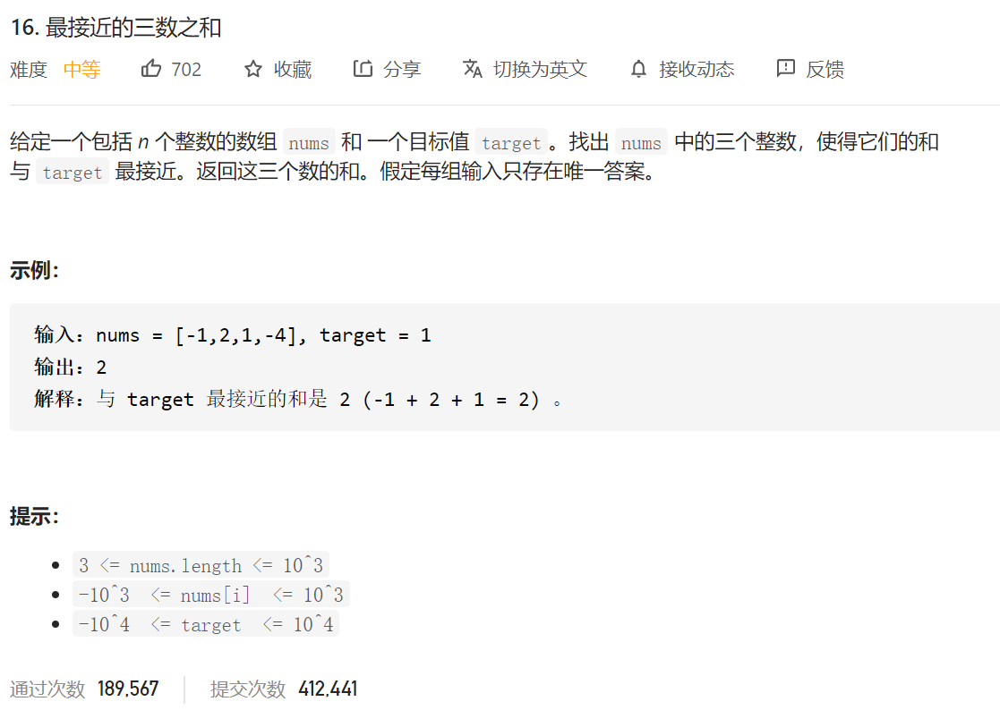

思路和前面的题目一致，

1.然后中间就比较Math.abs(target-(ptr+left+right))的大小，

2.ptr遍历过程中后得到min的差值Min，

3.如果和比target大，那就是 res=target+Min；如果比target小，那就是res=target-Min

```java
class Solution {
    public int threeSumClosest(int[] nums, int target) {
         //先排序
        Arrays.sort(nums);
        int ptr=0;
//       int need_add=Integer.MAX_VALUE;
       int res=Integer.MAX_VALUE;
       int out=nums[0]+nums[1]+nums[2];
       while ((ptr<nums.length))
       {
           if(ptr>0&&ptr< nums.length)
           {
               if(nums[ptr]==nums[ptr-1])
               {
                   ptr++;
                   continue;//如果相等 得直接跳过整个数 因为前一个数已经帮我们把这种情况给遍历了
               }
           }

           int left=ptr+1;
           int right=nums.length-1;

           while (left<right)
           {
               if(nums[ptr]+nums[left]+nums[right]-target==0)//如果相等 直接truen进去
               {
//                   System.out.println("target");
                   res=0;
                   out=target;
                   break;
               }
               else if(nums[ptr]+nums[left]+nums[right]>target)
               {
                   if(Math.abs(nums[ptr]+nums[left]+nums[right]-target)<res)
                   {
                       res=Math.abs(nums[ptr]+nums[left]+nums[right]-target);
                       out=target+res;
                   }
                   while (left<right&&nums[right]==nums[right-1])
                   {
                       right--;
                   }
                   right--;
                   continue;
               }else if(nums[ptr]+nums[left]+nums[right]<target)
               {
                   if(Math.abs(nums[ptr]+nums[left]+nums[right]-target)<res)
                   {
                       res=Math.abs(nums[ptr]+nums[left]+nums[right]-target);
                       out=target-res;
                   }
                   while (left<right&&nums[left]==nums[left+1])
                   {
                       left++;
                   }
                   left++;
                   continue;
               }
           }
           ptr++;
       }
        // System.out.println(res);
        // System.out.println(out);
        return out;

    }
}
```

