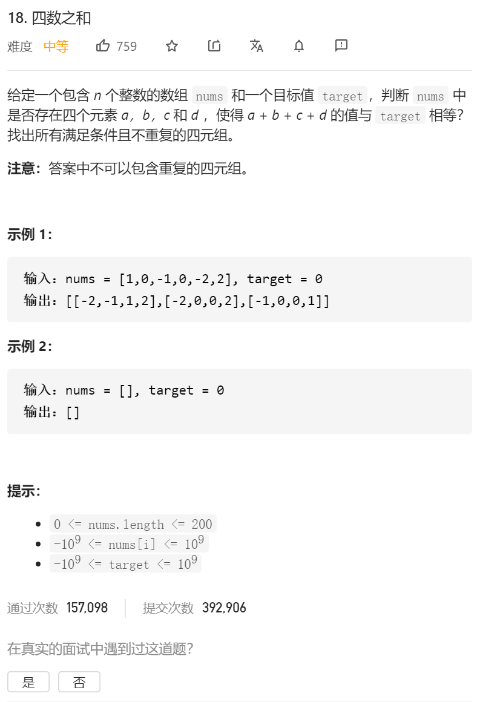
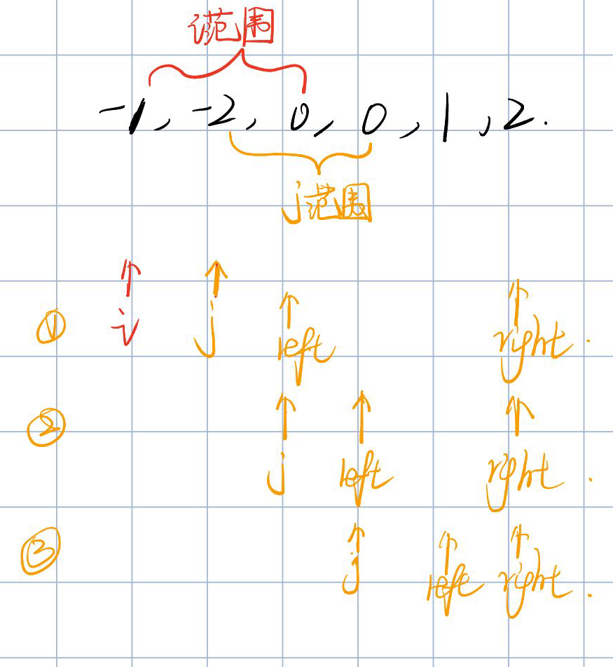

思路和三数之和是一样的，就是要多一根指针 多一层循环，然后left和right的范围是根据第二根指针来确定的。



然后这边注意一下i和j的范围。之前之所以没有注意范围，是因为i和j有个while的判断，而这边我们的j是有i决定的，是个必须访问的位置，所以 i和j必须要设定一个范围（其实主要是i）。

然后 上代码：

```java
class Solution {
    public List<List<Integer>> fourSum(int[] nums, int target) {
         List<List<Integer>> res=new ArrayList<>();
       Arrays.sort(nums);
//       for(int i=0;i< nums.length;i++)
//       {
//           System.out.print(nums[i]);
//           System.out.print(',');
//       }
//        System.out.println();

       //然后可以整指针了……
        //第一个指针 从[0 到 nums.length-4]      0 1 2 3 4   也就是 0-（5-4）  0-1
        for(int i=0;i<= nums.length-4;i++)
        {
           
            if(i>0&&i< nums.length)
            {
                if(nums[i]==nums[i-1])
                {
                    continue;//如果相等 得直接跳过整个数
                }
            }
            //然后是第二个指针 是从i+1 开始 到nums.length-3  0 1 2 3 4    i+1-5-3 i+1-2 也就是最多到2
            for(int j=i+1;j<=nums.length-3;j++)
            {
                

                if(j>i+1&&j<= nums.length-3)
                {
                    if(nums[j]==nums[j-1])
                    {
                        continue;//如果相等 得直接跳过整个数
                    }
                }

                //双指针根据j的位置来确定
                int left=j+1;
                int right=nums.length-1;

                while (left<right)
                {
                    // System.out.println("left="+left);
                    if(nums[i]+nums[j]+nums[right]+nums[left]==target)
                    {
                        res.add(Arrays.asList(nums[i],nums[j],nums[right],nums[left]));
                        while (left<right&&nums[left]==nums[left+1])
                        {
                            left++;
                        }
                        
                        left++;
                        continue;
                    }else if(nums[i]+nums[j]+nums[right]+nums[left]>target)
                    {
                        while (left<right&&nums[right]==nums[right-1])
                        {
                            right--;
                        }
                        right--;
                        continue;
                    }else
                    {
                        while (left<right&&nums[left]==nums[left+1])
                        {
                            left++;
                        }
                        left++;
                        continue;
                    }
                }
            }
        }
        return res;

    }
}
```

