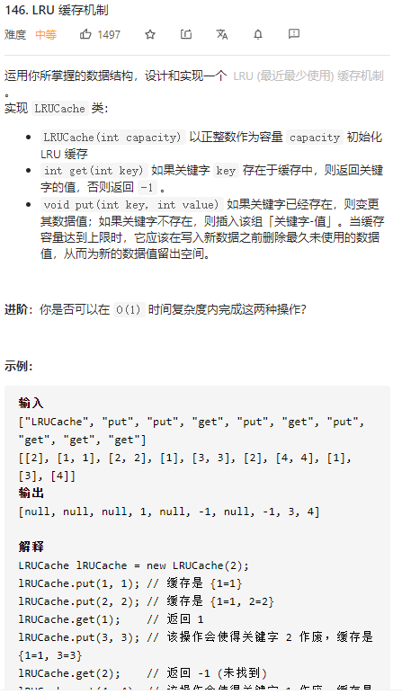

题目解析：

https://leetcode-cn.com/problems/lru-cache/solution/lru-ce-lue-xiang-jie-he-shi-xian-by-labuladong/

自己的代码题解

```java
/**
 * 定义节点
 */
class Node{
    int key,value;
    Node next,pre;
    public Node(int key, int value) {
        this.key = key;
        this.value = value;
    }
}

/**
 * 定义双向链表
 */
class DoubleList{
    Node head;
    Node tail;

    public DoubleList() {
        head=new Node(0,0);
        tail=new Node(0,0);
        head.next=tail;
        tail.pre=head;
    }
    //头插
    public void addFirst(Node n){
        n.next=head.next;
        head.next=n;
        n.next.pre=n;
        n.pre=head;
    }

    //删除特定节点 入参就是通过hashmap找到的节点
    public void remove(Node n){
        Node nPre=n.pre;
        Node nNext=n.next;
        nPre.next=n.next;
        nNext.pre=nPre;

    }
    //尾删 这边必须返回对应的节点给hashmap删除用
    public Node removeLast(){
        Node last=tail.pre;
        remove(last);
        return last;
    }

}
class LRUCache {

    int capacity;//容量
    // key -> Node(key, val) 用于映射双向链表中的节点
    Map<Integer, Node> map;
    // node(k1, v1) <-> Node(k2, v2)...
    private DoubleList cache;


    public LRUCache(int capacity) {
        this.capacity=capacity;
        map=new HashMap<Integer, Node>(capacity);
        cache=new DoubleList();
    }

    public int get(int key) {
        //没找到
        if(!map.containsKey(key)){
            return -1;
        }
        Node res=map.get(key);
        //得到对应的值
        int val=res.value;
        //然后需要将这个node提前
        cache.remove(res);
        cache.addFirst(res);
        return val;
    }

    public void put(int key, int value) {
        Node n=new Node(key,value);
        //如果map中存在着这个key 那就更新这个key
        if(map.containsKey(key)){
            cache.remove(map.get(key));
        }else if(map.size()==capacity){//节点不存在 但是map已经满了
            Node node=cache.removeLast();
            map.remove(node.key);
        }
        //更新链表信息
        cache.addFirst(n);
        //增加hashmap的映射
        map.put(key,n);
    }
    
}
```


### 二、LRU 算法描述

LRU 算法实际上是让你设计数据结构：首先要接收一个 capacity 参数作为缓存的最大容量，然后实现两个 API，一个是 put(key, val) 方法存入键值对，另一个是 get(key) 方法获取 key 对应的 val，如果 key 不存在则返回 -1。

注意哦，get 和 put 方法必须都是 O(1) 的时间复杂度，我们举个具体例子来看看 LRU 算法怎么工作。

```
/* 缓存容量为 2 */
LRUCache cache = new LRUCache(2);
// 你可以把 cache 理解成一个队列
// 假设左边是队头，右边是队尾
// 最近使用的排在队头，久未使用的排在队尾
// 圆括号表示键值对 (key, val)

cache.put(1, 1);
// cache = [(1, 1)]
cache.put(2, 2);
// cache = [(2, 2), (1, 1)]
cache.get(1);       // 返回 1
// cache = [(1, 1), (2, 2)]
// 解释：因为最近访问了键 1，所以提前至队头
// 返回键 1 对应的值 1
cache.put(3, 3);
// cache = [(3, 3), (1, 1)]
// 解释：缓存容量已满，需要删除内容空出位置
// 优先删除久未使用的数据，也就是队尾的数据
// 然后把新的数据插入队头
cache.get(2);       // 返回 -1 (未找到)
// cache = [(3, 3), (1, 1)]
// 解释：cache 中不存在键为 2 的数据
cache.put(1, 4);    
// cache = [(1, 4), (3, 3)]
// 解释：键 1 已存在，把原始值 1 覆盖为 4
// 不要忘了也要将键值对提前到队头

```

### 三、LRU 算法设计

分析上面的操作过程，要让 put 和 get 方法的时间复杂度为 O(1)，我们可以总结出 cache 这个数据结构必要的条件：查找快，插入快，删除快，有顺序之分。

因为显然 cache 必须有顺序之分，以区分最近使用的和久未使用的数据；而且我们要在 cache 中查找键是否已存在；如果容量满了要删除最后一个数据；每次访问还要把数据插入到队头。

那么，什么数据结构同时符合上述条件呢？哈希表查找快，但是数据无固定顺序；链表有顺序之分，插入删除快，但是查找慢。所以结合一下，形成一种新的数据结构：哈希链表。

LRU 缓存算法的核心数据结构就是哈希链表，双向链表和哈希表的结合体。这个数据结构长这样：


思想很简单，就是借助哈希表赋予了链表快速查找的特性嘛：可以快速查找某个 key 是否存在缓存（链表）中，同时可以快速删除、添加节点。回想刚才的例子，这种数据结构是不是完美解决了 LRU 缓存的需求？

也许读者会问，为什么要是双向链表，单链表行不行？另外，既然哈希表中已经存了 key，为什么链表中还要存键值对呢，只存值不就行了？

想的时候都是问题，只有做的时候才有答案。这样设计的原因，必须等我们亲自实现 LRU 算法之后才能理解，所以我们开始看代码吧～

## 四、代码实现

很多编程语言都有内置的哈希链表或者类似 LRU 功能的库函数，但是为了帮大家理解算法的细节，我们用 Java 自己造轮子实现一遍 LRU 算法。

首先，我们把双链表的节点类写出来，为了简化，key 和 val 都认为是 int 类型：

```java
class Node {
    public int key, val;
    public Node next, prev;
    public Node(int k, int v) {
        this.key = k;
        this.val = v;
    }
}
```

然后依靠我们的 Node 类型构建一个双链表，实现几个需要的 API（这些操作的时间复杂度均为 `O(1)`)：

PS：这就是普通双向链表的实现，为了让读者集中精力理解 LRU 算法的逻辑，就省略链表的具体代码。

到这里就能回答刚才“为什么必须要用双向链表”的问题了，因为我们需要删除操作。删除一个节点不光要得到该节点本身的指针，也需要操作其前驱节点的指针，而双向链表才能支持直接查找前驱，保证操作的时间复杂度 O(1)。

有了双向链表的实现，我们只需要在 LRU 算法中把它和哈希表结合起来即可。我们先把逻辑理清楚：

```java
// key 映射到 Node(key, val)
HashMap<Integer, Node> map;
// Node(k1, v1) <-> Node(k2, v2)...
DoubleList cache;

int get(int key) {
    if (key 不存在) {
        return -1;
    } else {        
        将数据 (key, val) 提到开头；
        return val;
    }
}

void put(int key, int val) {
    Node x = new Node(key, val);
    if (key 已存在) {
        把旧的数据删除；
        将新节点 x 插入到开头；
    } else {
        if (cache 已满) {
            删除链表的最后一个数据腾位置；
            删除 map 中映射到该数据的键；
        } 
        将新节点 x 插入到开头；
        map 中新建 key 对新节点 x 的映射；
    }
}

```

