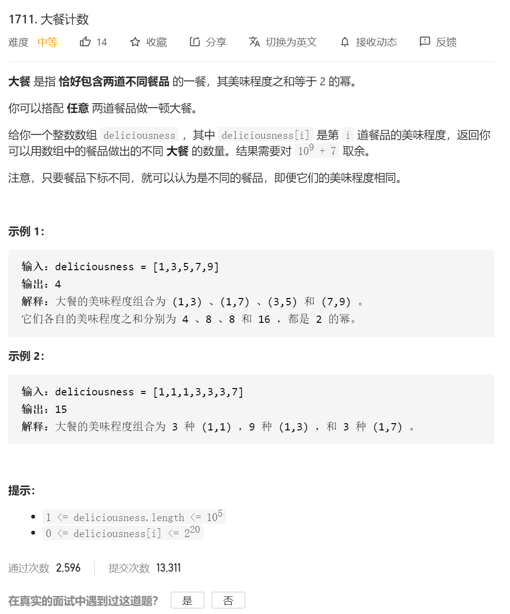

### 解题思路

#### 问题分析

我们需要找到两两配对的数组使之满足两数之和等于`2`的整数幂，类似于两数之和的解法。

#### 解法

类似于两数之和的解法，只不过我们需要确定target的值，这时候根据`0 <=`deliciousness[i] <= 2^20

可以确定`target`的值范围是`[2^0,2^21]`,最多有`22`种取法，分别从`2^0`（注意2的0次幂也是）、`2^1`、`2^2`、...`2^21`。那么对`target`加一层循环即可，这层循环是常数规模的，时间复杂度`O(1)`。然后遵循两数之和的经典解法即可解决问题。

```java
class Solution {
    public int countPairs(int[] deliciousness) {
        Map<Integer,Integer> map = new HashMap<>();
        long ans = 0;
        for (int i = 0;i < deliciousness.length;++i){
            for (int j = 0;j < 22;++j){
                int target = (int)Math.pow(2,j);
                if (target - deliciousness[i] < 0) continue;
                if (map.containsKey(target - deliciousness[i])){
                    ans += map.get(target - deliciousness[i]);
                }
            }
            map.put(deliciousness[i],map.getOrDefault(deliciousness[i],0) + 1);
        }
        ans %= (1e9 + 7);
        return (int)ans;
    }
}

作者：rookie_yanyu
链接：https://leetcode-cn.com/problems/count-good-meals/solution/liang-shu-zhi-he-bian-chong-by-rookie_ya-tzts/
来源：力扣（LeetCode）
著作权归作者所有。商业转载请联系作者获得授权，非商业转载请注明出处。
```

自己的答案：

```java
class Solution {
    public int countPairs(int[] deliciousness) {
         long sum=0;

        //还是two sum的问题 定义hashmap key为值 value为个数
        HashMap<Integer,Integer> mapTemp=new HashMap();

        for(int i=0;i<deliciousness.length;i++)
        {

            // long tempValue=1;
            for(int j=0;j<22;j++)
            {
                int tempValue=(int)Math.pow(2,j);//1也是2的幂
//                System.out.println(tempValue);
                if(tempValue>=deliciousness[i]&&mapTemp.containsKey((int)tempValue-deliciousness[i]))//这边必须是等于号 因为可能存在0 2 tempValue=2的情况
                {
                    // System.out.println(deliciousness[i]);
                    // System.out.println((int)tempValue-deliciousness[i]);
                    // System.out.println();
                    sum=sum+mapTemp.get((int)tempValue-deliciousness[i]);
                }
            }
            mapTemp.put(deliciousness[i],mapTemp.getOrDefault(deliciousness[i],0)+1);
        }

        return (int)(sum%1000000007);


    }
}
```

