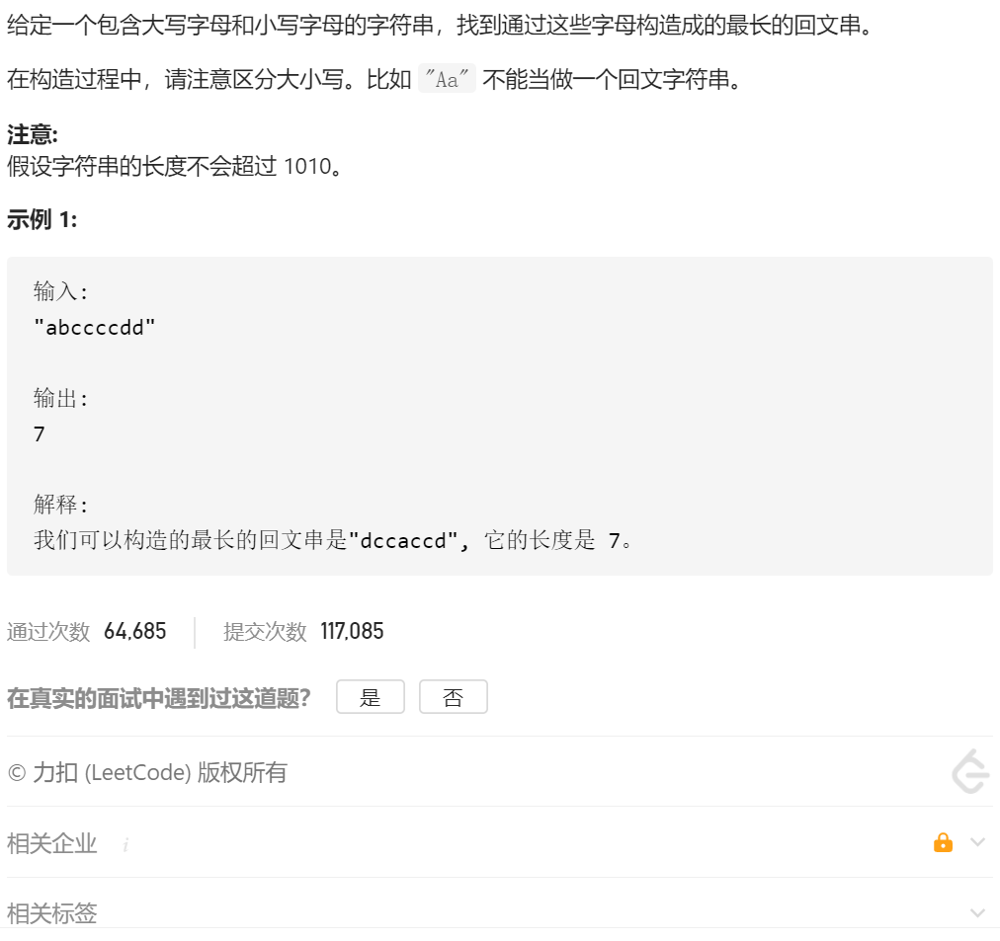

思路很简单就是统计每个字符出现的次数，

1.是偶数次的话长度直接+出现次数

2.如果出现奇数次的话，设定一个flag=1，在最后计数的时候加上这个flag，然后每次长度+=奇数出现次数-1

```java
class Solution {
    public int longestPalindrome(String s) {
          //最长回文串 第一次用hash
        int count=0;
        int map[]=new int[128];
        int flag=0;

        for(int i=0;i<s.length();i++)
        {
            map[s.charAt(i)]=map[s.charAt(i)]+1;
//            System.out.println(s.charAt(i));
        }

        for(int i=0;i<map.length;i++)
        {
            if(map[i]==0)
            {
                continue;
            }
            if(map[i]%2==0)
            {
                //偶数
                count=count+map[i];
            }
            else
            {
                count=count+map[i]-1;
                flag=1;
            }
        }
        return count+flag;

    }
}
```

