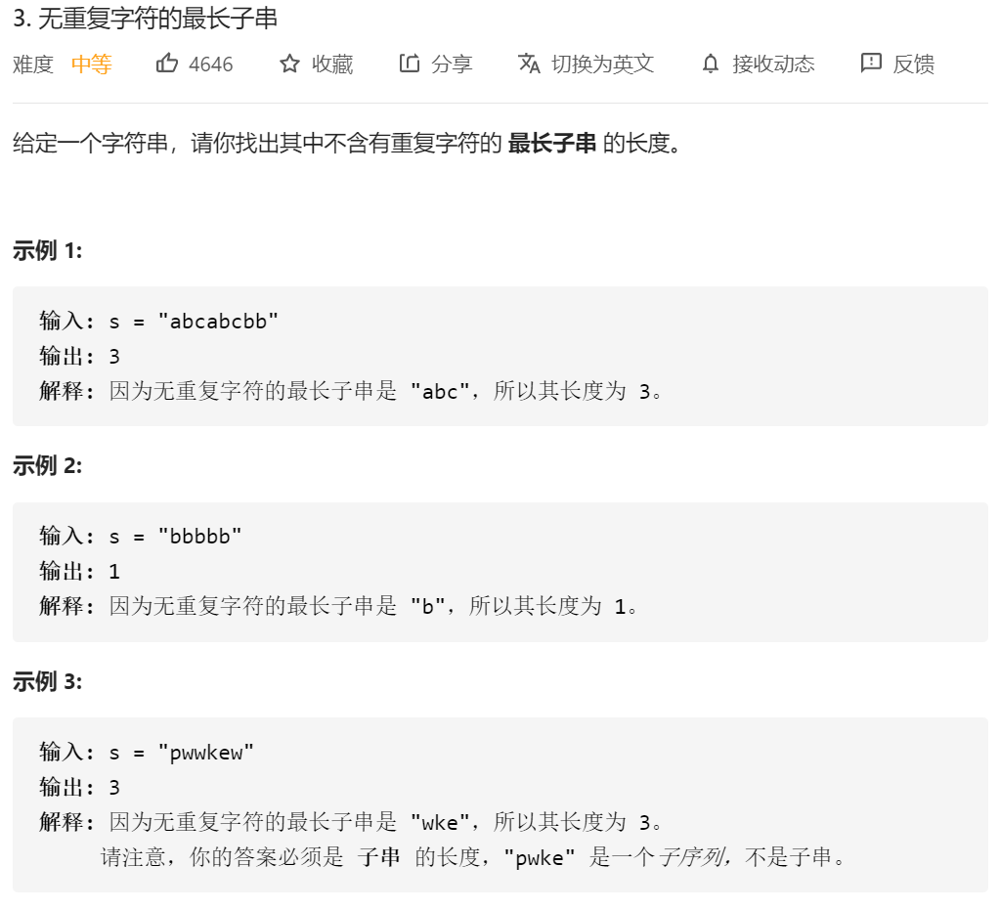
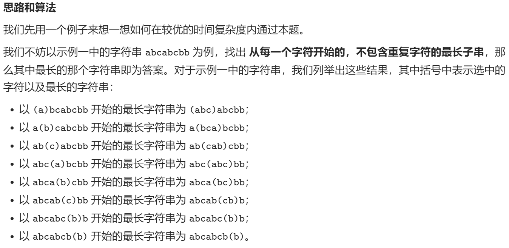
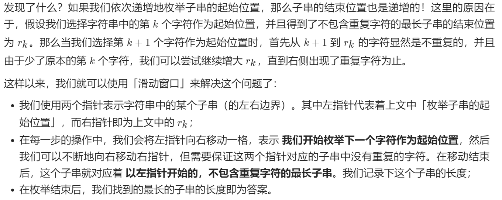

思路1：记录每一个字符开始的时候最大的不重复字符串，然后一直找到最大的不重复字符串。





```java
class Solution {
    public int lengthOfLongestSubstring(String s) {
        //错误思路1：再寻找过程中，直接将hashmap清空了 然后就会导致 “dvdf” 这样的样例过不去
        //过的方法：滑动窗口 这个是自己写的方法
         char sCharArr[]=s.toCharArray();
        int max=0;

        for(int i=0;i< sCharArr.length;i++)
        {
            int count=0;
            //对每一个数记录一个hashmap
            HashMap<String,Integer> mapTemp=new HashMap<>();
//            System.out.println(sCharArr[i]);
            String temp=String.valueOf(sCharArr[i]);
            //思路2 记录每一个数str[i]的最长子串 滑动窗口
            int j=i;
//            System.out.println("temp："+temp);
            while (j<sCharArr.length&&(!mapTemp.containsKey(String.valueOf(sCharArr[j]))))//坑点：注意 这边要判断的是第j个 不是判断
            {
//                System.out.println("不存在的key："+String.valueOf(sCharArr[j]));
                //如果键值不存在
//                System.out.println("不存在的key："+temp);
                mapTemp.put(String.valueOf(sCharArr[j]),1);//坑点2：这边也是 注意是add的是j 不是temp
                count++;
                if(count>max)
                {
                    max=count;
                }
                j++;
            }
        }
        return max;
       
    }
}
```

官方题解的方法：

```java
class Solution {
    public int lengthOfLongestSubstring(String s) {
        // 哈希集合，记录每个字符是否出现过
        Set<Character> occ = new HashSet<Character>();
        int n = s.length();
        // 右指针，初始值为 -1，相当于我们在字符串的左边界的左侧，还没有开始移动
        int rk = -1, ans = 0;
        for (int i = 0; i < n; ++i) {
            if (i != 0) {
                // 左指针向右移动一格，移除一个字符
                occ.remove(s.charAt(i - 1));
            }
            while (rk + 1 < n && !occ.contains(s.charAt(rk + 1))) {
                // 不断地移动右指针
                occ.add(s.charAt(rk + 1));
                ++rk;
            }
            // 第 i 到 rk 个字符是一个极长的无重复字符子串
            ans = Math.max(ans, rk - i + 1);
        }
        return ans;
    }
}

```

思路2：

真*滑动窗口

当遇到重复的字符时，进行一个处理：让左边界直接=max（重复的位置+1，左边界）（这边是因为有可能重复的数字是在左边界的左边，这个时候我们不需要更新左边界，因为计算的时候都不会计算它）；来保证没有重复的字符

定义左边指针；然后遍历数组。利用**map来存储字符的出现的位置**

如果出现了

```java
mapTemp.containsKey(s.charAt(i))
```

的情况，说明出现了重复的字符，这时候左边的指针就需要移动一个单位

但是这边注意，左边的指针只能往右边移动，不能往回移动//abba的left在3的位置的时候，就可能会往回移动

```java
left=Math.max(left,mapTemp.get(s.charAt(i))+1);//由于我们每一步都更新数字的位置 也就是（mapTemp.add(s.charAt(i),i)）所以这个位置一定是最新的那个位置
```

这个时候字符串又是不重复的了

没一步都要更新一下map，也就是更新一下新的i的位置//这一步每个字符串都需要做

```
mapTemp.add(s.charAt(i),i)
```

处理完之后，再计算一下长度

```
max=Math.max(max,i-left+1);
```

总结代码：

```java
class Solution {
    public int lengthOfLongestSubstring(String s) {
       HashMap<Character,Integer> mapTemp=new HashMap<>();
        //这次开始真 滑动窗口
        int max = 0;
        int left = 0;//start左边界
        for(int i=0;i< s.length();i++)
        {
            if(mapTemp.containsKey(s.charAt(i)))//如果contain key了
            {
                left=Math.max(left,mapTemp.get(s.charAt(i))+1);// 坑点：max 用于abba 当left=3的时候，不能将left变为1 左边界=之前的那个重叠的数往后移动一位 abca left 从0到了1
            }
            mapTemp.put(s.charAt(i),i);//记录这个点 和对应的位置
            max=Math.max(max,i-left+1);
        }
        return max;
       
    }
}
```

