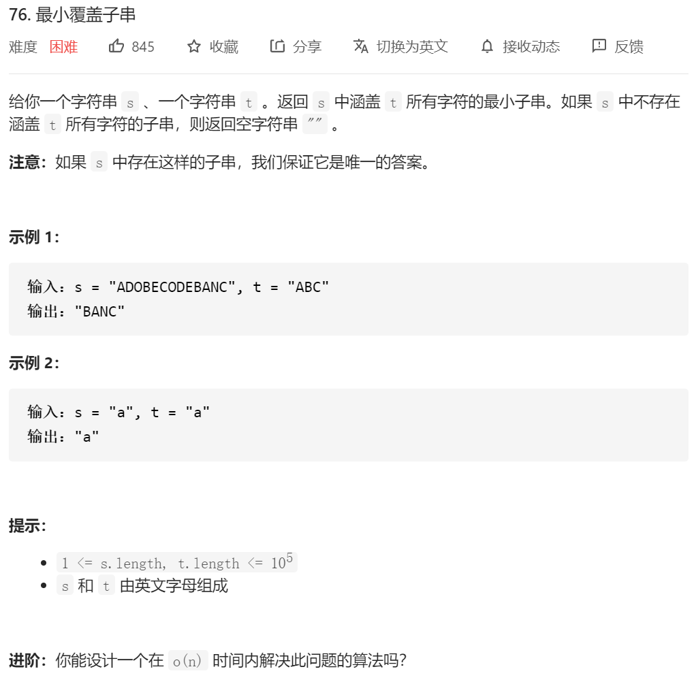
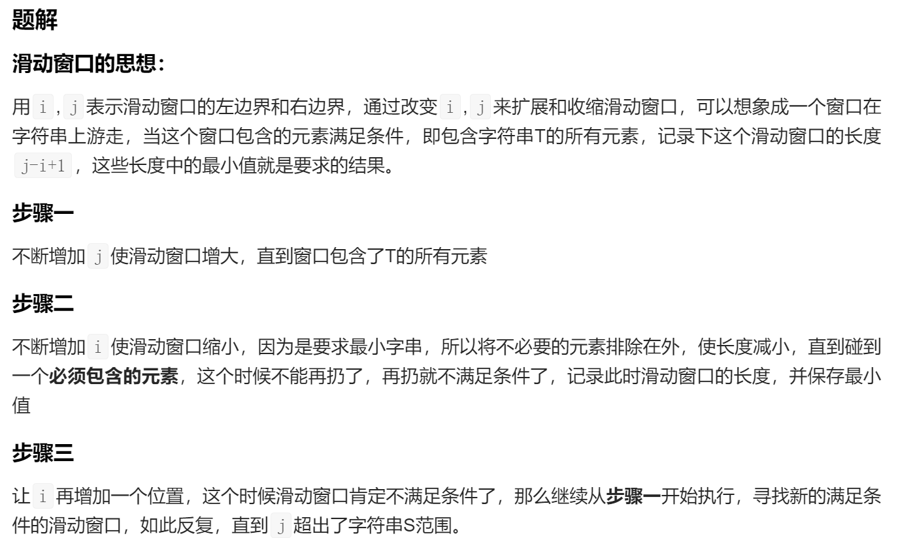
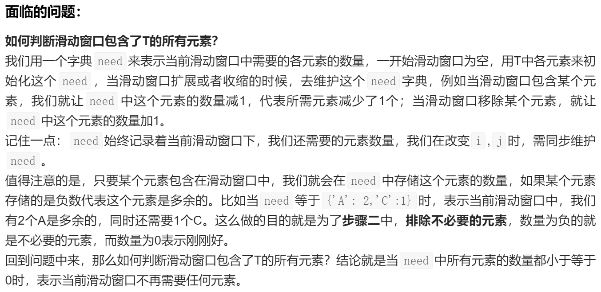
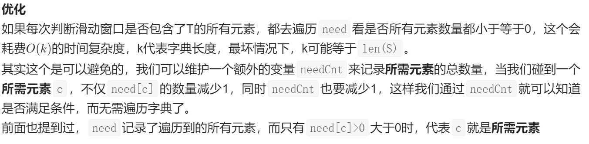
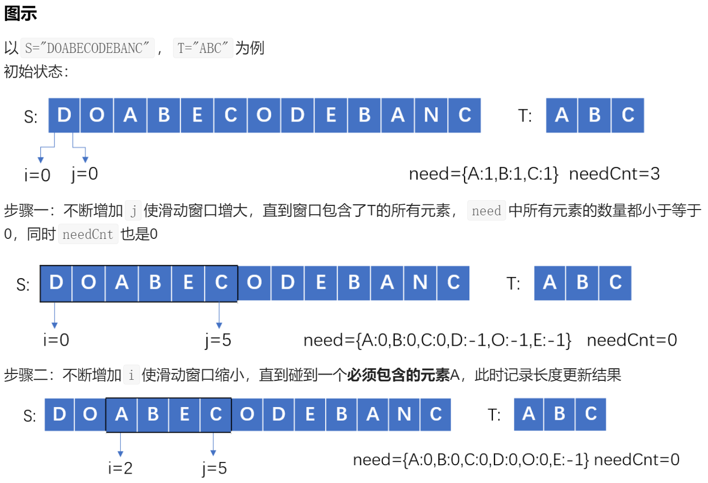
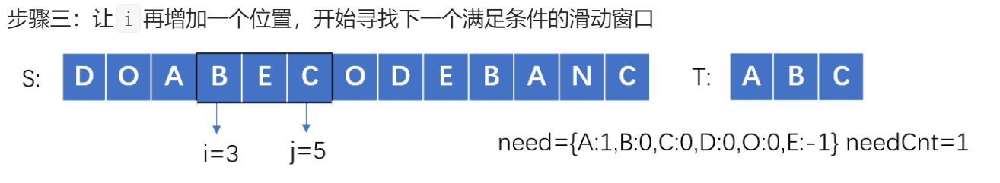

代码：

```java
class Solution {
    public String minWindow(String s, String t) {
        //对付hard 直接看的题解
        //简单思路：滑动窗口 先滑动右边的指针 然后满足要求后，滑动左边的指针，去掉窗口中不需要的元素；
        //先排除掉那些因素
        if(s==null||s.length()==0||t.length()==0||t==null)
        {
            return "";
        }

//        然后开始滑动窗口的阶段
        int need[]=new int[128];//维护一个need数组
        int count=t.length();
        int left=0;
        int right=0;
        int minSize=Integer.MAX_VALUE;//记录窗口大小
        int start=0;//记录窗口开始的位置

        //初始化need[]；
        for(int i=0;i<t.length();i++)
        {
            need[t.charAt(i)]++;//将对应的位置++ 设置为1
        }
        //开始遍历
        while (right<s.length())
        {
            if(need[s.charAt(right)]>0)//这边不是==1 是大于0 因为有可能会有“aa” 这种数字情况
            {
//                如果right是符合要求的
                count--;
            }
            need[s.charAt(right)]--;//不管怎么样遍历到这个数字 就将这个数字的need--；

            if(count==0)
            {
                //如果已经到达t的要求了 那就要开始收缩左边界
                while (left<right&&(need[s.charAt(left)]<0))
                {
                    //当左边界的数字<0的时候 说明这些数字是不被需要的 那就将左边界给收缩
                    need[s.charAt(left)]++;
                    left++;
                }

                //收缩完成之后 先记录一下长度
                int tempLen=right-left+1;
                if(tempLen<minSize)
                {
                    minSize=tempLen;//跟新长度
                    start=left;//跟新开始的点
                }
                //然后 将左边界往前移动一个
                need[s.charAt(left)]++;//这个位置需要++  因为这个数字没了
                left++;
                count++;//计数++；
            }

            right++;
        }
        //不能直接返回s.substring(start, start + minSize); 因为会有 a 然后让你有aa 这个时候 就是不存在这个子串 那我们的count！=0
        //也就是 minSize==Integer.MAX_VALUE
        if(minSize==Integer.MAX_VALUE)
        {
            return "";
        }
       return s.substring(start, start + minSize);

    }
}

```

