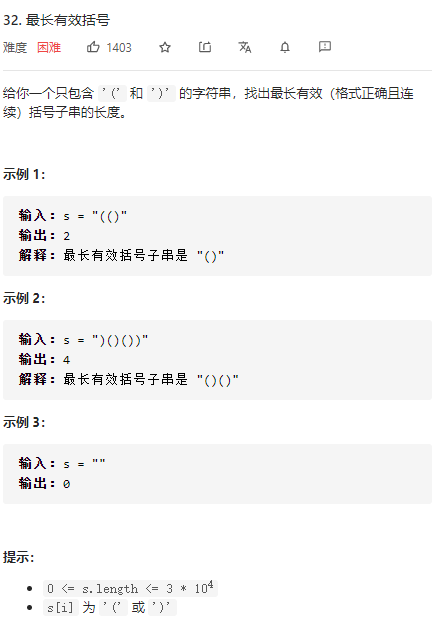

https://leetcode-cn.com/problems/longest-valid-parentheses/solution/zui-chang-you-xiao-gua-hao-by-leetcode-solution/

堆栈相关内容：

```java
class Solution {
    public int longestValidParentheses(String s) {
        Stack<Integer> stackInt=new Stack<>();
//        Stack<Character> stackChar=new Stack<>();
        int flag[]=new int[s.length()];


        for(int i=0;i<s.length();i++)
        {
            char tempChar=s.charAt(i);
            //如果是左边的括号 直接入堆栈 如果是右边的括号 要进行一个判断
            if(tempChar=='(')
            {
                stackInt.push(i);
//                stackChar.push()
            }
            else if(tempChar==')')
            {
                if(!stackInt.isEmpty())
                {
                    flag[stackInt.pop()]=1;
                    flag[i]=1;
                }

            }
        }

//        for(int i=0;i<flag.length;i++)
//        {
//            System.out.println(flag[i]);
//        }

        int maxLen=0;
        int tempLen=0;

        for(int i=0;i<flag.length;i++)
        {
            if(flag[i]==1)
            {
                tempLen=tempLen+1;
                if(tempLen>maxLen)
                {
                    maxLen=tempLen;
                }
            }else
            {
                tempLen=0;
            }
        }
        return maxLen;

    }
}
```

