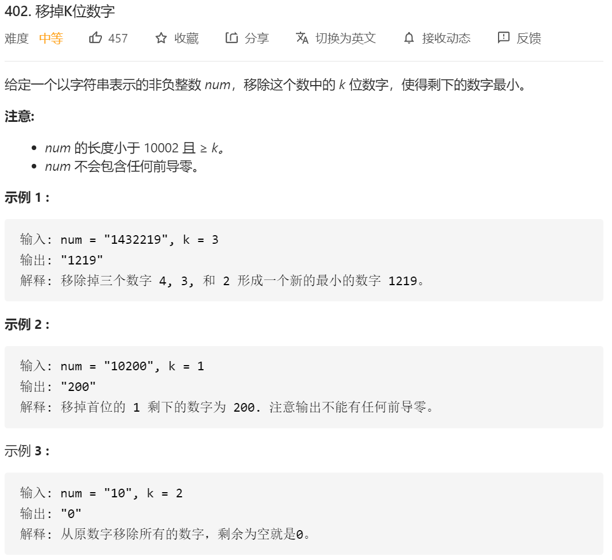

这题典型的单调栈的问题，自己解决过一次，不是用单调栈的，这次自己用单调栈来解决这个问题。

解题思路：

1.当前元素大于等于栈顶元素，入栈；否则，将栈中大于当前元素的数一直出栈，再将当前元素压栈，以此保证栈中最小字典序的顺序。
2.其中记录删除了多少元素，题目保留k个元素，即删除n-k个元素，若删**除的数目达到上限，则保留栈中元素不再删除。**
3.遍历一遍后，若栈中元素数目大于k个（即n-k>0），将多余元素出栈。

如果只是这样的思路，不考虑第0个位置是0的情况的话代码可以这么写（周赛11、29）：


```java
class Solution {
    public int[] mostCompetitive(int[] nums, int k) {//这边的意思是保留k个数
        int n=nums.length;
        if(k==n)return nums;
        int[] ans=new int[k];
        int p=n-k;
        Stack<Integer> sta=new Stack<>();
        for(int i=0;i<n;i++){
            while(!sta.isEmpty()&&p>0&&nums[i]<nums[sta.peek()]){
                sta.pop();
                p--;
            }
            sta.push(i);
        }
        for(int i=0;i<p;i++){
            sta.pop();
        }
        int j=k-1;
        while(!sta.isEmpty()){
            ans[j--]=nums[sta.pop()];
        }
        return ans;
    }
}

作者：elegantQ
链接：https://leetcode-cn.com/problems/find-the-most-competitive-subsequence/solution/dian-xing-de-dan-diao-zhan-wen-ti-by-elegantq/
来源：力扣（LeetCode）
著作权归作者所有。商业转载请联系作者获得授权，非商业转载请注明出处。
```

然后由于我们的题目有


这种情况，所以我们需要对其进行一系列操作。

```java
class Solution {
    public String removeKdigits(String num, int k) {
        //特殊情况全部删除
        if(num.length() == k){
            return "0";
        }
        char[] s = num.toCharArray();
        Stack<Character> stack = new Stack<>();
        //遍历数组
        for(Character i : s){
          //移除元素的情况，k--
            while(!stack.isEmpty() && i < stack.peek() && k > 0){
                   stack.pop();
                   k--;
            }
            //栈为空，且当前位为0时，我们不需要将其入栈
            if(stack.isEmpty() && i == '0'){
                continue;
            }
            stack.push(i);
        }
        while(k > 0){
            stack.pop();
            k--;
        }
        //这个是最后栈为空时，删除一位，比如我们的10，删除一位为0，按上面逻辑我们会返回""，所以我们让其返回"0"
         if(stack.isEmpty()){
             return "0";
         }
         //反转并返回字符串
         StringBuilder str = new StringBuilder();
         while(!stack.isEmpty()){
             str.append(stack.pop());
         }
         return str.reverse().toString();
    }
}

链接：https://leetcode-cn.com/problems/remove-k-digits/solution/dong-tu-shuo-suan-fa-zhi-yi-diao-kwei-shu-zi-by-yu/
来源：力扣（LeetCode）
著作权归作者所有。商业转载请联系作者获得授权，非商业转载请注明出处。
```

