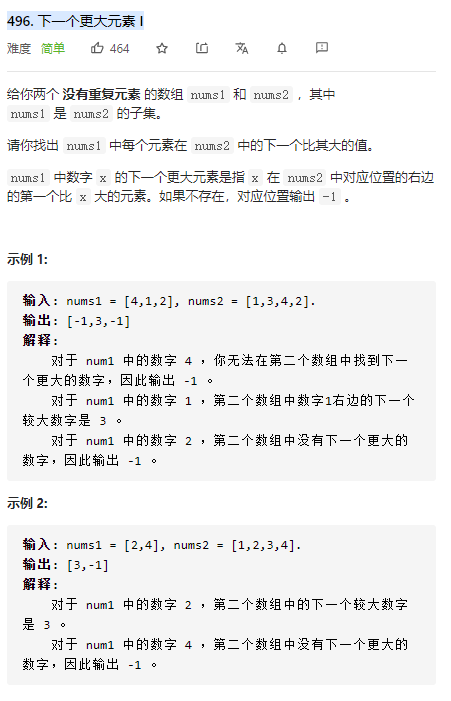
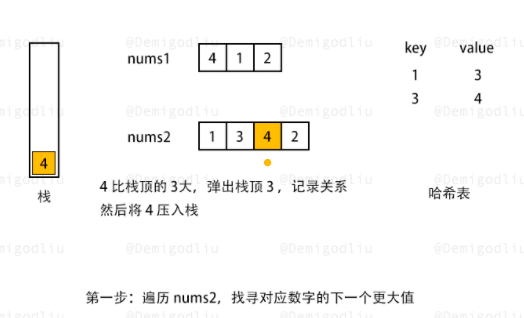
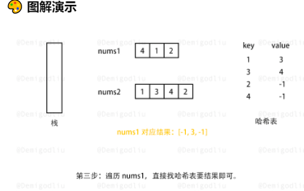

单调栈经典问题

nums1  4  1  2

nums2  1 3 4 2

扫描nums2，利用单调栈，得到对应的hash表

1  3  4   2

3  4   -1  -1





```java
public class Solution {
    public int[] nextGreaterElement(int[] nums1, int[] nums2) {
        int len1 = nums1.length;
        int len2 = nums2.length;
        Deque<Integer> stack = new ArrayDeque<>();
        Map<Integer, Integer> map = new HashMap<>();
        for (int i = 0; i < len2; i++) {
            while (!stack.isEmpty() && stack.peekLast() < nums2[i]) {//只要大于堆栈顶 就出栈 出栈元素对应的value设置为那个大于的值
                map.put(stack.removeLast(), nums2[i]);
            }
            stack.addLast(nums2[i]);
        }
        int[] res = new int[len1];
        for (int i = 0; i < len1; i++) {
            res[i] = map.getOrDefault(nums1[i], -1);
        }
        return res;
    }
}
```

