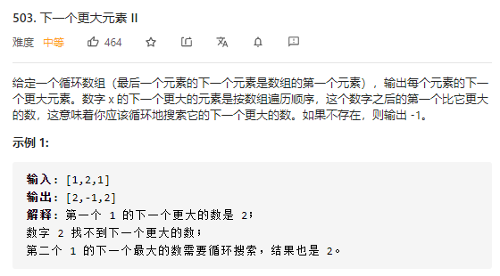

对于「找最近一个比当前值大/小」的问题，都可以使用单调栈来解决。

单调栈就是在栈的基础上维护一个栈内元素单调。

在理解单调栈之前，我们先回想一下「朴素解法」是如何解决这个问题的。

对于每个数而言，我们需要遍历其右边的数，直到找到比自身大的数，这是一个 O(n^2)O(n 
2
 ) 的做法。

之所以是 O(n^2)O(n 
2
 )，是因为每次找下一个最大值，我们是通过「主动」遍历来实现的。

而如果使用的是单调栈的话，可以做到 O(n)O(n) 的复杂度，我们将当前还没得到答案的下标暂存于栈内，从而实现「被动」更新答案。

也就是说，栈内存放的永远是还没更新答案的下标。

具体的做法是：

每次将当前遍历到的下标存入栈内，将当前下标存入栈内前，检查一下当前值是否能够作为栈内位置的答案（即成为栈内位置的「下一个更大的元素」），如果可以，则将栈内下标弹出。

如此一来，我们便实现了「被动」更新答案，同时由于我们的弹栈和出栈逻辑，决定了我们整个过程中栈内元素单调。

还有一些编码细节，由于我们要找每一个元素的下一个更大的值，因此我们需要对原数组遍历两次，对遍历下标进行取余转换。

以及因为栈内存放的是还没更新答案的下标，可能会有位置会一直留在栈内（最大值的位置），因此我们要在处理前预设答案为 -1。而从实现那些没有下一个更大元素（不出栈）的位置的答案是 -1。

```java
class Solution {
    public int[] nextGreaterElements(int[] nums) {
        int n = nums.length;
        int[] ans = new int[n];
        Arrays.fill(ans, -1);
        Deque<Integer> d = new ArrayDeque<>();
        for (int i = 0; i < n * 2; i++) {
            while (!d.isEmpty() && nums[i % n] > nums[d.peekLast()]) {
                int u = d.pollLast();
                ans[u] = nums[i % n];
            }
            d.addLast(i % n);
        }
        return ans;
    }
}

作者：AC_OIer
链接：https://leetcode-cn.com/problems/next-greater-element-ii/solution/cong-po-su-jie-fa-de-jiao-du-qu-li-jie-d-trht/
来源：力扣（LeetCode）
著作权归作者所有。商业转载请联系作者获得授权，非商业转载请注明出处。
```

