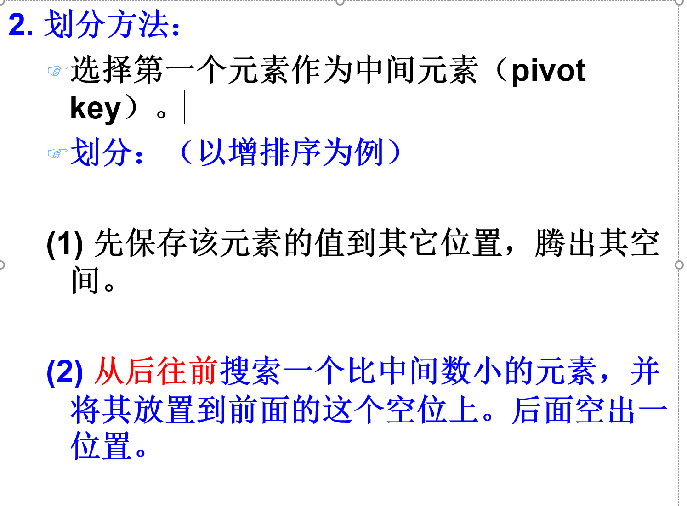
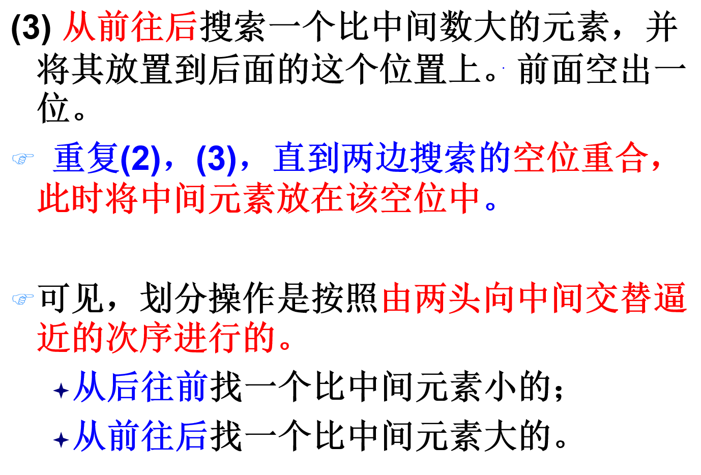
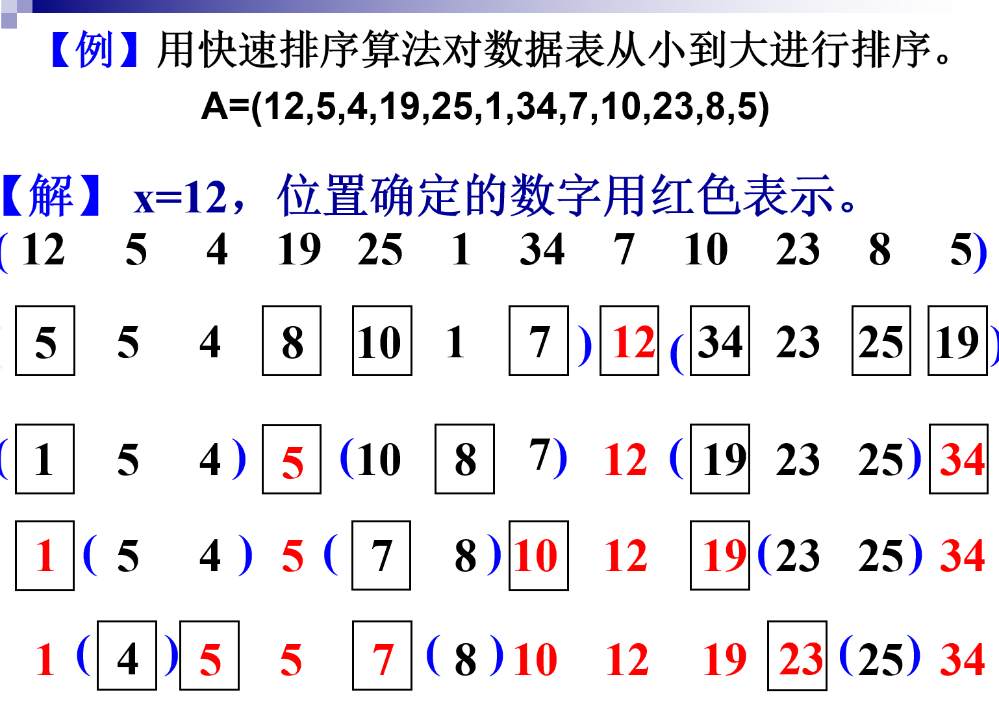

```
//    public void quickSort(int leftIndex ,int rightIndex,int nums[])
//    {
//        if(leftIndex>=rightIndex)
//        {
//            return;
//        }
//
//        int left=leftIndex;
//        int right=rightIndex;
//        int key=nums[left];
//        //开始第一遍
//        while (left<right)
//        {
//            //从右边往左边找小于key的
//            while (left<right&&nums[right]>=key)
//            {
//                right--;
//            }
//            //找到了小于的
//            nums[left]=nums[right];
//
//            //从左边往右边找大于key的
//            while (left<right&&nums[left]<=key)
//            {
//                left++;
//            }
//            nums[right]=nums[left];
//
//        }
//        //left==right
//        nums[left]=key;
//        //递归调用左边和右边
//        quickSort(leftIndex,left-1,nums);
//        quickSort(right+1,rightIndex,nums);
//    }
```

