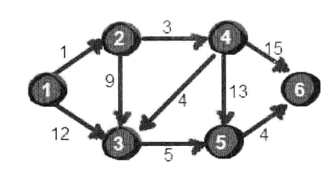

# 1.Floyd算法

​	问题背景：


暑假，小哼准备去一些城市旅游。有些城市之间有公路，有些城市之间则没有，如下图。为了节省经费以及方便计划旅程，小哼希望在出发之前知道任意两个城市之前的最短路程。


  上图中有4个城市8条公路，公路上的数字表示这条公路的长短。请注意这些公路是单向的。我们现在需要求任意两个城市之间的最短路程，也就是求任意两个点之间的最短路径。这个问题这也被称为“多源最短路径”问题。

  现在需要一个数据结构来存储图的信息，我们仍然可以用一个4*4的矩阵（二维数组e）来存储。比如1号城市到2号城市的路程为2，则设e[1]  [2]的值为2。2号城市无法到达4号城市，则设置e[2] [4]的值为∞。另外此处约定一个城市自己是到自己的也是0，例如e[1] [1]为0，具体如下。

​	我们来想一想，根据我们以往的经验，如果要让任意两点（例如从顶点a点到顶点b）之间的路程变短，只能引入第三个点（顶点k），并通过这个顶点k中转即a->k->b，才可能缩短原来从顶点a点到顶点b的路程。那么这个中转的顶点k是1~n中的哪个点呢？甚至有时候不只通过一个点，而是经过两个点或者更多点中转会更短，即a->k1->k2b->或者a->k1->k2…->k->i…->b。比如上图中从4号城市到3号城市（4->3）的路程e[4][3]原本是12。如果只通过1号城市中转（4->1->3），路程将缩短为11（e[4] [1]+e[1] [3]=5+6=11）。其实1号城市到3号城市也可以通过2号城市中转，使得1号到3号城市的路程缩短为5（e[1] [2]+e[2] [3]=2+3=5）。所以如果同时经过1号和2号两个城市中转的话，从4号城市到3号城市的路程会进一步缩短为10。通过这个的例子，我们发现每个顶点都有可能使得另外两个顶点之间的路程变短。好，下面我们将这个问题一般化。

当任意两点之间不允许经过第三个点时，这些城市之间最短路程就是初始路程，如下。


假如现在只允许经过1号顶点，求任意两点之间的最短路程，应该如何求呢？只需判断e[i] [1]+e[1] [j]是否比e[i][j]要小即可。e[i] [j]表示的是从i号顶点到j号顶点之间的路程。e[i] [1]+e[1] [j]表示的是从i号顶点先到1号顶点，再从1号顶点到j号顶点的路程之和。其中i是1 ~ n循环，j也是1~n循环，代码实现如下。

```
for(i=1;i<=n;i++)//其实自己这边想从0开始的
{
    for(j=1;j<=n;j++)
    {
        if ( e[i][j] > e[i][1]+e[1][j] )
              e[i][j] = e[i][1]+e[1][j];
    }
}
```

在只允许经过1号顶点的情况下，任意两点之间的最短路程更新为：


具体步骤(我自己这边是从0开始的)：


​    接下来继续求在只允许经过1和2号两个顶点的情况下任意两点之间的最短路程。如何做呢？我们需要在只允许经过1号顶点时任意两点的最短路程的结果下，再判断如果经过2号顶点是否可以使得i号顶点到j号顶点之间的路程变得更短。即判断e[i] [2]+e[2] [j]是否比e[i] [j]要小，代码实现为如下。

```
//经过1号顶点
for(i=1;i<=n;i++)
    for(j=1;j<=n;j++)
        if (e[i][j] > e[i][1]+e[1][j])  e[i][j]=e[i][1]+e[1][j];

//经过2号顶点
for(i=1;i<=n;i++)
    for(j=1;j<=n;j++)
        if (e[i][j] > e[i][2]+e[2][j])  e[i][j]=e[i][2]+e[2][j];
```


通过上图得知，在相比只允许通过1号顶点进行中转的情况下，这里允许通过1和2号顶点进行中转，使得e[1] [3]和e[4] [3]的路程变得更短了。

同理，继续在只允许经过1、2和3号顶点进行中转的情况下，求任意两点之间的最短路程。任意两点之间的最短路程更新为：


最后允许通过所有顶点作为中转，任意两点之间最终的最短路程为：


核心代码：

```
for(k=1;k<=n;k++)//遍历所有的点
    for(i=1;i<=n;i++)//遍历所有的行
        for(j=1;j<=n;j++)//走过一个特定的点 对应的特定的行 去 修改这一行所有的列
            if(e[i][j]>e[i][k]+e[k][j])
                 e[i][j]=e[i][k]+e[k][j];
```

最终代码

```java
#include <stdio.h>
int main()
{
    int e[10][10],k,i,j,n,m,t1,t2,t3;
    int inf=99999999; //用inf(infinity的缩写)存储一个我们认为的正无穷值
    //读入n和m，n表示顶点个数，m表示边的条数
    scanf("%d %d",&n,&m);
                              
    //初始化
    for(i=1;i<=n;i++)
        for(j=1;j<=n;j++)
            if(i==j) e[i][j]=0;
              else e[i][j]=inf;
    //读入边
    for(i=1;i<=m;i++)
    {
        scanf("%d %d %d",&t1,&t2,&t3);
        e[t1][t2]=t3;
    }
                              
    //Floyd-Warshall算法核心语句
    for(k=1;k<=n;k++)
        for(i=1;i<=n;i++)
            for(j=1;j<=n;j++)
                if(e[i][j]>e[i][k]+e[k][j] )
                    e[i][j]=e[i][k]+e[k][j];
                              
    //输出最终的结果
    for(i=1;i<=n;i++)
    {
     for(j=1;j<=n;j++)
        {
            printf("%10d",e[i][j]);
        }
        printf("\n");
    }
                              
    return 0;
}

```

有一点需要注意的是：如何表示正无穷。我们通常将正无穷定义为99999999，因为这样即使两个正无穷相加，其和仍然不超过int类型的范围（C语言int类型可以存储的最大正整数是2147483647）。在实际应用中最好估计一下最短路径的上限，只需要设置比它大一点既可以。例如有100条边，每条边不超过100的话，只需将正无穷设置为10001即可。如果你认为正无穷和其它值相加得到一个大于正无穷的数是不被允许的话，我们只需在比较的时候加两个判断条件就可以了，请注意下面代码中带有下划线的语句。

```java
//Floyd-Warshall算法核心语句
for(k=1;k<=n;k++)
  for(i=1;i<=n;i++)
      for(j=1;j<=n;j++)
        if(e[i][k]<inf && e[k][j]<inf && e[i][j]>e[i][k]+e[k][j])
            e[i][j]=e[i][k]+e[k][j];

```

上面代码的输入数据样式为：

```java
4 8
1 2 2
1 3 6
1 4 4
2 3 3
3 1 7
3 4 1
4 1 5
4 3 12

```

第一行两个数为n和m，n表示顶点个数，m表示边的条数。
接下来m行，每一行有三个数t1、t2 和t3，表示顶点t1到顶点t2的路程是t3。
得到最终结果如下


通过这种方法我们可以求出任意两个点之间最短路径。它的时间复杂度是O(N3)。令人很震撼的是它竟然只有五行代码，实现起来非常容易。正是因为它实现起来非常容易，如果时间复杂度要求不高，使用Floyd-Warshall来求指定两点之间的最短路或者指定一个点到其余各个顶点的最短路径也是可行的。当然也有更快的算法，请看下一节：Dijkstra算法。

另外需要注意的是：Floyd-Warshall算法不能解决带有“负权回路”（或者叫“负权环”）的图，因为带有“负权回路”的图没有最短路。例如下面这个图就不存在1号顶点到3号顶点的最短路径。因为1->2->3->1->2->3->…->1->2->3这样路径中，每绕一次1->-2>3这样的环，最短路就会减少1，永远找不到最短路。其实如果一个图中带有“负权回路”那么这个图则没有最短路。


# 2.Dijkstra算法

本周来来介绍指定一个点（源点）到其余各个顶点的最短路径，也叫做“单源最短路径”。例如求下图中的1号顶点到2、3、4、5、6号顶点的最短路径。



与Floyd-Warshall算法一样这里仍然使用二维数组e来存储顶点之间边的关系，初始值如下。


我们还需要用一个一维数组dis来存储1号顶点到其余各个顶点的初始路程，如下。


我们将此时dis数组中的值称为最短路的“估计值”。

   既然是求**1号顶点到其余各个顶点**的最短路程，那就先找一个离1号顶点最近的顶点。通过数组dis可知当前离1号顶点最近是2号顶点。**当选择了2号顶点后，dis[2]的值就已经从“估计值”变为了“确定值”**，即1号顶点到2号顶点的最短路程就是当前dis[2]值。为什么呢？你想啊，目前离1号顶点最近的是2号顶点，并且这个图所有的边都是正数，那么肯定不可能通过第三个顶点中转**（1到其它点距离+其它点到2的距离>1到2的距离）**，使得1号顶点到2号顶点的路程进一步缩短了。因为1号顶点到其它顶点的路程肯定没有1号到2号顶点短，对吧O(∩_∩)O~

   既然选了2号顶点，接下来再来看2号顶点有哪些出边呢。有2->3和2->4这两条边。先讨论通过2->3这条边能否让1号顶点到3号顶点的路程变短。也就是说现在来**比较dis[3]和dis[2]+e[2] [3]的大小**。其中dis[3]表示1号顶点到3号顶点的路程。dis[2]+e[2] [3]中dis[2]表示1号顶点到2号顶点的路程，e [ 2 ] [3]表示2->3这条边。所以dis[2]+e[2] [3]就表示从1号顶点先到2号顶点，再通过2->3这条边，到达3号顶点的路程。

  我们发现dis[3]=12，dis[2]+e[2] [3]=1+9=10，dis[3]>dis[2]+e[2] [3]，因此dis[3]要更新为10。这个过程有个专业术语叫做**“松弛”**。即1号顶点到3号顶点的路程即dis[3]，通过2->3这条边松弛成功。这便是Dijkstra算法的主要思想：通过“边”来松弛1号顶点到其余各个顶点的路程。

   同理通过2->4（e[2] [4]），可以将dis[4]的值从∞松弛为4（dis[4]初始为∞，dis[2]+e[2] [4]=1+3=4，dis[4]>dis[2]+e[2] [4]，因此dis[4]要更新为4）。

 刚才我们对2号顶点所有的出边进行了松弛。松弛完毕之后dis数组为：


  接下来，继续在剩下的3、4、5和6号顶点中，选出离1号顶点最近的顶点。通过上面更新过dis数组，当前离1号顶点**最近是4号顶点**。此时，dis[4]的值已经从“估计值”变为了“确定值”。下面继续对4号顶点的**所有出边**（4->3，4->5和4->6）用刚才的方法进行松弛。松弛完毕之后dis数组为：


​    继续在剩下的3、5和6号顶点中，选出离1号顶点最近的顶点，这次选择3号顶点。此时，dis[3]的值已经从“估计值”变为了“确定值”。对3号顶点的**所有出边**（3->5）进行松弛。松弛完毕之后dis数组为：


 继续在剩下的5和6号顶点中，选出离1号顶点最近的顶点，这次选择**5号顶点**。此时，dis[5]的值已经从“估计值”变为了“确定值”。对5号顶点的**所有出边**（5->6）进行松弛。松弛完毕之后dis数组为：


  最后对6号顶点所有点出边进行松弛。因为这个例子中6号顶点没有出边，因此不用处理。到此，dis数组中所有的值都已经从“估计值”变为了“确定值”。

最终dis数组如下，这便是1号顶点到其余各个顶点的最短路径。


OK，现在来总结一下刚才的算法。算法的基本思想是：每次找到离源点（上面例子的源点就是1号顶点）最近的一个顶点，然后以该顶点为中心进行扩展，最终得到源点到其余所有点的最短路径。基本步骤如下：

 

- 将所有的顶点分为两部分：已知最短路程的顶点集合P和未知最短路径的顶点集合Q。最开始，已知最短路径的顶点集合P中只有源点一个顶点。我们这里用一个book[ i ]数组来记录哪些点在集合P中。例如对于某个顶点i，如果book[ i ]为1则表示这个顶点在集合P中，如果book[ i ]为0则表示这个顶点在集合Q中。
- 设置源点s到自己的最短路径为0即dis=0。若存在源点有能直接到达的顶点i，则把dis[ i ]设为e[s] [ i ]。同时把所有其它（源点不能直接到达的）顶点的最短路径为设为∞。
- 在集合Q的所有顶点中选择一个离源点s最近的顶点u（即dis[u]最小）加入到集合P。并考察所有以点u为起点的边，对每一条边进行松弛操作。例如存在一条从u到v的边，那么可以通过将边u->v添加到尾部来拓展一条从s到v的路径，这条路径的长度是dis[u]+e[u] [v]。如果这个值比目前已知的dis[v]的值要小，我们可以用新值来替代当前dis[v]中的值。
- 重复第3步，如果集合Q为空，算法结束。最终dis数组中的值就是源点到所有顶点的最短路径。

```c++
#include <stdio.h>
int main()
{
    int e[10][10],dis[10],book[10],i,j,n,m,t1,t2,t3,u,v,min;
    int inf=99999999; //用inf(infinity的缩写)存储一个我们认为的正无穷值
    //读入n和m，n表示顶点个数，m表示边的条数
    scanf("%d %d",&n,&m);
    
    //初始化
    for(i=1;i<=n;i++)
        for(j=1;j<=n;j++)
            if(i==j) e[i][j]=0;  
              else e[i][j]=inf;
              
    //读入边
    for(i=1;i<=m;i++)
    {
        scanf("%d %d %d",&t1,&t2,&t3);
        e[t1][t2]=t3;
    }

    //初始化dis数组，这里是1号顶点到其余各个顶点的初始路程
    for(i=1;i<=n;i++)
        dis[i]=e[1][i];

    //book数组初始化
    for(i=1;i<=n;i++)
        book[i]=0;
    book[1]=1;
    
    //Dijkstra算法核心语句
    for(i=1;i<=n-1;i++)
    {
        //找到离1号顶点最近的顶点
        min=inf;
        for(j=1;j<=n;j++)
        {
            if(book[j]==0 && dis[j]<min)
            {
                min=dis[j];
                u=j;
            }
        }
        book[u]=1;//这个点已经被寻找过了
        for(v=1;v<=n;v++)
        {
            if(e[u][v]<inf)
            {
                if(dis[v]>dis[u]+e[u][v]) 
                    dis[v]=dis[u]+e[u][v];
            }
        }    
    }
    
    //输出最终的结果
    for(i=1;i<=n;i++)
        printf("%d ",dis[i]);
        
    getchar();
    getchar();
    return 0;
}
```

可以输入以下数据进行验证。第一行两个整数n m。n表示顶点个数（顶点编号为1~n），m表示边的条数。接下来m行表示，每行有3个数x y z。表示顶点x到顶点y边的权值为z。

```
6 9
1 2 1
1 3 12
2 3 9
2 4 3
3 5 5
4 3 4
4 5 13
4 6 15
5 6 4
```

​     运行结果是

```
0 1 8 4 13 17
```

通过上面的代码我们可以看出，这个算法的时间复杂度是O(N*2*N)即O(N2)。其中每次找到离1号顶点最近的顶点的时间复杂度是O(N)，这里我们可以用“堆”（以后再说）来优化，使得这一部分的时间复杂度降低到O(logN)。另外对于边数M少于N2的稀疏图来说（我们把M远小于N2的图称为稀疏图，而M相对较大的图称为稠密图），我们可以用邻接表（这是个神马东西？不要着急，下周再仔细讲解）来代替邻接矩阵，使得整个时间复杂度优化到O(MlogN)。请注意！在最坏的情况下M就是N2，这样的话MlogN要比N2还要大。但是大多数情况下并不会有那么多边，因此MlogN要比N2小很多。