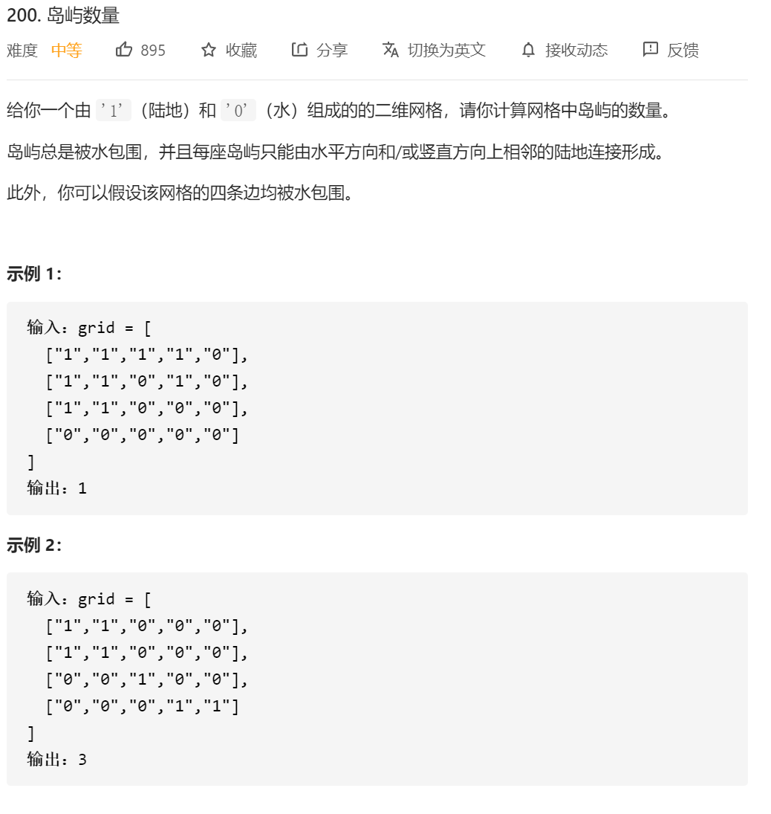

思路：按照b站ppt上的思路。

整体思路：

1.首先遍历整张图，当遍历到有**“1”这个数字**&&**这个数组没有访问过**的时候的时候，进行BFS或者DFS。将所有与其相邻的点都设定为visited,当遍历到它们的时候，就不需要进行搜索了。

2.islandNum++

3.继续下一轮搜索。


对于DFS的思路：

PPT的思路：递归

1.遍历到了这个点，说明这个点没有访问过，将这个点设置为 visited （在题目中直接设置为了“0”）。然后**递归**访问其上下左右   **1.**不为0的点**** && **2.不是边界的点**。  **3.如果这个点没被访问过** 进行递归

2.递归就是：

```
public void dfs2(char[][] grid,int x,int y)
    {
        //访问到了这个数
        grid[x][y]='0';//直接将这个数设置为0
        int dx[]=new int[]{-1,1,0,0};
        int dy[]=new int[]{0,0,1,-1};

        for(int i=0;i<4;i++)
        {
            //分别从四个不同的方向进行遍历
            int newX=x+dx[i];
            int newY=y+dy[i];
            if(newX<0||newY<0||newX>=grid.length||newY>=grid[newX].length)//我这边定义x为几行 y为几列
            {
                //如果越界了 直接就continue
                continue;
            }
            if(grid[newX][newY]=='1')
            {
                dfs2(grid,newX,newY);
            }
        }
    }
```

我自己的思路：用堆栈，方法和bfs一样只不过把队列换成了堆栈

```java
class Solution {
    public int numIslands(char[][] grid) {
        int count=0;
        //按照ppt上面的答案来解答的
        //复习的时候 记得把其它几题和岛屿相关的都做了
//        char mark[][]=new char[grid.length][grid[0].length];
//        for(int i=0;i<mark.length;i++)
//        {
//            for(int j=0;j<mark[i].length;j++)
//            {
//                mark[i][j]='0';
//            }
//        }
        // int mark[][]=new int [grid.length][grid[0].length];

        for(int i=0;i<grid.length;i++)
        {
            for(int j=0;j<grid[i].length;j++)
            {
                if(grid[i][j]=='1')
                {
                    dfs2(grid,i,j);
                    count++;
                }
            }
        }
        return count;
        

    }

    public void dfs2(char[][] grid,int x,int y)
    {
        //访问到了这个数
        grid[x][y]='0';//直接将这个数设置为0
        int dx[]=new int[]{-1,1,0,0};
        int dy[]=new int[]{0,0,1,-1};

        for(int i=0;i<4;i++)
        {
            //分别从四个不同的方向进行遍历
            int newX=x+dx[i];
            int newY=y+dy[i];
            if(newX<0||newY<0||newX>=grid.length||newY>=grid[newX].length)//我这边定义x为几行 y为几列
            {
                //如果越界了 直接就continue
                continue;
            }
            if(grid[newX][newY]=='1')
            {
                dfs2(grid,newX,newY);
            }
        }
    }
    //  public void dfs(int mark[][],char[][] grid,int x,int y )//表示数组 原始数组 需要dfs的坐标
    // {
    //     //访问到了这个数
    //     mark[x][y]=1;//将这个数定义为1
    //     int dx[]=new int[]{-1,1,0,0};
    //     int dy[]=new int[]{0,0,1,-1};

    //     for(int i=0;i<4;i++)
    //     {
    //         //分别从四个不同的方向进行遍历
    //         int newX=x+dx[i];
    //         int newY=y+dy[i];

    //         if(newX<0||newY<0||newX>=grid.length||newY>=grid[newX].length)//我这边定义x为几行 y为几列
    //         {
    //             //如果越界了 直接就continue
    //             continue;
    //         }

    //         if(mark[newX][newY]==0&&grid[newX][newY]=='1')
    //         {
    //             dfs(mark,grid,newX,newY);
    //         }

    //     }
    // }
}
```


对于BFS的搜索思路：

1.遍历到这个点，说明这个点没有被访问过。然后将这个点上下左右的 1.不为0的点 && 2.不是边界的点   3.没被访问过的点  给放进一个队列 （或者在这边放进队列的时候就能标记为visited了（就是直接设置为了0））

2.只要队列不为空，就循环将队列中的元素 pop 并标记为visited


