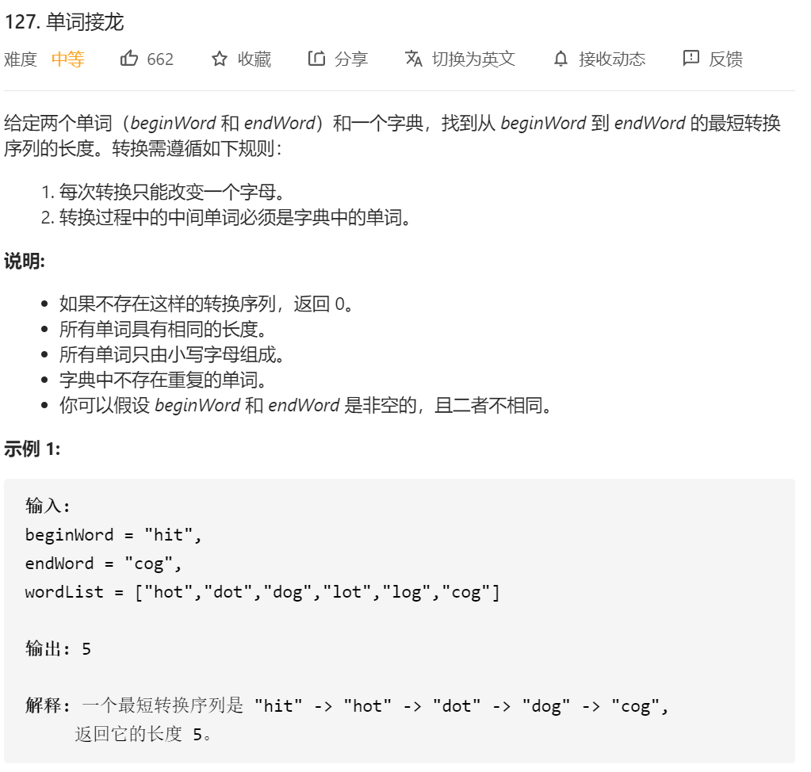
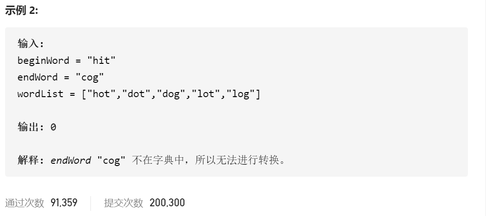
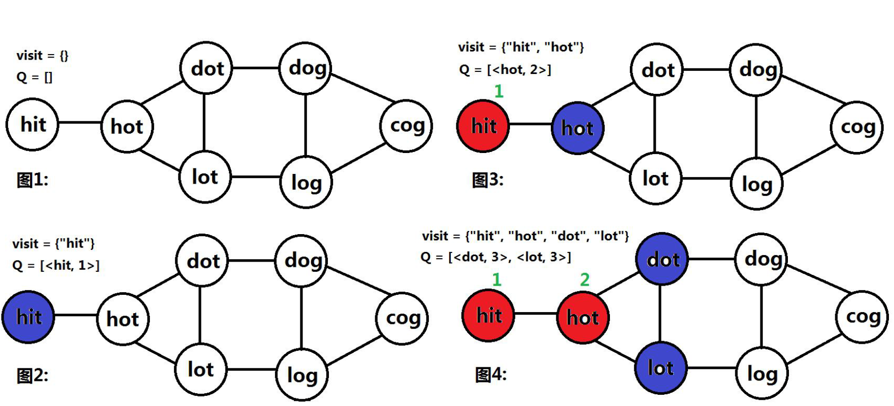

思路：BFS

宽度优先搜索，其实可以通过一张图来表示这一整个过程



其实可以发现，就是每一个单词，会和其只**相差一个元素**的单词构建边。那其实很容易就能想到一个过程：

1.访问到一个单词，将这个单词放进vidited

2.访问这个单词周围的其它单词，如果这些单词 没有被访问过 且 和这个单词只相差一个元素 那就把这个单词访问了。 并且将这个单词放进队列中。

3.将队列中元素一个个地遍历去访问，直到找到相关的元素。

代码：

```java

class Solution {
    public int ladderLength(String beginWord, String endWord, List<String> wordList) {
        //java 第一次使用bfs来解题  这题思路：
        // 就是先把beginWord 放进队列 ；然后将其放进 visited ；  这样一整个操作 count++ ；开始遍历队列，如果队列不为空：
        // 然后将List中所有1.未被visited的 且2。和队列中头部元素（第一次就是和beginword比）相差只有一个元素的
        //string给压入队列 （队头在取的时候就得poll）

        if (!wordList.contains(endWord)) {//坑点 忘记了没有包括这个词的情况
            return 0;
        }
        int count=0;
        Set<String> visited=new HashSet<>();
        Queue<String> queue=new LinkedList<>();

        visited.add(beginWord);
        queue.offer(beginWord);

        while (!queue.isEmpty())//只要队列不为空
        {
            int queueLen=queue.size();
            count++;
            //因为是bfs 每一轮循环开始 都代表更深一层 开始的时候是第一层 count++ =1
            for(int i=0;i<queueLen;i++)
            {
                //一个个将队列中的元素整出来
                String temp=queue.poll();
                //遍历其它所有的元素 其实这边的复杂度挺高的
                for(int j=0;j<wordList.size();j++)
                {
                    if(visited.contains(wordList.get(j)))//如果遍历过了这个元素 直接过
                    {
                        continue;
                    }

                    if(!canConvert(temp,wordList.get(j)))//如果两个相差不是一个元素之内
                    {
                        continue;//值结过

                    }
                    //如果满足了以上两个要求 先判断是不是已经找到了对应的元素
                    if(wordList.get(j).equals(endWord))//注意 一定要用equal 坑点3 这边是等于最后一个元素 之前这里写错了
                    {
                        return count+1;
                    }
                    //如果以上都不满足了 那就进行下一轮 将temp点只差一个元素 且未被访问过的点push 进去
                    queue.offer(wordList.get(j));
                    visited.add(wordList.get(j));

                }

            }

        }
        return 0;//坑点2 这边最后如果没有找到对应的元素 必须要返回0
    }


     public boolean canConvert(String s1,String s2)
    {
        if (s1.length() != s2.length()) return false;
        int count = 0;
        for (int i = 0; i < s1.length(); ++i) {
            if (s1.charAt(i) != s2.charAt(i)) {
                ++count;
                if (count > 1) {
                    return false;
                }
            }
        }
        return count == 1;
    }
}
```


