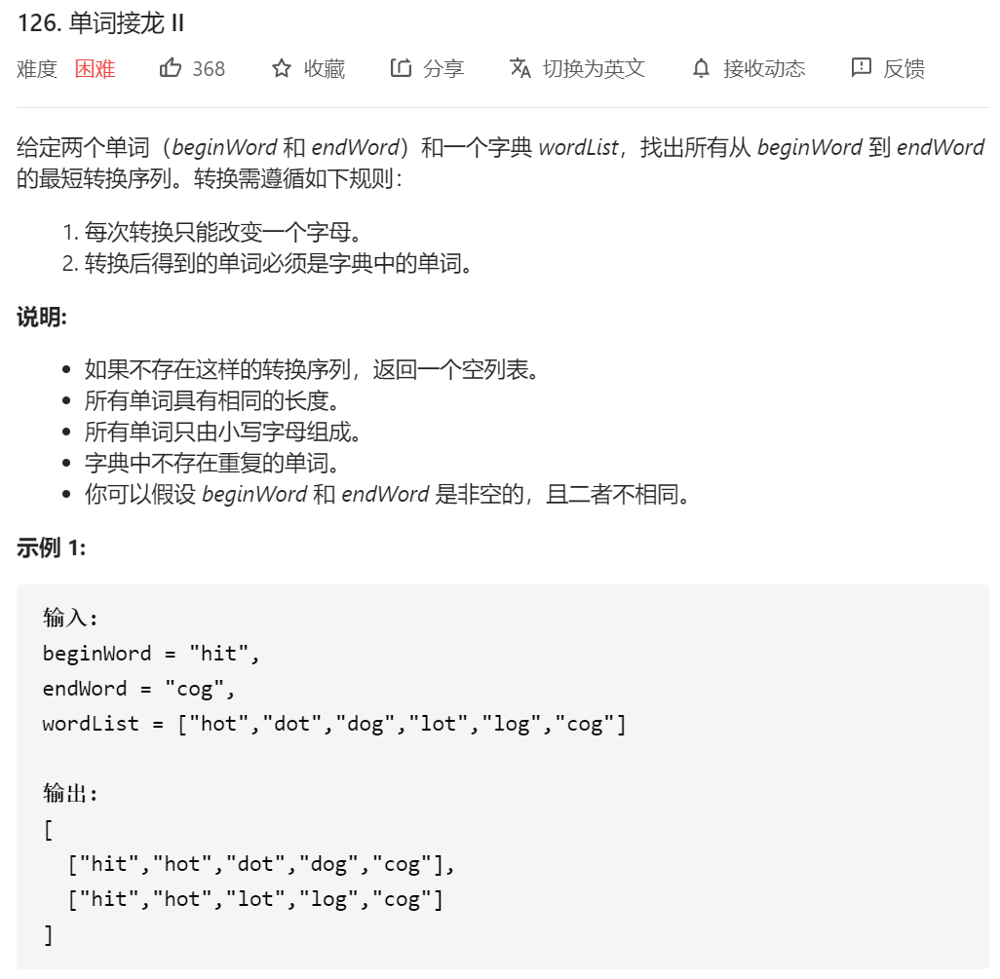
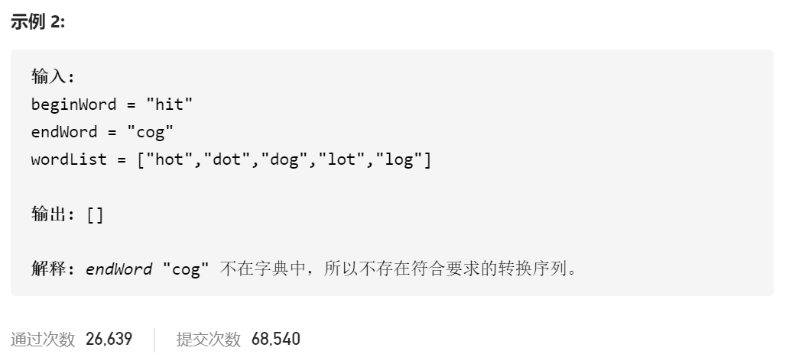

```java
class Solution {
   //首先这题的前置mid是127 127只需要记录次数 那也就是1.我访问到了那个单词 我就直接可以跳出循环 2.过程中队列存的是上一次访问的符合条件的**节点**
    // 而在这题中访问这个单词后 不能立马跳出循环，必须要继续把这一整层给访问完 因为有可能有等长度的序列
    // 综上 对于第一个 设置一个flag 保证遍历某一层的开始的时候 如果上一层为true了  那就不要再往下遍历了；而且要设置个记录该层访问的的visied 最后将其归属到visited 不然就只会有一个结果了（因为有些可能有多种路径情况）
    // 第二个问题 就是之前存的是上一层的字符 这边改成存上一层的路径  这边每add一个元素 就得新建一个新的路径
    public List<List<String>> findLadders(String beginWord, String endWord, List<String> wordList) {
        List<List<String>> res = new ArrayList<>();//结果集合
        Set<String> distSet = new HashSet<>(wordList);//检查wordList 是否包括了endWord
        // 字典中不包含目标单词
        if (!distSet.contains(endWord)) {
            return res;//直接返回空
        }

        Set<String> visited=new HashSet<>();//建立访问数组 总
        Queue<List<String>> queue=new LinkedList<>();//队列是linklist

        List<String> listTemp=new ArrayList<>();
        listTemp.add(beginWord);
        queue.offer(listTemp);//队头先入begin
        visited.add(beginWord);//visit 也先入
        boolean flag=false;

        while ((!queue.isEmpty())&&flag==false)
        {
            //开始进入下一轮的循环
            int size=queue.size();
            Set<String> visitedInOneQueue=new HashSet<>();// 坑点三 再每一次遍历队伍的时候要重新新建一个临时的tempset 设置队伍中的visit 防止出现只有一个结果的情况

            for(int i=0;i<size;i++)
            {
                List<String> path=queue.poll();
                //获取path的最后一个元素 也就是上一层加进去的元素
                String word=path.get(path.size()-1);
                //遍历所有的list 看看能不能找到对应的 且没有visited 的元素
                //发现直接遍历wordlist会超时
                //所以 这边用一个相对省时间的方法 就是将word 变成 char array 然后 将每一位都变化成‘a’-'z' 种的某一个元素
                //判断 改变后的这个char array 是否在我们的list当中
                char[] wordChar=word.toCharArray();
                //  System.out.println(wordChar);
                for(int j=0;j<wordChar.length;j++)
                {
                    char temp=wordChar[j];
                    //  System.out.println(temp);
                    for(char ch='a';ch<='z';ch++)//坑点1 不用这个遍历的方法的话 会超时
                    {
                       
                        if(temp==ch)
                        {
                            continue;
                        }
                        wordChar[j]=ch;//将其中一个位变为a-z 中的某一位
                        //将 char 转为string
                        String str=new String(wordChar);//坑点4 这边记得转 string 不要用sb sb的时间消耗更久
                        // //尝试用stringb
                        //  StringBuffer sb = new StringBuffer();
                        // for(int ii=0;ii<wordChar.length;ii++)
                        // {
                        //     sb.append(wordChar[ii]);
                        // }
                        // String str=sb.toString();
                        

                        //然后 这个数字肯定是只相差一位的那就只需要判断两个地方 是否在list里面 是否之前出现过
                        if((!visited.contains(str))&&(distSet.contains(str)))
                        {
                            // System.out.println(str);
                            visitedInOneQueue.add(str);//临时变量统计
                            List<String> pathList = new ArrayList<>(path);//坑点5如果发现了可以add的路径 必须先创建临时路径，然后再add这个数，然后最后队伍里存的是这个临时的路径  再add点之前 必须生成一个新的路径 直接用原来的path的话是在原来的地址上做文章了
                            pathList.add(str);// 然后再加
                            queue.add(pathList);
                            //如果满足了以上两个要求 且是符合要求的元素
                            if(str.equals(endWord))//注意 一定要用equal
                            {   
                                flag =true;//下一层循环没必要了
                                res.add(pathList);//坑点6 记得这边要加临时的路径
                                // System.out.println(str);

                            }

                        }
                    
                    }
                     wordChar[j]=temp;//记得将字符串变回来  坑点2 在变换完字符串后 再下一个j 之前要把这个j变换回来

                }

            }
            //遍历完一层之后 将这层访问过的节点全部都add到正真的访问列表中
            visited.addAll(visitedInOneQueue);
//            for (int i=0;i<visitedInOneQueue.size();i++)
//            {
//                visted.add(vis)
//            }

        }
        return res;
    }

}
```

