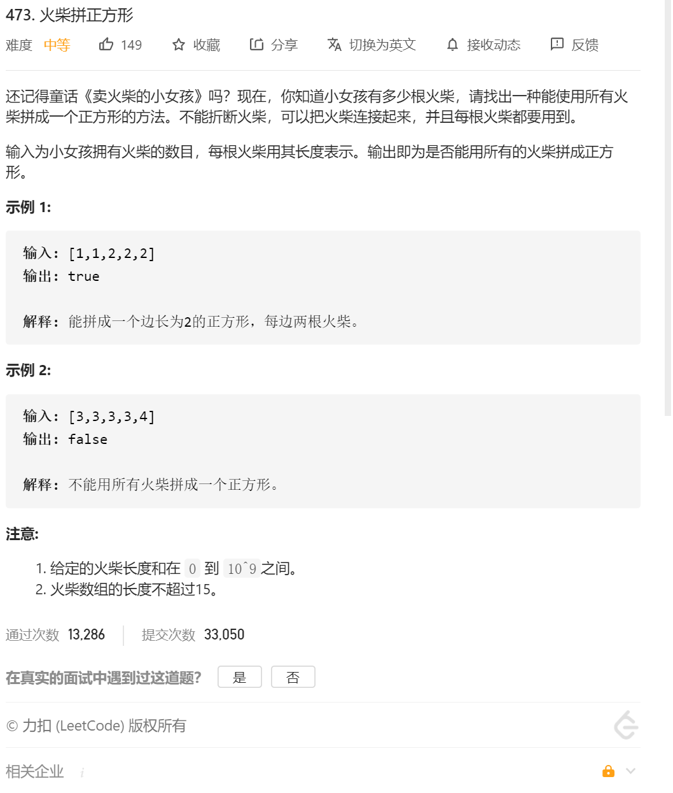

虽然题目是深度优先搜索，但其实包含了回溯的思想在里面

1.首先遍历所有的nums[i],求和，判断能不能取余4，不能——false；能，求出target=sum/4

2.将所有的nums[i]排个序，这样再之后装边的时候，先将大的装下，可以减少剪枝

3.开始进行回溯dfs

3.1 回溯退出条件 1.遍历到了最后一个index && 2.四个桶子（边）全部都等于target

3.2 遍历四个桶子

3.3 如果桶子+ nums[index] >target  continue 直接遍历下一个桶子

3.4  如果小于等于 target 则dfs下一个index 如果返回 true 直接就返回true

3.6 如果没返回 说明这个尝试失败了 桶子=桶子-nums[index]

代码：

```java
class Solution {
   public boolean makesquare(int[] nums) {
        //回溯的时候考虑三个条件、
        //1.这个列表中的数必须被4整除
        //2.每一条边不可能大于 sum/4
        //3 从大的边开始回溯
        //坑点1 判断是否小于4个数
        if(nums.length<4)
        {
            return false;
        }

        boolean res=true;
        int sum=0;
        for(int i=0;i<nums.length;i++)
        {
            sum=sum+nums[i];
        }
        if(sum%4!=0)
        {
            return false;
        }
        // System.out.println("ddd");


        Arrays.sort(nums);
        int nums2[]=new int[nums.length];
        for(int i=0;i<nums.length;i++)
        {
            nums2[i]=nums[nums.length-1-i];//从大到小排序
            // System.out.println("nums2:"+ nums2[i]);
        }


        int bucket[]=new int[4];//定义四条边


        return generate(0,nums2,sum/4,bucket);
    }


    public boolean generate(int indexNum,int nums2[],int target,int bucket[])//定义 回溯第几个数  需要回溯的列表  最终的回溯目标
    {
        if(indexNum>=nums2.length)
        {
            
            // //如果递完了所有的数字
            // if(bucket[0]==target&&bucket[1]==target&&bucket[2]==target&&bucket[3]==target)
            // {
            //     return true;
            // }
            // else
            // {
            //     return false;
            // }
            return bucket[0]==target&&bucket[1]==target&&bucket[2]==target&&bucket[3]==target;
        }

        //接下来分别尝试四条边
        for(int j=0;j<4;j++)
        {
            if((bucket[j]+nums2[indexNum])>target)//如果加上这条边 超过了target 那就直接跳过这条边
            {
                continue;
            }
            //否则 这个条边加上这个值
            bucket[j]=bucket[j]+nums2[indexNum];
            if(generate(indexNum+1,nums2,target,bucket))//在将这个数 放入这条边的同时 再尝试将看下一个数应该放在哪里
            {
                return true;
            }
            bucket[j]=bucket[j]-nums2[indexNum];//样例 [5,5,5,5,4,4,4,4,3,3,3,3] 10<12  所以 这边的回溯得把5去掉
        }
        return false;

    }
}
```

