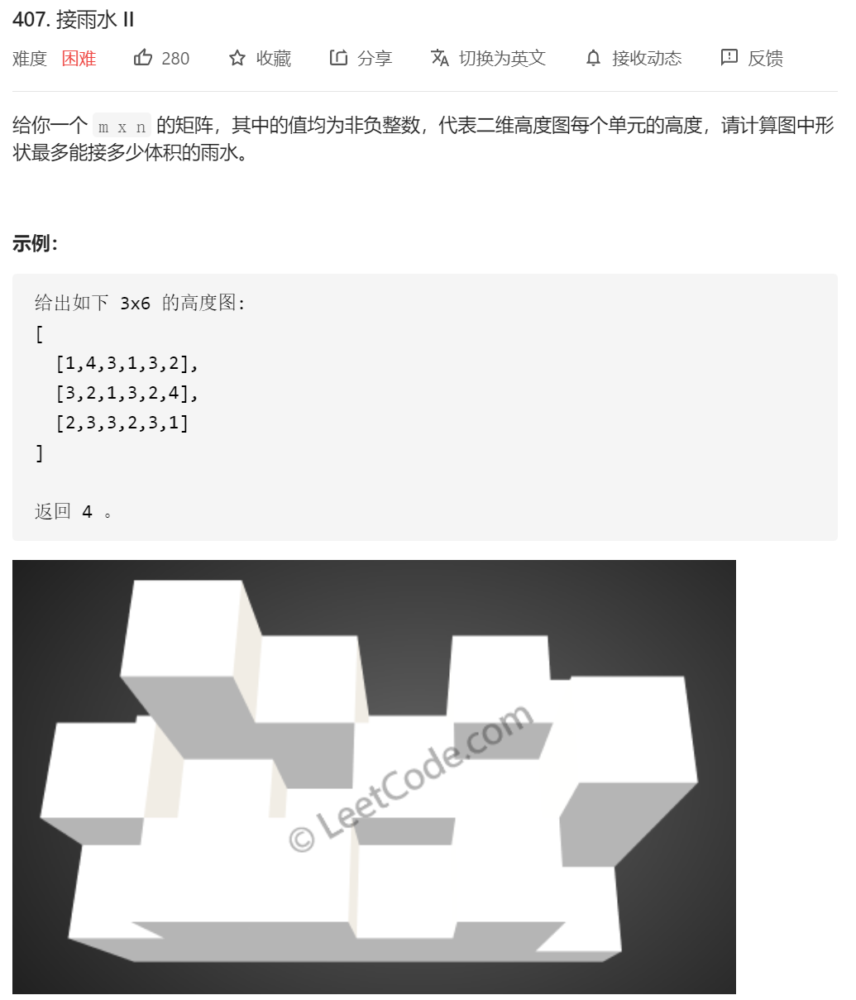
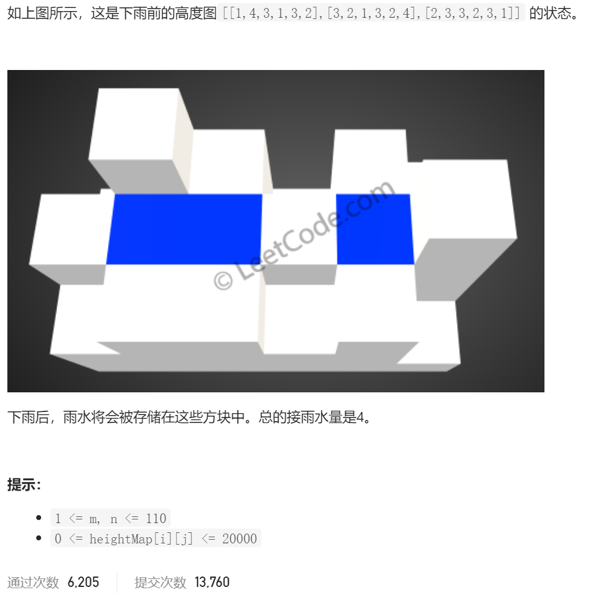
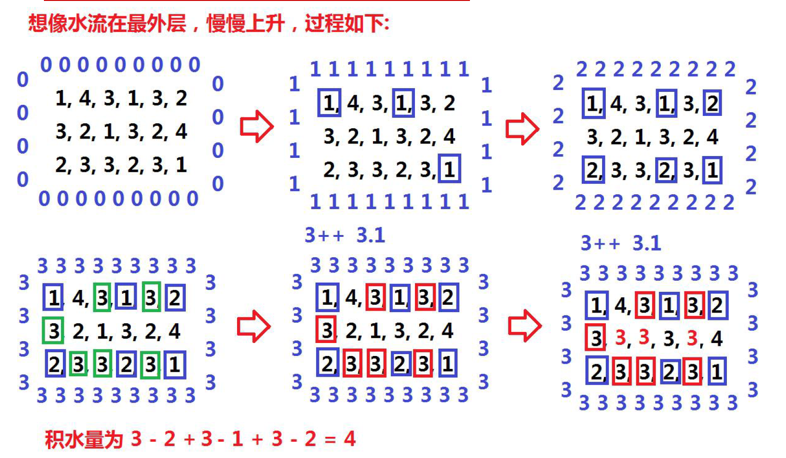
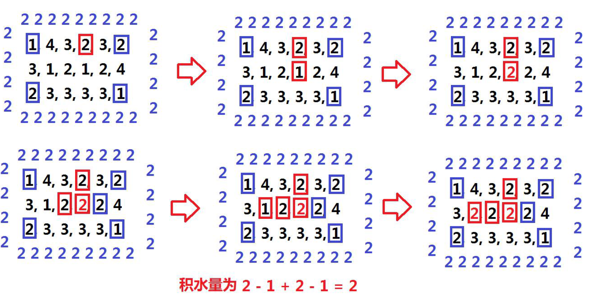

就想像成从外面往里面灌水。





代码：

```java
class Solution {
   public int trapRainWater(int[][] heights) {
        //这题的核心思想 从四周往里面搜索
        int res=0;
        if(heights==null||heights.length==0)
        {
            return 0;
        }
        int n=heights.length;
        int m= heights[0].length;

        // 用一个vis数组来标记这个位置有没有被访问过
        boolean[][] vis = new boolean[n][m];
        // 优先队列中存放三元组 [x,y,h] 坐标和高度
        PriorityQueue<int[]> pq = new PriorityQueue<>(new Comparator<int[]>(){ //小顶堆，容量11
            @Override
            public int compare(int[] o1,int[] o2){
                if(o1[2]<o2[2])//这样就不容易出现越界的情况
                {
                    return -1;
                }
                else
                {
                    return 1;
                }
            }
        });

        // 先把最外一圈放进去
        for (int i = 0; i < n; i++) {
            for (int j = 0; j < m; j++) {
                if (i == 0 || i == n - 1 || j == 0 || j == m - 1) {
                    pq.offer(new int[]{i, j, heights[i][j]});//
                    vis[i][j] = true;
                }
            }
        }

        //定义方向数组
        int x[]=new int[]{-1,0,1,0};//左 下 右 上
        int y[]=new int[]{0,1,0,-1};

        while (!pq.isEmpty())
        {
            int poll[]= pq.poll();//因为是最小堆 所以每次都是找最小的那个角落去灌水
            // // 看一下周围四个方向，没访问过的话能不能往里灌水
            // System.out.println("poll[2]="+poll[2]);
            // System.out.println("x="+poll[0]+",y="+poll[1]);
            for(int k=0;k<4;k++)
            {
                int nx=poll[0]+x[k];
                int ny=poll[1]+y[k];
                // 如果位置合法且没访问过
                if(nx>=0&&nx<n&&ny>=0&&ny<m&&(!vis[nx][ny]))
                {// 如果外围这一圈中最小的比当前这个还高，那就说明能往里面灌水啊
                    if(poll[2]>heights[nx][ny])
                    {
                        res=res+poll[2]-heights[nx][ny];
                    }
                    // 如果灌水高度得是你灌水后的高度了，如果没灌水也要取高的(也就是原来的高度)
                    pq.offer(new int[]{nx, ny, Math.max(heights[nx][ny], poll[2])});
                    vis[nx][ny] = true;

                }

            }

        }

        return res;
    }
}
//https://leetcode-cn.com/problems/trapping-rain-water-ii/solution/you-xian-dui-lie-de-si-lu-jie-jue-jie-yu-shui-ii-b/
```

