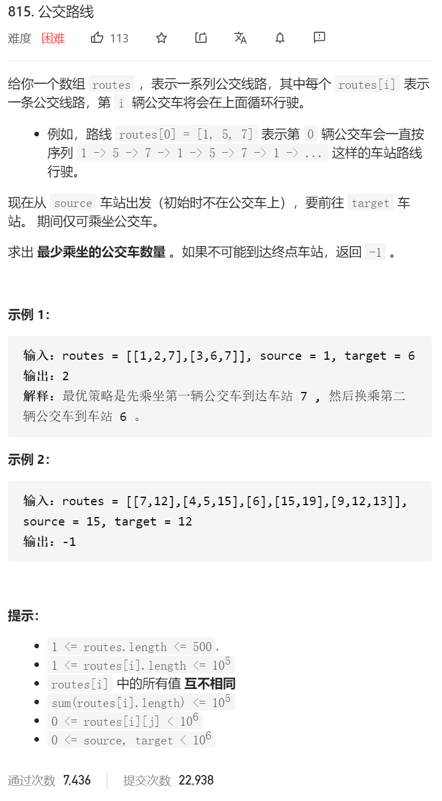
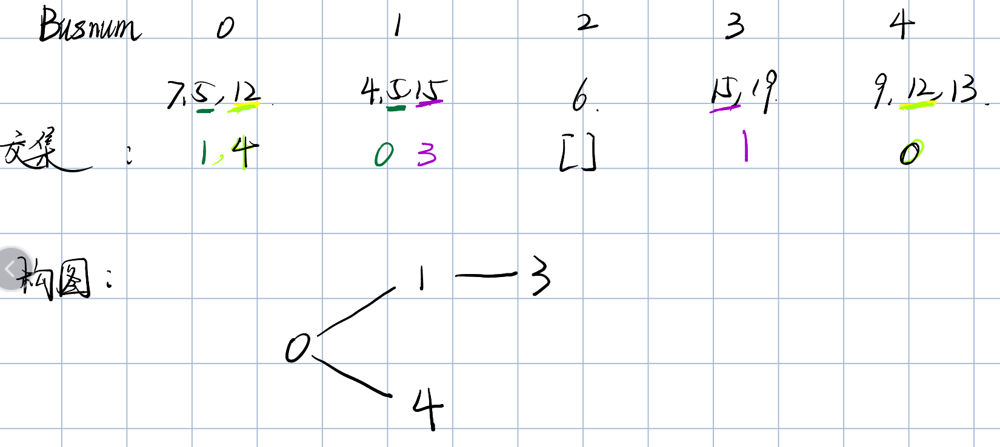

思路：bfs 拓扑排序

1.每一辆**公交车**都可以视为一个节点，然后根据公交车**路线是否相交**判断这两辆公交车是否能够建立一条**边**。

如第二个例子，就可以构建出这样的图



2.那我们找到起始站点的bus（比如对应的**12(source)->0, 4 (busNum)**），以及终点所对应的bus**（15->1,3）**

3.然后 我们就可以进行bfs（拓扑排序）了

4.众所周知 bfs就是用队列来实现

```java
class Solution {
      class Node{
        int busNum;
        int depth;

        Node(int busNum,int depth){
            this.busNum=busNum;
            this.depth=depth;
        }
    }

    public int numBusesToDestination(int[][] routes, int S, int T) {
        if(S==T)
        {
            return 0;//如果车子是一样的话 那就是这样 坑爹
        }

        int m=routes.length;//先看看有多少车

        List<List<Integer>> bus=new ArrayList<>();
        //一边创建新的节点 一边对routes里面进行排序
        for(int i=0;i<m;i++)
        {
            bus.add(new ArrayList<>());
            Arrays.sort(routes[i]);
        }

        //然后开始判断每一辆bus会和哪几辆bus进行相遇
        for(int i=0;i<m-1;i++)
        {
            for(int j=i+1;j<m;j++)
            {
                if(isUninon(routes[i],routes[j]))
                {//如果两辆巴士有相交
                    bus.get(i).add(j);
                    bus.get(j).add(i);
                }
            }
        }
        //到此获得了所有的可以相连的bus

        //开始进行拓扑排序
        //1.设定好我们bfs 的一个路径 防止重复寻找
        HashSet<Integer> roads=new HashSet<>();
//        //2.设定我们的初始站 可以是哪些 这一步骤 可以放在我们的roads里面
//        HashSet<Integer> source=new HashSet<>();
        //3.设定我们的终止站 可以是哪些？
        HashSet<Integer> target=new HashSet<>();
        //4.最后设定一个队列 用于bfs 用于存放我们途中经过点
        Queue<Node> queue=new LinkedList<>();

        //初始化 我们进行将起始点 终点 还有我们的队列进行一个初始化
        for(int i=0;i<m;i++)
        {
            if(Arrays.binarySearch(routes[i],S)>=0)//如果我们的busi 包括了这个站点
            {
                roads.add(i);
//                source.add(i);
                queue.add(new Node(i,0));
            }

            if(Arrays.binarySearch(routes[i],T)>=0)//如果我们的busi 包括了我们的目的地
            {
                target.add(i);
            }
        }

        //正式开始bfs
        while (!queue.isEmpty())
        {
            Node busOne=queue.poll();
            int busNum=busOne.busNum;
            int depth=busOne.depth;

            //寻找target所在的bus 是否能被这辆bus直达
            if(target.contains(busNum))
            {
                return depth+1;//直接一班车就到
            }
            //如果不在 那我就要遍历邻居
            for(Integer neigborBus:bus.get(busNum))
            {
                if(!roads.contains(neigborBus))
                {//我们只寻找没有遍历过的邻居
                    roads.add(neigborBus);
                    queue.add(new Node(neigborBus,depth+1));
                }
            }
            
        }
        return -1;
    }

    //判断两个数组是否有交集
    //1      2
    //l,m    r
    
    boolean isUninon(int a[],int b[])
    {//因为 ab都是排序好的 所以这边应该就直接二分找
        for(int i=0;i<a.length;i++)
        {
            int left=0;
            int right=b.length-1;
            int target=a[i];

            while (left<right)
            {
                int mid=left+(right-left)/2;//这边就用  1  2 这个例子来
                
                if(b[mid]>=target)
                {
                    right=mid;
                }else
                {
                    left=mid+1;
                }
            }

            if(b[left]==target)
            {
                return true;
            }
        }
        return false;
    }
}
```

